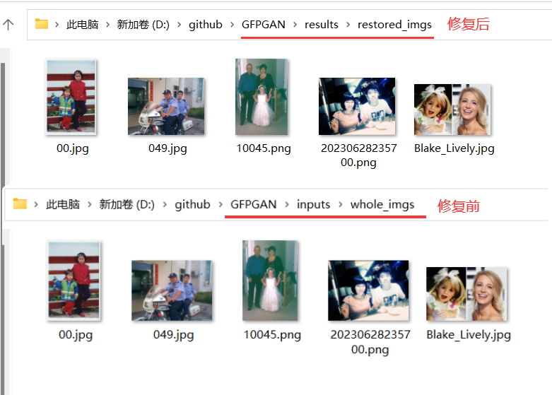
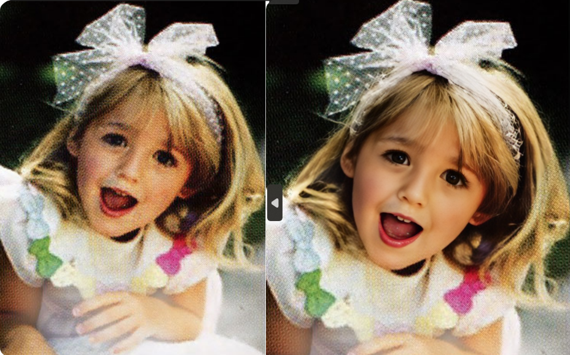

# GFPGAN 用他修复我10年前的老照片

## 背景

有一天我在翻看老照片，突然想到是否可以把这些老照片修复一下，随后，下了旧款APP都要收费，作为白嫖党，花钱是不可能花钱，于是开始找开源项目，随即发现 GFPGAN是一个不错的开源项目。

## GFPGAN 介绍

GFPGAN 旨在开发一种用于现实世界人脸恢复的实用算法。

它利用封装在预训练面部 GAN（例如 StyleGAN2）中的丰富多样的先验来进行盲人面部恢复。

## 安装

__1. 安装要求__

* python >= 3.7


__2. 克隆项目__

```bash
> git clone https://github.com/TencentARC/GFPGAN.git
> cd GFPGAN
```

__3. 安装依赖包__


```bash
# 安装 basicsr - https://github.com/xinntao/BasicSR
# 我们使用BasicSR训练和推理
> pip install basicsr

# 安装 facexlib - https://github.com/xinntao/facexlib
# 我们使用facexlib包中的人脸检测和人脸恢复助手
> pip install facexlib

# 安装项目依赖 和项目本身
> pip install -r requirements.txt
> python setup.py develop

# 如果你想用 Real-ESRGAN 增强背景(非人脸)区域
# 你还需要安装realesorgan包
> pip install realesrgan
```

注：以上依赖包有些达到1~2百兆（MB）, 安装过程会比较慢。

__4. 下载训练模型__

实际上，我们可以在 releases 中找到1.2、1.3 和 1.4 的训练模型。我自己尝试 1.3 和 1.4 的效果差别不大。

https://github.com/TencentARC/GFPGAN/releases/download/v1.3.0/GFPGANv1.2.pth

https://github.com/TencentARC/GFPGAN/releases/download/v1.3.0/GFPGANv1.3.pth

https://github.com/TencentARC/GFPGAN/releases/download/v1.3.4/GFPGANv1.4.pth

每个模型都要 300多MB，github访问一直比较慢，你可以选择下载工具。

将下载好的模型放到到 GFPGAN 项目下的 `experiments/pretrained_models` 目录中。

```bash
> cd /experiments/pretrained_models/
> ls

    目录: D:\github\GFPGAN\experiments\pretrained_models

Mode                 LastWriteTime         Length Name
----                 -------------         ------ ----
-a----         2023/6/23      0:43      348632874 GFPGANv1.3.pth
-a----         2023/6/23      0:32      348632874 GFPGANv1.4.pth
```


## 开始修复照片

我们需要记住两个目录：

* `\GFPGAN\inputs\whole_imgs\`: 存放修复前的照片，把你要修复的照片放到这个目录。
* `\GFPGAN\results\restored_imgs`：存放修复后的照片，当程序执行完成，修复好的照片存放到这个目录。

__执行程序__

```bash
> python inference_gfpgan.py -i inputs/whole_imgs -o results -v 1.3 -s 2
```

* `-i`: 指定输入照片的目录。
* `-o`: 指定输出照片的目录。
* `-v`: 指定训练模型的版本。
* `-s`: 图像的最终上采样比例，默认: 2




* 放大对比：




1. GFPGAN 主要修复的是脸部特写，所以其他部位没有明显变化。

2. 并不是所有照片都如上图修复的那么好，我猜测是对比度比较高，脸部轮廓分明，所以修复的比较好。我自己的老照片失真挺严重的。哈哈~！

3. GFPGAN 不当修复照片，还能修复视频，B站有UP主演示 先用工具把视频转为连续帧的照片，修复好后，再将连续帧的照片转为视频。

4. 如果你会APP开发，基于GFPGAN是不是也可以做个APP玩玩，🤔，不过运行过程挺消耗硬件资源的。

