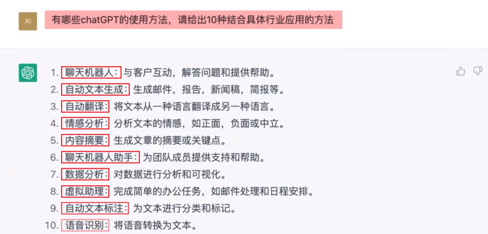
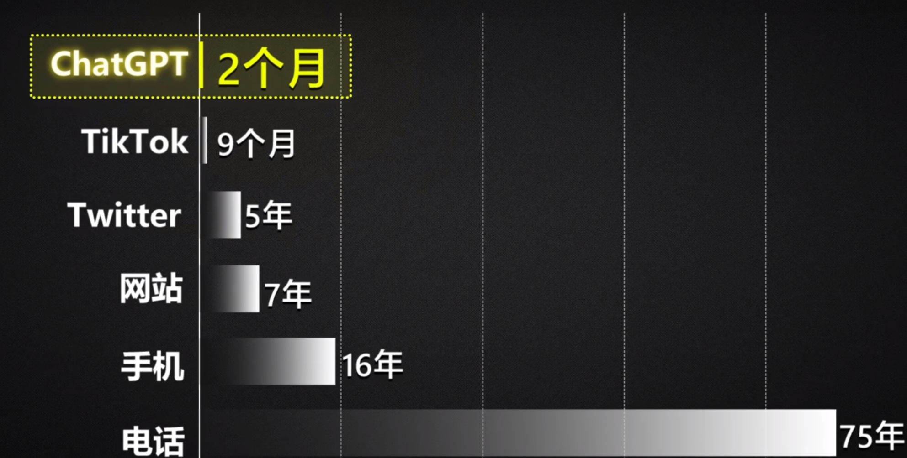
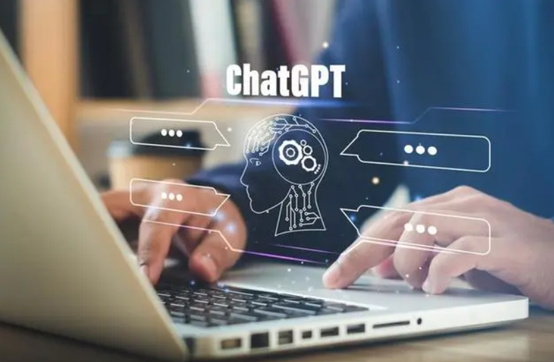

## chatGPT 对我们有哪些影响？

chatGPT 一两月被持续刷屏了，一开始以为像 AI 作画一样，只是掀起一阵热潮，一开始觉得有趣，并不会对我们的生活产生太多的改变。然而，chatGPT 的热度并未消减，反而仍然在持续引起关注。

__chatGPT引起了科技巨头的高度重视。__

* 苹果：将于下周召开内部AI峰会。

* google: 谷歌推出Bard对抗ChatGPT（然而，在刚刚演示问答中，翻车了^_^!）。

* 百度：百度官宣即将推出"文心一言"。

...

是什么原因引起了各大公司巨头 `恐慌性` 发布竞品，原因是 chatGPT 强大的功能，以及从发布起短短两个月用户达到1亿规模

* chatGPT 可以做什么

* 用户增长速度

__chatGPT是否快速的被竞品追赶。__

AI技术其实大家并不陌生，许多互联网科技巨头都有投入，这也是他们能快速推出竞品的原因，那么这些竞品是否能快速追赶上chatGPT，甚至是超越？

主要看三个方面：

* 算力：英伟达先进的AI学习计算卡 大概 几万 到 十几万之间，chatGPT目前有几万卡在工作，这是一笔不小的硬件开支。

* 数据：chatGPT目前有一亿用户，也就说有一亿用户在训练GPT的模型，这是 chatGPT的先发优势。

* AI工程化：openAI 在 2020年就推出 GPT-3模型，到目前两年时间未做模型结构的创新，一直在训练和迭代升级。所以，AI工程化非常重要。openAI将GTP模型作为产品在不断的迭代。模型的持续迭代或工程化的过程对于 AI 工具的发展也至关重要。

__chatGPT对行业以及互联网产品的颠覆__

对于chatGPT对于现有的一些互联网产品可能会致命性的颠覆。

* 作为一名软件工程师，在写代码的过程中需要查找代码报错，以往的方式去技术问答社区，stackoverflow 搜索问题，有答案列表中一个一个找寻正确答案，或发起一个问题，等待有人来解答。而通过 chatGPT 只需要描述完问题，甚至不需要1s将会收到答案。

* 再比如你打开知呼提问，月薪3w是一种什么体验？需要和 stackoverflow 类似的流程...

* 或者通过搜索引擎输入关键字，出现 几百万条相关结束，不得不从搜索列表一条一条寻找正确答案。

* ...

我认为对于问答类的产品会有颠覆性的影响，当然，这取决于 chatGPT 答案的准确性。目前来看在一些专业领域 chatGPT 还有很大的学习空间。

__chatGPT对哪些职业产生颠覆__

对于chatGPT对于现有的一些职业可能会致命性的颠覆。

* 网络作家：如果你是一位资质平平的网络写手，那么很可能还不如 chatGPT 写的文章更好。

* 头条写手/知乎写手：这种靠着在平台上发布新闻，回答问题来赚取平台分成的工作。

* 在线情感顾问/法律顾问/客服：chatGPT 比你专业还比你善解人意，还耐心、无负面情绪。

...

__chatGPT能给我们带来什么__

* 提升工作效率: 

> chatGPT 自动做PPT
> chatGPT 帮你练习英语口语
> chatGPT 帮写作业
> chatGPT 帮你写年终总结
> ...

* 聊天交流

> 也许你突发奇想，也许你漫无目的 像 chatGPT 提一些问题，发现 他还是个博学且有趣的灵魂呢。

电影《钢铁侠》里的贾维斯 也许已经离我们很近了。

