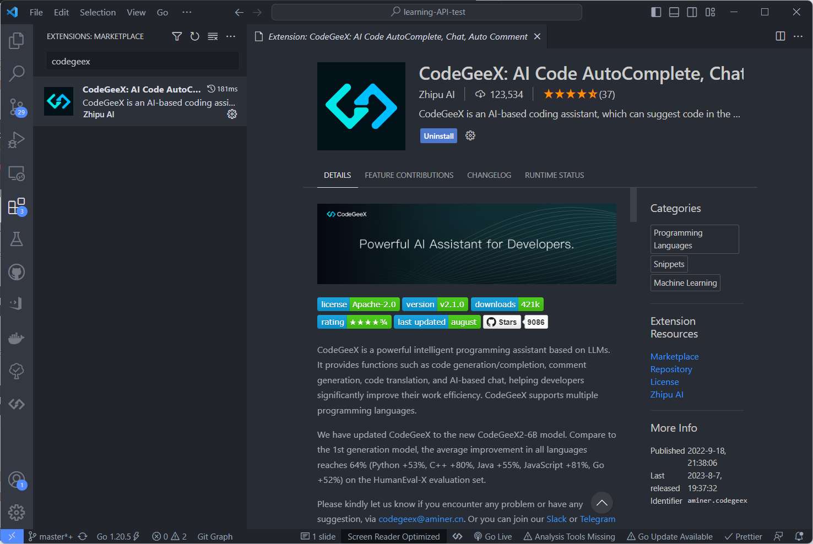
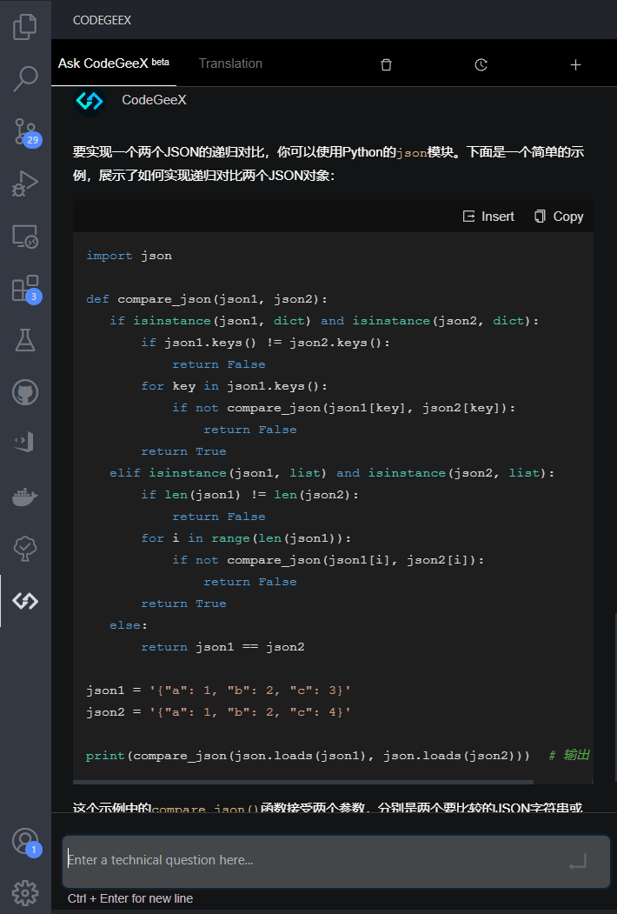
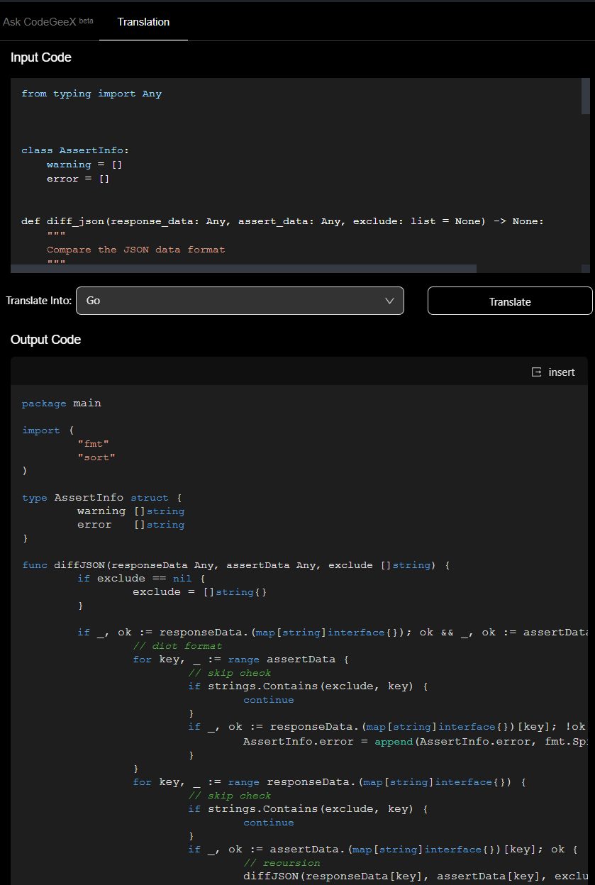
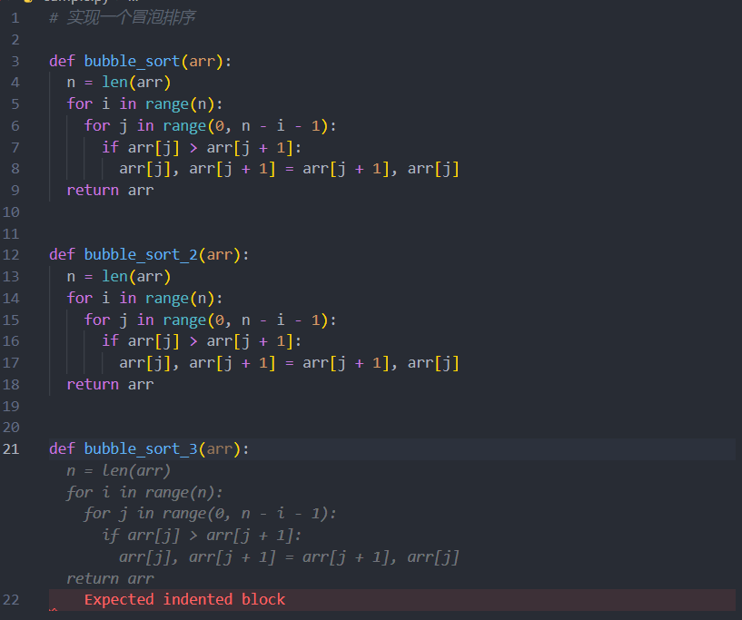

# 开发效率工具CodeGeeX

CodeGeeX是一个多编程语言代码生成预训练模型。

官方地址：https://codegeex.cn

## CodeGeeX有以下特点

* __高精度代码生成：__ 支持生成Python、C++、Java、JavaScript和Go等多种主流编程语言的代码，在HumanEval-X代码生成任务上取得47%~60%求解率，较其他开源基线模型有更佳的平均性能。

* __跨语言代码翻译：__ 支持代码片段在不同编程语言间进行自动翻译转换，翻译结果正确率高，在HumanEval-X代码翻译任务上超越了其它基线模型。

* __自动编程插件：__ CodeGeeX插件现已上架VSCode插件市场（完全免费），用户可以通过其强大的少样本生成能力，自定义代码生成风格和能力，更好辅助代码编写。

* __模型跨平台开源:__ 所有代码和模型权重开源开放，用作研究用途。CodeGeeX同时支持昇腾和英伟达平台，可在单张昇腾910或英伟达V100/A100上实现推理。

## 安装CodeGeeX插件

根据官方网站介绍，CodeGeeX支持VS Code插件和 Jetbrain IDE插件，这里我们以VS Code插件为例，介绍如何使用CodeGeeX。

在VS Code插件市场搜索CodeGeeX，安装即可。

安装之后提示需要登陆，点击登录按钮跳转到网站进行登录即可。

## CodeGeeX使用

__Ask CodeGeeX 功能：__

首先，安装完成VS Code左侧导航栏会多出CodeGeeX的图标，点击即可打开CodeGeeX界面。

我们可以体验一下 Ask CodeGeeX 功能，可以提问一些编程语言相关的问题，CodeGeeX会自动生成代码。

从问题的回答结果来看，质量很高，可以有效减少 百度、谷歌的使用。

__Translate 功能：__

接下来，我们可以使用他的语言转换能力。

直接拿出我的测试代码：

https://github.com/SeldomQA/seldom/blob/master/seldom/utils/diff.py

这个代码主要是用了python实现的json 递归对比，并返回差异部分。代码还是有点复杂的，如果让我用go语言实现一边，估计得要半天时间。

从结果来看，翻译的不错，基本没有语法错误，而且代码风格也差不多。

__Generate Code 功能：__

最后，我们来体验一下他的代码生成能力。

我创建一个 sample.py 文件，写下一行注释： "实现一个冒泡排序"

以上截图中的代码全部由CodeGeeX自动联想，是我全程按tab键生成的。

## 总结

总结起来就是一句话：CodeGeeX 值得拥有，妥妥的开发效率提升工具。