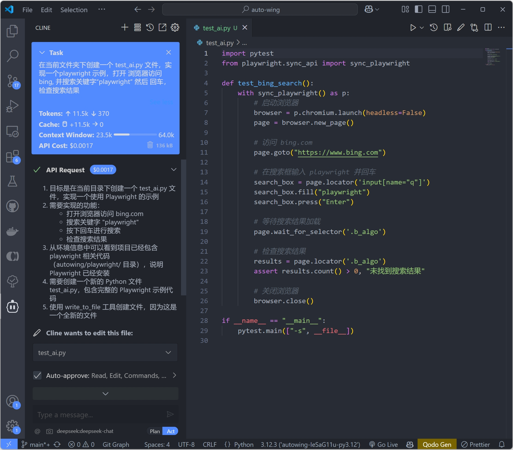
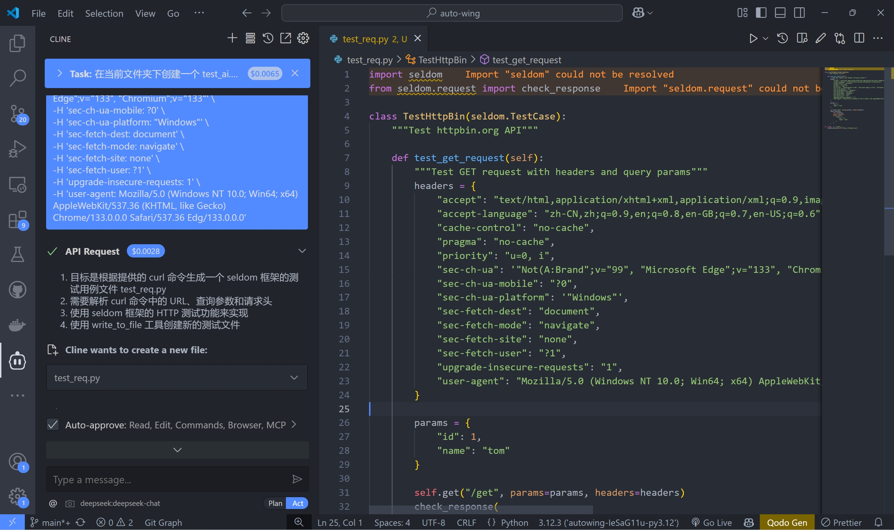
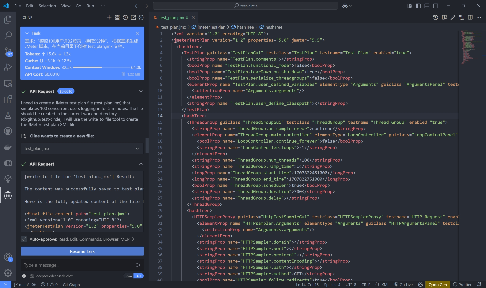
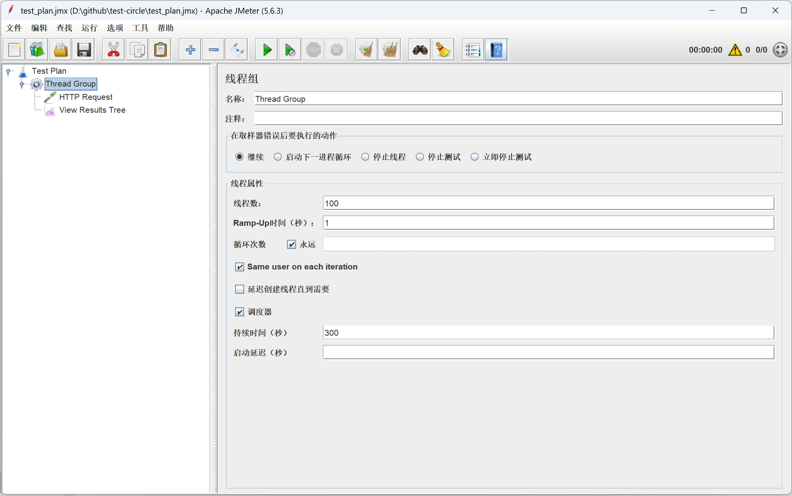

## Deepseek 可以帮测试工程师完成那些工作

> 从春节前 Deepseek 开始火爆全网，我们几乎每天都看到 Deepseek 的新闻，有介绍 IDE 配置的，有介绍本地部署的。再好的工具也要在工作中用起来才能产生真正的价值，对吧！接下来，我将会总结一下自己的使用。

## 前置条件

1. 充值购买 tokens，并创建 API key。
   Deepseek 开放平台: https://platform.deepseek.com/

2. VScode 安装 cline 插件，并添加 Deepseek 模型。

## 生成功能用例

> 在日常测试工作中，编写功能测试用例会占用我们大量的时间，通过使用 AI 可以提高效率，同时也可以做到用例的补充。

* 登录功能

输入一段需求描述：“用户登录功能需要支持手机号+验证码和邮箱+密码两种方式，且密码错误 3 次后锁定账户 5 分钟”

DeepSeek 可以生成如下测试用例：

```bash
1. 验证用户使用正确手机号+验证码登录成功。
2. 验证用户使用正确邮箱+密码登录成功。
3. 验证密码输入错误 3 次后账户锁定 5 分钟（每次错误提示剩余尝试次数）。
4. 验证锁定期间无法登录，5 分钟后自动解锁。
5. 验证验证码过期后登录失败。
```

* 边界条件自动补充

输入：“输入框允许 1-100 的整数”

DeepSeek 自动补充测试用例：

```bash
1. 输入 0 → 预期：报错。
2. 输入 1 → 预期：通过。
3. 输入 100 → 预期：通过。
4. 输入 101 → 预期：报错。
5. 输入非整数（如 12.5）→ 预期：报错。
```

## 自动化测试脚本编写

> 如果你是自动化测试工程师或者测试开发，那么编写自动化测试用例也会占用大量的时间。借助于 AI，这方面的提升蹭蹭的提高。

* 自动生成 playwright 脚本。



* 自动生成接口测试用例。

通过浏览器复制 cURL 命令，然后丢给 AI 来生成脚本。



以前我们认为自动化测试带录制功能是比较高效的，接口测试工具提供格式转换是很有用的，但是在 AI 面前都显得不那么有用了。

## 编写性能测试脚本

谁说 AI 只能写自动化测试脚本，性能脚本也一样。JMeter 界面配置用例也比较繁琐。当然也可以通过 AI 来生成 `xx.jmx` 脚本



然后，通过 JMeter 客户端打开 `xx.jmx` 脚本就可以用了。



当然，如果是 locust 的话，直接就是 python 语言实现的更加的简单。

## 生成测试数据

输入需求：“生成 100 条用户数据，手机号为 13 开头的 11 位数字，邮箱为随机 Gmail”，

DeepSeek 生成示例：

```py
import random

def generate_users():
    users = []
    for _ in range(100):
        phone = "13" + "".join(random.choices("0123456789", k=9))
        email = "user" + str(random.randint(1000,9999)) + "@gmail.com"
        users.append({"phone": phone, "email": email})
    return users
```

当然，这里本质还是代码生成，结合实际工作需求，能生成的代码，就不需要手写，除非写 `描述需求` 比 `写代码` 更复杂。

## 安全测试

安全测试可能是我们日常测试中会忽略的一个方面，我们也可以借助 AI 帮我们生成相关用例。

* 生成 SQL 注入测试用例

输入需求：“测试登录接口的 SQL 注入漏洞”，

DeepSeek 生成 Payload:

```bash
测试用例：
1. 用户名输入：admin' OR '1'='1' --
2. 密码输入：任意值
预期结果：如果登录成功，说明存在 SQL 注入漏洞。
```

其实，还有更好的方式，就是获得项目的代码，让 AI 帮忙识别代码的安全问题，不过，这个事情我猜测开发会自己做。哈哈。

## 持续集成（CI）脚本

一切脚本都可 AI 生成，当然，也包含了 CI 脚本啦。

* 生成 Jenkins/GitLab CI 配置文件

输入需求：“在 GitLab CI 中运行 Python 测试并生成 Allure 报告”，

DeepSeek 生成 .gitlab-ci.yml 片段：

```yaml
stages:
  - test

pytest:
  image: python:3.9
  stage: test
  script:
    - pip install -r requirements.txt
    - pytest --alluredir=./allure-results
  artifacts:
    paths:
      - allure-results/
```

如果你在工作中有更好，更高效的 AI 使用场景，也欢迎在评论区留言。我们一起探讨更多的 AI 使用，让软件测试工作飞起。
