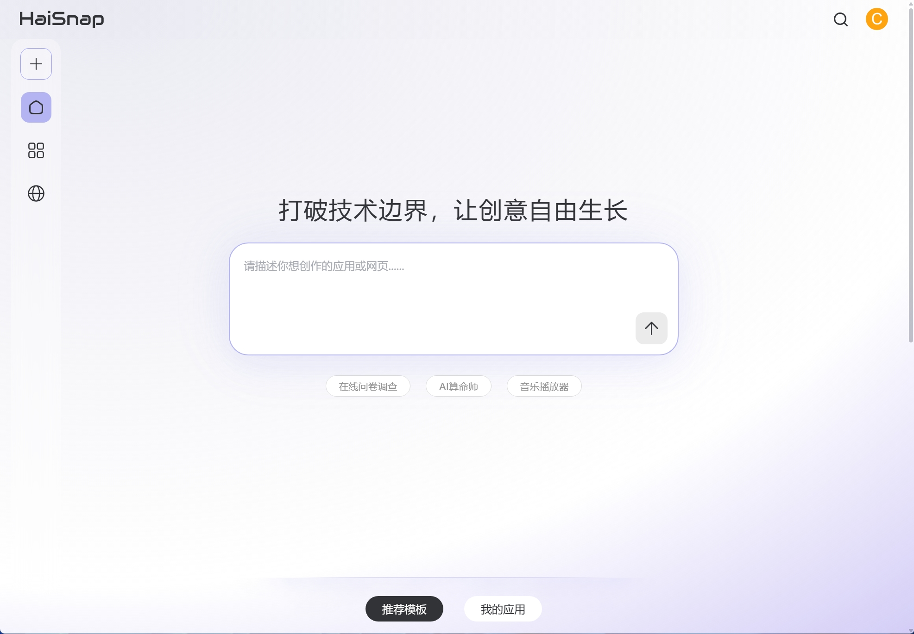
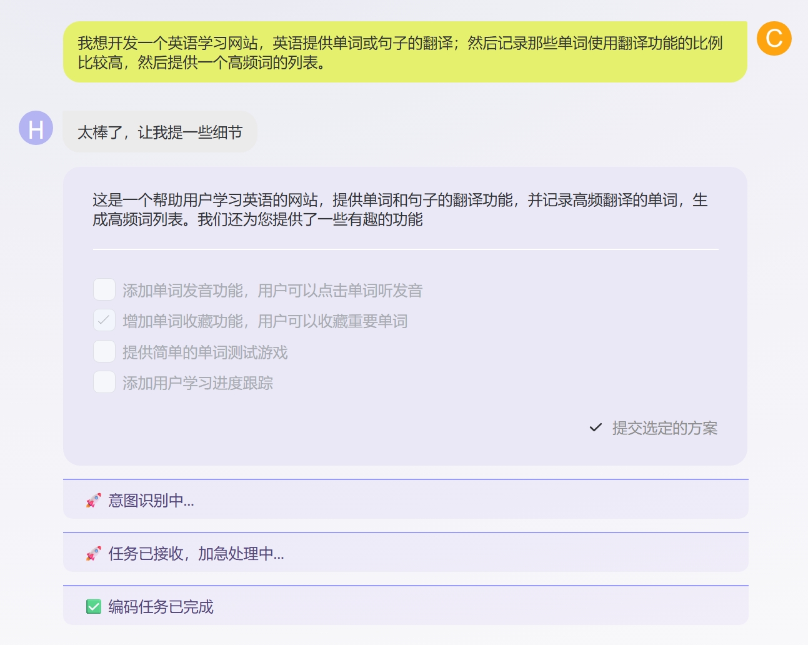
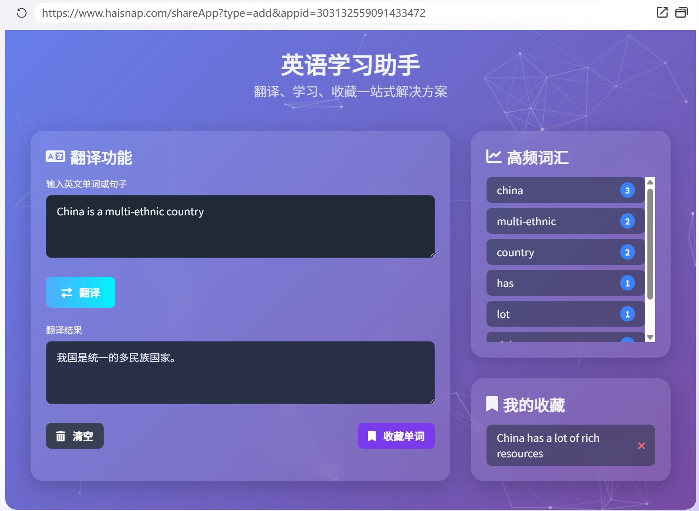
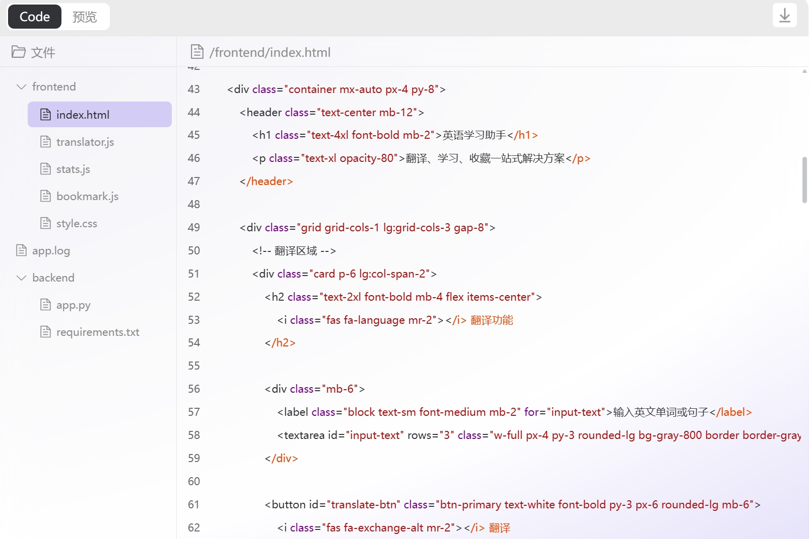
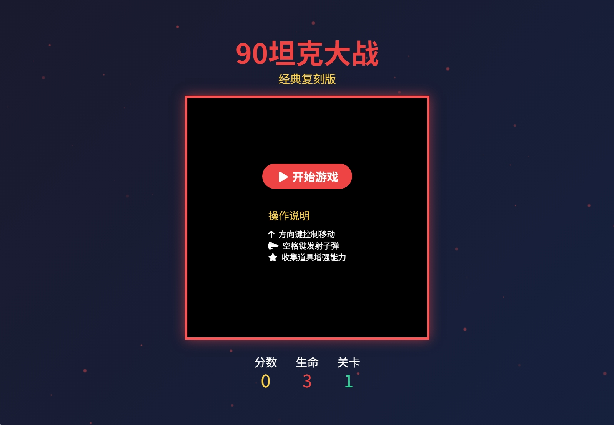

# 炸裂！一句话完成一个网站开发 | 免费

了解朋友都知道，虽然新出的AI工具我们大部分都会体验，真的有价值的项目我们才会进行介绍，有不少些噱头大于实际应用价值的也会选择放弃。

但是，今天要介绍的工具，真的有惊艳到我。没有铺垫，直接体验。



首先，网站提供了一个与所有AI工具一样的对话框，要说有啥不一样，就是对话框比较大。



然后，直接描述需求：

> 我想开发一个英语学习网站，英语提供单词或句子的翻译；然后记录那些单词使用翻译功能的比例 比较高，然后提供一个高频词的列表。

我在使用英语翻译软件的就想有这么个功能，经常需要翻译的高频词拎出来空余时间背单词。

我们看到 AI 对于我的描述还补充了需求。

- [ ] 添加单词发音功能，用户可以点击单词听发音
- [x] 增加单词收藏功能，用户可以收藏重要单词
- [ ] 提供简单的单词测试游戏
- [ ] 添加用户学习进度跟踪 

接下来，就是AI生成了，大概需要几分钟吧。



功能生成好了，我们来体验一下：

首先分别输入两句话翻译：

"China has a lot of rich resources".

"China is a multi-ethnic country"

我们可以看到，右侧单词按照频率进行了排序。而且，还有我勾选附加的收藏功能。



我们可以切换到`code模式`，查看整个项目的代码。

项目区分的了前后端，javascrip + python 组合代码比较简单。

前端的核心功能是翻译功能，我看到代码调用了一个第三方api实现。

```js
...
// 翻译功能
translateBtn.addEventListener('click', async function() {
    const text = inputText.value.trim();
    if (!text) {
        alert('请输入要翻译的内容');
        return;
    }

    try {
        // 显示加载状态
        translateBtn.disabled = true;
        translateBtn.innerHTML = '<i class="fas fa-spinner fa-spin mr-2"></i> 翻译中...';
        
        // 使用MyMemory翻译API
        const response = await fetch(`https://api.mymemory.translated.net/get?q=${encodeURIComponent(text)}&langpair=en|zh-CN`);
        const data = await response.json();
        
        if (data.responseData) {
            const translatedText = data.responseData.translatedText;
            outputText.value = translatedText;
            
            // 保存翻译历史
            saveTranslationHistory(text, translatedText);
            
            // 触发高频词更新
            if (typeof updateWordStats === 'function') {
                updateWordStats();
            }
        } else {
            outputText.value = "翻译失败，请重试";
        }
    } catch (error) {
        console.error('翻译错误:', error);
        outputText.value = "翻译服务暂时不可用";
    } finally {
        // 恢复按钮状态
        translateBtn.disabled = false;
        translateBtn.innerHTML = '<i class="fas fa-exchange-alt mr-2"></i> 翻译';
    }
})；
```

后端的核心是翻译句子拆分和词频统计:

```python
...
# 内存数据存储
players = {}  # 连接池
game_states = {}  # 游戏状态
high_scores = {}  # 最高分存档

@app.route('/api/score', methods=['POST'])
def save_score():
    data = request.get_json()
    score = data.get('score')
    board = data.get('board')
    user_id = request.headers.get('Authorization', 'default')
    
    if not score or not board:
        return jsonify({'success': False, 'error': 'Missing parameters'})
        
    # 更新最高分
    current_high = high_scores.get(user_id, 0)
    if score > current_high:
        high_scores[user_id] = score
        
    # 保存游戏状态
    game_states[user_id] = {
        'board': board,
        'score': score,
        'highScore': high_scores[user_id]
    }
    
    return jsonify({
        'success': True,
        'highScore': high_scores[user_id]
    })
```

就算无法完全满足我们的需求，在此基础上修改至少节省了一天时间（注，前端样式调整起来是很浪费时间的）。

可惜的是代码只能语言，不能在线编辑，如果可以的话本地开发环境都不用搭建了，我们可以将项目代码下载下来继续开发。

最后，我又让AI帮我开发了一个《90坦克大战》去找找我童年的回忆。



你还不去体验。

体验地址：https://www.haisnap.com/
