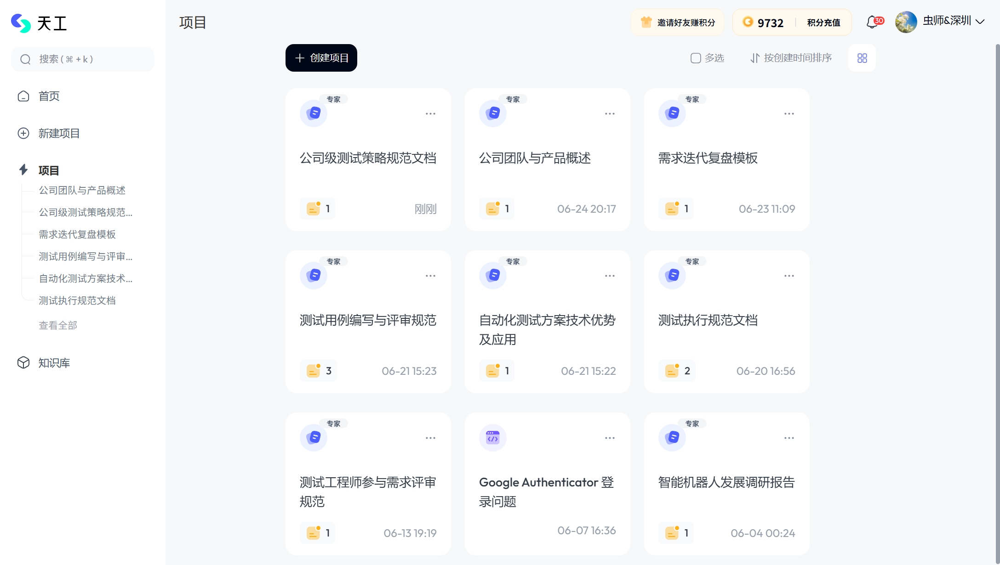
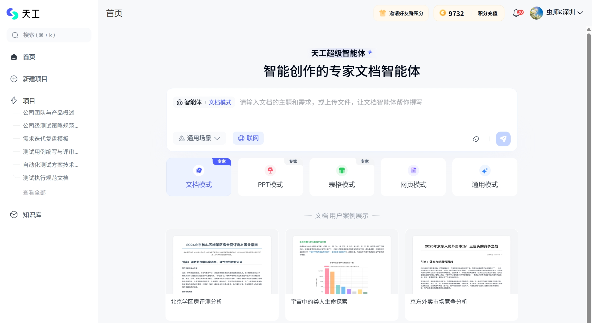
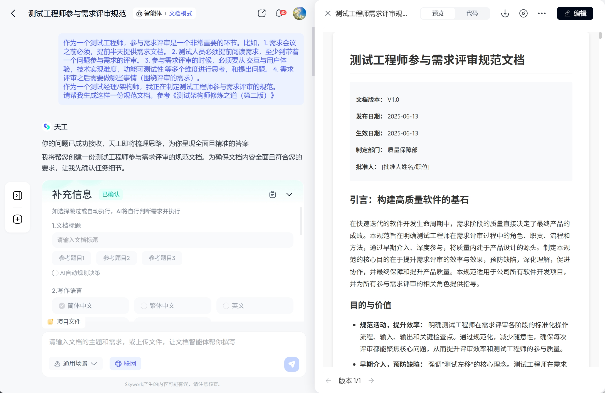

# AI智能体-真正的生产力工具

## 背景

背景是这样的，我需要制定一些公司测试规范性文档，平时习惯于用Qwen3，最近严重怀疑是不是被降智了，就是感觉它的回答既简短、又没深度，非常敷衍。于是，尝试用了一下天工，非常实用。

网址：https://www.tiangong.cn/


## 使用

01. 首先，我的使用频率不高，毕竟不是纯文字工作者，以下是我最近生成的一些文档。



02. 使用方式非常简单，天工支持文档、PPT、表格和网页等格式。我目前只用于生成文档。



03. 描述你的需求，建议先在本地描述好你的需求，参考格式：

```shell
我是一名软件测试工程师。

我需要完成以下工作：
1. ..
2. ..
3. ..

参考资料：《测试架构师修炼之道（第二版）》

```

总之，越详细越好，每次使用都消耗积分。天工智能体在生成的过程中还会让你确认一些选项，或补充一些信息。接下来，就是生成的过程了，大概几分钟到十几分钟的时间，一篇有深度的文档就生成好了。





## 总结


首先，AI智能体除了天工，还有 `Manus`、`flowith`、`lovart` 等。从我的个人体验来看，在文档生成方面，AI智能体要比大模型高一个级别。如果大模型写的是中学作文，那么AI智能体相当于作家水平，可以直接发表赚稿费的那种。

而且，天工每天可以免费领取1500积分，基本上可以满足回答一个问题。我曾经因为不够还充了几十块钱，感觉使用上没有负担，毕竟我的使用频率很低。
