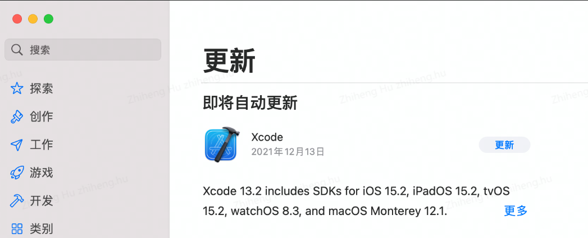
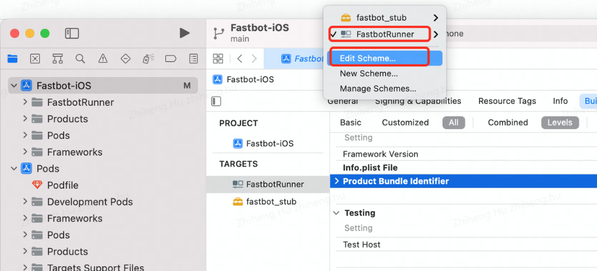
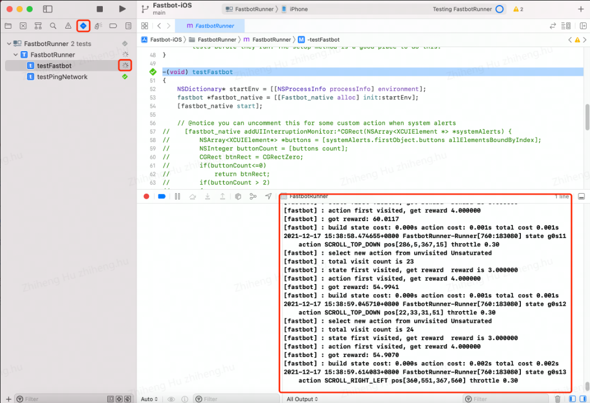

## Monkey工具之fastbot-iOS实践

## 背景

目前移动端App上线后 crash 率比较高， 尤其在iOS端。我们需要一款Monkey工具测试App的稳定性，更早的发现crash问题并修复。

去年移动开发者大会上有参加 fastbot 的分享，所以很自然的就想到Fastbot工具。

## Fastbot-iOS安装配置

__准备工具__

- XCode: iOS开发IDE。
- CocoaPads: 用来管理XCode依赖库的项目。
- Fastbot_iOS: github项目。
- tidevice: iOS 自动化工具。

1. 通过macOS应用商店下载XCode。



2. 安装cocoapods 

```shell
> sudo gem install cocoapods -v=1.8.1
```

3. 克隆`fastbot_iOS`项目，并初始化

```shell
> git clone https://github.com/bytedance/Fastbot_iOS
> cd Fastbot_iOS
> cd Fastbot-iOS && pod install --repo-update
```

> `Fastbot_iOS` 是克隆的项目目录，`Fastbot-iOS`是项目下面的子目录。

5. 通过Xcode 打开项目`Fastbo-iOS`项目。

https://github.com/bytedance/Fastbot_iOS

> 具体配置查看github项目中的《中文手册》，操作步骤非常详细。


### 运行测试（XCode）

1. 点击顶部`FastbotRunner` 弹出菜单，选择`Edit Scheme...` 选项。



在`Scheme`中设置参数，参考表格：

|字段 | 说明 | 示例 |
|:---|:---|:---|
|BUNDLEID |被测试App的 Bundle ID | com.apple.Pages |
|duration |测试时长，单位分钟 |240 |
|throttle|操作间隔，单位毫秒| 300|
|launchenv| 启动测试App的环境变量，一般为空，或者以 ':'分割的key=value形式| isAutoTestUI=1:=AutoTest|


3. 执行测试

点击`testFastbot` 按钮，开始运行Monkey测试。你可以在手机端看到被测试App以及启动，并开始自动执行操作。




## 运行测试（tidevice）

tidevice是阿里开源的iOS自动化测试工具，其实叫自动化工具有点不准确。他本质上有点像android 的 `adb` 工具，可以理解为PC与iOS之间的通信工具。提供了一些非常有用的功能，查看设备信息、安装卸载应用，当然，最主要的是可以执行`XCTest`。

github: https://github.com/alibaba/taobao-iphone-device


1. 安装tidevices 

```shell
> pip install -U tidevice
```

2. 使用tidevice检查连接的设备udid

```shell
> tidevice list
List of apple devices attached
xxxx-xxxxxxxxxxx iPhone USB
```


3. 检查是否安装`FastbotRunner-Runner` App。

```
> tidevice ps --json
[
    {
        "pid": 11549,
        "name": "FastbotRunner-Runner",
        "bundle_id": "bytedance.FastbotRunner.name.xctrunner",
        "display_name": "FastbotRunner-Runner"
    },
]
```

> 前参考前面fastbot-iOS《中文手册》，他会详细说明如何在手机上安装`FastbotRunner-Runner` APP。这一步极为重要。

4. 通过`tidevices` 运行测试

```shell
> tidevice xctest -B bytedance.FastbotRunner.name.xctrunner -e BUNDLEID:com.apple.Pages -e duration:480 -e throttle:300  --debug
```
> 参考前面，Scheme参数说明。


### 遇到的问题

1. fastbot是如何遍历的？

这是我们想搞懂的一个问题，以便于看看是否有可配置的选项。


__fastbot- 算法原理__

> 我们将页面的 GUI 信息抽象成模型中的 State，将执行的动作抽象成模型中的 Action，通过 State 作为图的节点，Action 作为图的边，连接形成有向有环图模型。遍历决策想法上源于 Alphago 的蒙特卡洛搜索树的思想，此基础上我们也使用了其他强化学习的方法，设计了 N 步 Q-Learning 算法和基于页面变化程度的 reward function，为页面下每个 Action 计算出相应的 Q 值，基于 Q 值选取最优动作。
...
我们选择使用好奇心强化学习的方法来解决奖励稀疏问题，同时结合自然语言处理对页面信息做特征抽象，在原有 reward function 基础上增加好奇心（Curiosity）的 reward

上面摘自《奔跑吧！智能Monkey之Fastbot跨平台》 一文，所以不用做过多的人工配置或干预。随着不断执行App 的遍历，也是不断强化遍历的工具的学习的过程。

2. fastbot不识别元素或无法解析DOM tree怎办?

这一点对我们尤为重要，因为我们的App中大量页面是用flutter实现的，做传统的UI自动化是非常麻烦。

> 在 Fastbot 低能耗、低耗时、高性能前提要求下，我们优先选用最基础的图像处理技术来识别 GUI 界面信息，可以在毫秒级完成构建一个页面的信息。

上面摘自《奔跑吧！智能Monkey之Fastbot跨平台》 一文， 强烈建议阅读原文，多读几遍，受益匪浅。

3. 如何同时执行多个设备？

tidevice的作者给了答案，通过设备的`udid`号区分就可以了。当你的PC连接多个手机时。

```shell
> tidevice list
List of apple devices attached
xxxx-xxxxxxxxxxx iPhone USB
yyyy-yyyyyyyyyyy iPhone USB
```

* 启动x设备

```shell
> tidevice -u xxxx-xxxxxxxxxxx xctest -B bytedance.FastbotRunner.name.xctrunner -e BUNDLEID:com.apple.Pages -e duration:480 -e throttle:300  --debug
```

* 启动y设备

```shell
> tidevice -u yyyy-yyyyyyyyyyy xctest -B bytedance.FastbotRunner.name.xctrunner -e BUNDLEID:com.apple.Pages -e duration:480 -e throttle:300  --debug
```

3. 测出了崩溃怎么办？

我一开始想当然的以为测出了崩溃工具就停止呗，以至于我跑了两天都以为工具没发现崩溃。后来，在官方的微信群里问过才知道，崩溃后重新启动App继续执行。直到设置的运行时间结束。

4. 如何获取崩溃报告？

这一步也很重要，总不能崩溃就崩溃了吧！monkey的执行过程我们又无法复现。我一开始以为日志藏在`tidevice` 中，因为他运行的过程（加`--debug`参数）中会打印大量的日志。我又没办法把这个日志写到文件中(命令结尾加 `> log.txt` 无用），花了半天时间改 `tidevice` 的代码，在logger的地方写文件。

后来，发现这么做没有卵用！`tidevice/fastbot` 相当于是指令的发出者，他只会说：“我发送了一条指令哦！” 这样的废话，至于 App 接收到指令后是否执行，是否引起崩溃，无法给到 `tidevice/fastbot` 工具。

但是，作者说`fastbot`工具可以集成报告。

https://github.com/bytedance/Fastbot_iOS/issues/2

我觉得，他也只是说说，因为这是8月份的问题，当然这么好用的工具愿意开源就很好了，不要不知好歹。可能他又有别的KPI要忙~！

那么，我们的App是有集成`firebase`的SDK，如果App崩溃，那么会上报日志到`firebase`平台，可以在`firebase`平台上统计分析。


> 这是我最近一周的实践经验，希望能帮到你！我是虫师，关注`测试圈TC`，带走我~！


