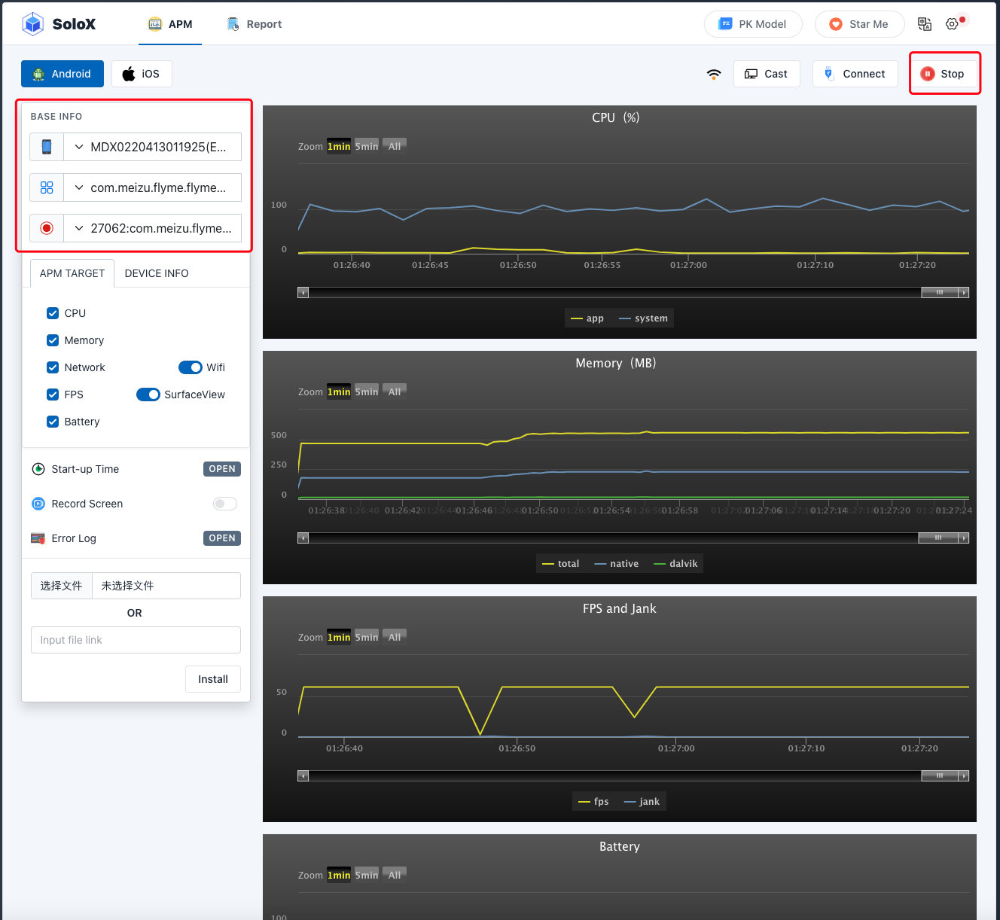
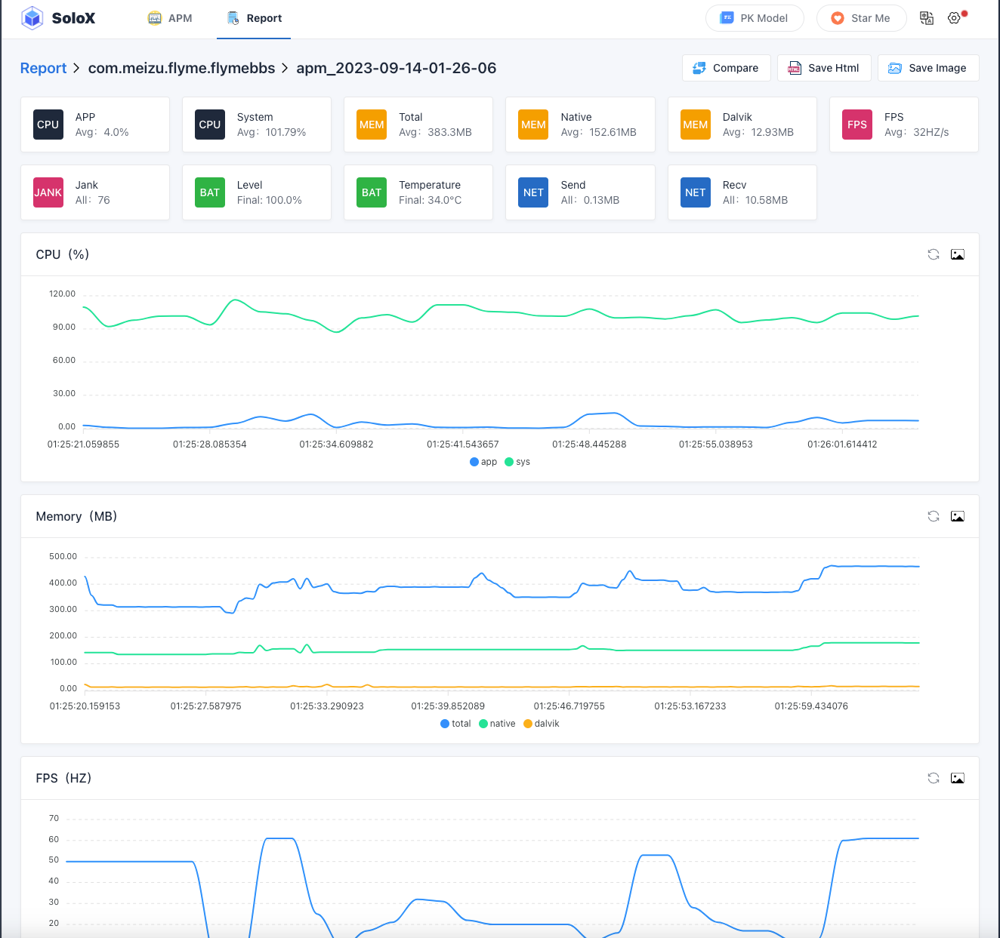

## solox 性能数据实时收集工具

### 前言

关于App性能测试工具非常见，比如腾讯的GT早已不在维护，印象比较深的是几年前用过的一款收费工具叫gamebench，支持Android/iOS平台。刚刚搜索了一下，目前比较主流的是 PerfDog？同样是腾讯出的收费工具。有使用过的同学可以评价一下。本文要介绍的工具是SoloX， 是一款开源 Android/iOS 性能数据实时收集工具。

## Solox 优缺点

__优点__

* 无需ROOT/越狱: Android设备无需ROOT，iOS设备无需越狱。高效解决Android & iOS性能测试分析难题。

* 数据完整性: 可提供FPS、Jank、CPU、GPU、Memory、Battery 、Network等性能参数，这些您都可以轻松获得。

* 美观的报告看板: 报告看板，您可以随时随地存储、可视化、编辑、管理和下载使用任何版本的SoloX收集的所有测试数据。

* 好用的监控设置: 支持在监控过程中设置告警值、收集时长、访问其他PC机器的移动设备。

* 比对模式: 支持两台移动设备同时对比测试。

* API收集性能数据: 支持python、API收集性能数据，帮助用户轻松集成在CI/CD流程。

__缺点__

* 数据准确性不足：perfdog采用的方式是安装一个监听app在测试设备上，用原生的api收集性能数据再返回给工具端，这种方式肯定是更靠谱的（数据准确才是最重要的，条件允许我建议使用perfdog）


### 安装与使用

* 要求

python 3.10 +

* pip安装

```bash
pip install solox
```

Solox 的使用分两种模式。

__默认模式__

默认模式比较简单，启动 solox 服务，将手机设备连接到 PC，然后在手机上针对某款App进行操作，即可实时看到他的性能指标了。

* 启动服务

```bash
sudo python -m solox
```

注：mac OS/ Linux 用户可能需要加sudo 权限。

* 实时收集页面



左侧选择收集的设备和App，以及勾选要显示的指标，然后选择开始收集。 

* 测试报告界面



停止收集，点击 report页面，可以分析收集的指标。

__自定义模式__

自定义模式，通过solox提供的API收集App的性能。

```py
from solox.public.apm import APM
from solox.public.common import Devices

d = Devices()
pids = d.getPid(deviceId='ca6bd5a5', pkgName='com.bilibili.app.in') # for android

apm = APM(pkgName='com.bilibili.app.in',platform='Android', deviceId='ca6bd5a5', 
          surfaceview=True, noLog=True, pid=None)

# ************* 收集单个性能指标 ************* #
cpu = apm.collectCpu() # %
memory = apm.collectMemory() # MB
flow = apm.collectFlow(wifi=True) # KB
fps = apm.collectFps() # HZ
battery = apm.collectBattery() # level:% temperature:°C current:mA voltage:mV power:w
gpu = apm.collectGpu() # % only supports ios

if __name__ == '__main__':
     apm.collectAll() # 会生成HTML报告
```

## Solox工作原理

虽然没有找到太多文章介绍Solox的工作原理，我们可以通过 Solox 的依赖库窥探一二。

```
flask>=2.0.1,
Jinja2==3.0.1,
Werkzeug==2.0.3,
Flask-SocketIO==4.3.1,
python-engineio==3.13.2,
python-socketio==4.6.0,
requests,
logzero,
fire,
tqdm,
xlwt,
pyfiglet,
tidevice==0.9.7,
psutil,
opencv-python
```

flask和Jina2用于实现一个Web服务页面提供性能指标的显示。Werkzeug就Flask使用的底层WSGI库。

如果想实时的显示，需要用websocket进行通信，Flask-SocketIO、python-socketio、python-engineio 用例实现WebSocket。

tidevice 用于PC于iOS设备之间的连接，adb用于PC与Android设备的连接。

psutil是一个跨平台库能够轻松实现获取系统运行的进程和系统利用率（包括CPU、内存、磁盘、网络等）信息。

opencv-python（Open Source Computer Vision Library）是一个基于开源发行的跨平台计算机视觉库，它实现了图像处理和计算机视觉方面的很多通用算法。我们可以用于 app 元素的图像识别、对比等。

剩下的几个库非核心，就不说明了。
