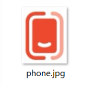

## appium图像识别之images-plugin插件


在进行App自动化测试的过程中，由于页面的复杂性，需要根据页面的技术实现，通过上下文来切换不同的定位类型，给定位元素的稳定性带来了不小的挑战；图像识别技术则不依赖于页面本身是用什么技术实现的，只要能识别图片上的元素即可定位，从而成了未来探索的一个方向。appium提供了一些方法利用图像识别来定位元素。


## images-plugin插件

此插件支持的 `-image` 定位器策略，可以通过appium指定想要定位的元素的图片文件，如果appium可以找到与你的图片匹配的屏幕区域，它会将有关该区域的信息包装为标准WebElement并将其发送回appium客户端。


首先，安装appium images plugin插件。

```bash
appium plugin install images
```

查看已安装的appium插件。

```bash
appium plugin list --installed

✔ Listing installed plugins
- images@2.1.8 [installed (npm)]
```

启动 `appium server` 时指定使用image插件。

```bash
appium server --address '127.0.0.1' -p 4723  --use-plugins=images
```

以App 为例：


首先，将要定位的页面按钮，截图并保存为图片文件`phone.png`。



然后，编写appium自动测试脚本。


```python
import os
import base64
from appium import webdriver
from appium.options.android import UiAutomator2Options
from appium.webdriver.common.appiumby import AppiumBy


capabilities = {
    "automationName": "UiAutomator2",
    "platformName": "Android",
    "appPackage": "com.meizu.flyme.flymebbs",
    "appActivity": "com.meizu.myplus.ui.splash.SplashActivity",
    "noReset": True,
}

appium_server_url = "http://127.0.0.1:4723"
options = UiAutomator2Options().load_capabilities(capabilities)
driver = webdriver.Remote(command_executor=appium_server_url, options=options)

driver.update_settings({"fixImageTemplatescale": True})
driver.implicitly_wait(10)

current_dir = os.path.dirname(os.path.abspath(__file__))
image_path = os.path.join(current_dir, "phone.png")

with open(image_path, 'rb') as png_file:
    b64_data = base64.b64encode(png_file.read()).decode('UTF-8')

driver.find_element(AppiumBy.IMAGE, b64_data).click()

```

__代码说明__

update_settings()方法用于设置当前会话，fixImageTemplatescale为True，详见后面的表格说明。

image_path变量用于定义定位图片的路径，通过 open()方法打开文件，并使用read()方法读取文件内容，然后，使用base64.b64encode()对文件进行编码。最后，使用`-image`方式定位图片并进行click()操作。


## 基于图像定位支持的操作

通过图片定位到的元素，仅支持以下操作。

  * click
  * isDisplayed
  * getSize
  * getLocation
  * getLocationInView
  * getElementRect
  * getAttribute
    * ovisual
    * oscore

这些操作支持在“图像元素”上，因为它们是涉及屏幕位置的操作。其他操作（比如sendKeys）无法支持，因为根据提供的定位图像，appium只知道是否有一个屏幕区域与其视觉匹配，appium无法将这些信息转化为特定驱动程序的UI元素对象，因此无法图像坐标元素的输入。

以上支持的操作在python-client中的API如下：

```python
...
driver.update_settings({"getMatchedImageResult": True})
...

el = driver.find_element(AppiumBy.IMAGE, b64_data)
# 是否显示
is_disp = el.is_displayed()
print("是否显示：", is_disp)

print("元素的尺寸：", el.size)
print("元素在可渲染画布中的位置：", el.location)
print("获取元素相对于视图的位置：", el.location_in_view)
print("起始坐标-结束坐标：", el.rect)

# 返回匹配的图像作为base64数据, 需要设置 getMatchedImageResult为true
visual = el.get_attribute("visual")
print("visual：", visual)

# 自Appium 1.18.0起，返回相似度分数为浮点数，范围在[0.0, 1.0]之间。
score = el.get_attribute("score")
print("score：", score)

# 点击
el.click()
```


## 参数设置

由于通过图像查找元素依赖于图像分析软件与appium的截图功能，以及你提供的图片，appium提供了一些设置，帮助你调节此功能，在某些情况下可能加快匹配速度或使其更准确。


具体使用参考前面的方法：

```python
driver.update_settings({"getMatchedImageResult": True})
driver.update_settings({"fixImageTemplatescale": True})
```
