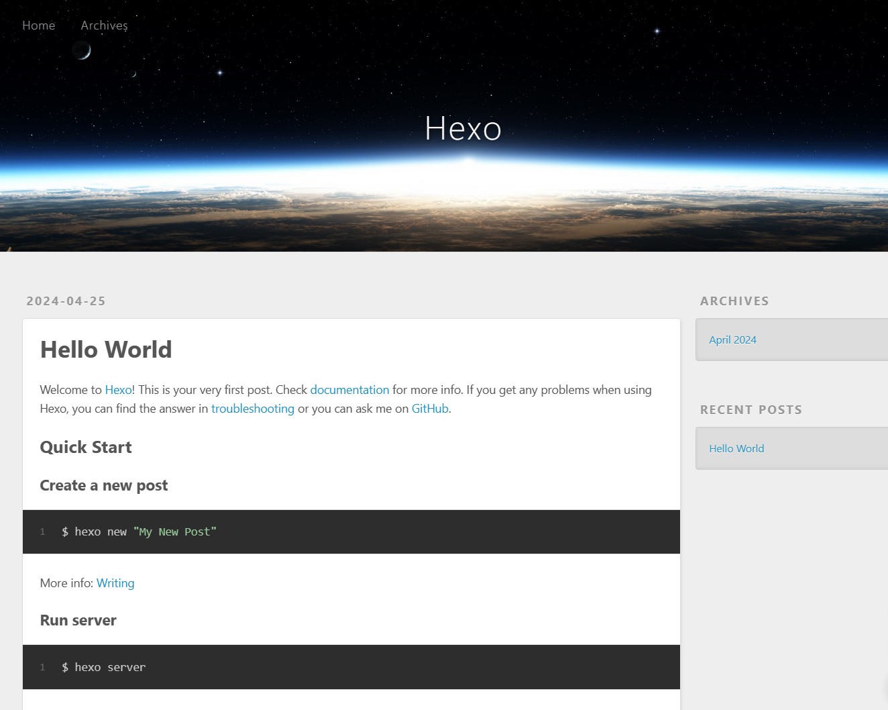
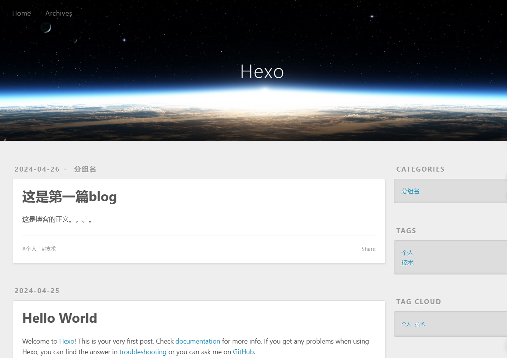
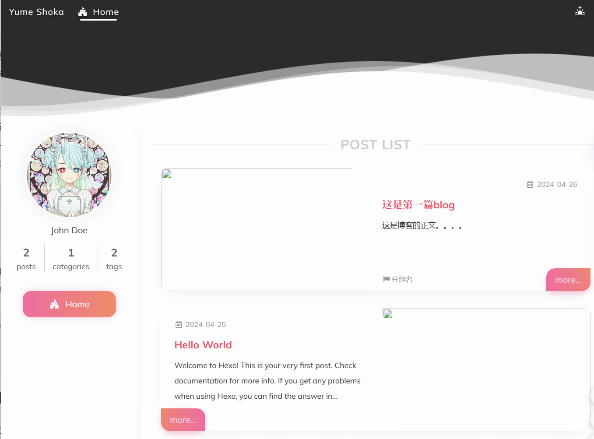

## Hexo：快速搭建网站的利器

> 作为一个长期写作习惯的技术人员，都有想法要自己申请域名搭建一个博客网站，如果用一般的网站开发技术，设计数据库、开发后端API、设计前端页面显然过重了，个人博客不需要上这套技术。`WordPress` 是个很好的解决方案，世界上有大量的网站基于`WordPress` 开发，不过，我们今天的主角是 `Hexo`，他的安装和使用更加简单。

Hexo作为一款高效、简洁的博客框架，能够帮助我们快速搭建起一个个性化的博客网站。


### Hexo 特点

* __超快速度__

Node.js 所带来的超快生成速度，让上百个页面在几秒内瞬间完成渲染。

* __支持 Markdown__

Hexo 支持 GitHub Flavored Markdown 的所有功能，甚至可以整合 Octopress 的大多数插件。

* __一键部署__

只需一条指令即可部署到 GitHub Pages, Heroku 或其他平台。

* __插件和可扩展性__

强大的 API 带来无限的可能，与数种模板引擎（EJS，Pug，Nunjucks）和工具（Babel，PostCSS，Less/Sass）轻易集成

### 安装与使用

__1. 安装Hexo及其依赖__

首先，需要已经安装了`Node.js`，这个工具是Hexo的基础依赖。然后，以通过`npm`来安装`Hexo`命令行工具。在终端中输入以下命令：

```bash
npm install -g hexo-cli
```

__2. 初始化博客项目__

接下来，我们需要初始化一个新的Hexo博客项目。选择一个文件夹作为存放Hexo站点的文件夹，然后在终端中进入此文件夹，执行以下命令：

```bash
hexo init myblog
```

其中，`myblog`是我们为新站点项目的命名，可以根据个人喜好进行修改。执行完该命令后，Hexo会自动生成一个包含必要文件和目录结构的博客项目。

进入新创建的站点目录：

```bash
cd myblog
```

__3. 配置博客站点__

Hexo站点的主要配置文件为`_config.yml`。在该文件中，我们可以设置站点的名称、描述、标签、第三方社交媒体等。

```yaml
# Site
title: Hexo  # 网站标题
subtitle: ''
description: ''
keywords:
author: John Doe  # 网站作者
language: en   # 语言
timezone: ''

# URL
## Set your site url here. For example, if you use GitHub Page, set url as 'https://username.github.io/project'
url: http://example.com
permalink: :year/:month/:day/:title/  # 文章路径规则
permalink_defaults:
pretty_urls:
  trailing_index: true # Set to false to remove trailing 'index.html' from permalinks
  trailing_html: true # Set to false to remove trailing '.html' from permalinks

# Directory
source_dir: source  # 资源目录
public_dir: public
tag_dir: tags
archive_dir: archives
category_dir: categories
code_dir: downloads/code
i18n_dir: :lang
skip_render:

...

# Extensions
## Plugins: https://hexo.io/plugins/
## Themes: https://hexo.io/themes/
theme: landscape   # 更改主题

```

大部分配置不需要修改，不过，我们需要花点儿时间了解每个配置的作用。


__4. 启动本地服务器预览__

在Hexo项目根目录中，我们可以启动本地服务器来实时预览博客效果。执行以下命令：

```bash
$ hexo server
INFO  Validating config
INFO  Start processing
INFO  Hexo is running at http://localhost:4000/ . Press Ctrl+C to stop.
```

此时，Hexo将在本地启动一个服务器，并在默认浏览器中打开预览页面。我们可以在浏览器中实时查看博客的样式和布局，以便进行进一步的调整和优化。



__5. 创建和发布文章__

`Hexo`使用`Markdown`文件来创建文章。在博客项目的`source/_posts`目录下，我们可以创建新的Markdown文件来撰写文章。每个Markdown文件对应一篇博客文章，文件名通常采用`标题-日期`的格式。

在Markdown文件中，我们可以使用Markdown语法来编写文章的内容，包括标题、段落、列表、链接、图片等。完成文章编写后，保存文件即可。

在`source/_posts` 目录下创建`hello-blog.md`文件。

```bash
---
title: 这是第一篇blog
date: 2024-04-26
tags:
- 个人
- 技术
categories:
- 分组名

---

这是博客的正文。。。。

```



要发布文章，我们只需要在终端中执行以下命令：

```bash
hexo generate
```

该命令将根据Markdown文件生成静态的HTML文件，并将它们存放在public目录下。此时，我们可以通过访问本地服务器的地址来查看已发布的文章。

__6. 自定义主题和扩展功能__

Hexo支持丰富的主题和插件，可以让我们轻松实现博客的个性化定制和功能扩展。

我们可以在Hexo的主题市场中挑选一个喜欢的主题，并将其应用到博客中。

https://hexo.io/themes/

我随便找了个主题来替换，博客瞬间焕然一新。




同时，我们还可以安装各种插件来增强博客的功能，如添加评论系统、集成社交分享等。

https://hexo.io/plugins/


### 总结

此外，为了提升博客的性能和用户体验，我们还可以对博客进行优化，如压缩图片、使用CDN加速等。

总之，Hexo作为一款高效、简洁的博客框架，能够帮助我们快速搭建起一个个性化的博客网站。通过简单的安装和配置，我们就可以轻松创建、管理和发布文章，实现博客的个性化定制和功能扩展。如果你也想拥有一个属于自己的个人博客，不妨试试Hexo吧！

