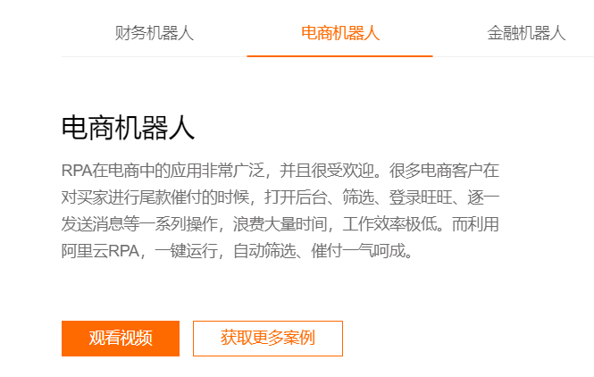

# RPA 机器人流程自动化


## 概念

* PRA: Robotic process automation，即 机器人流程自动化。

> wikipedia：Robotic process automation (RPA) is a form of business process automation technology based on metaphorical software robots (bots) or on artificial intelligence (AI)/digital workers.[1] It is sometimes referred to as software robotics (not to be confused with robot software).

维基百科的解释非常模糊。

> 机器人过程自动化（RPA）是一种软件技术，它使构建、部署和管理软件机器人变得容易，这些软件机器人模拟与数字系统和软件交互的人类动作。就像人一样，软件机器人可以理解屏幕上的内容、完成正确的击键、导航系统、识别和提取数据，以及执行各种定义的操作。软件机器人可以比人更快、更稳定地完成这项工作，不需要站起来伸展一下身体或喝杯咖啡休息一下。

好像明白了，又好像没太懂。



阿里的RPA案例讲的比较清楚。

相信玩游戏的同学都执行游戏外挂，游戏里面有很多大量重复的操作，比如刷怪，跑商，日常任务等，可以通过游戏外挂自动的帮你完成这些操作。

那么我们在日常工作中其实也有大量重复的工作，比如早上一到公司先登录沟通工具，查看一下邮件，然后，提醒客户尾款时间等等。

以下是我个人理解：

* RPA应该是模拟用户操作的，他并不是软件本身帮你简化了流程。比如，我通过OA系统请假，以前要经过5个步骤。现在，并不是OA系统本身简化了流程，只需要一步搞定；而是由一个机器人，自动的帮我完成这5个步骤，而且，你可以看到他操作5步的过程。

* RPA应该是跨应用软件的，也就是说他可以在不同的应用软件之间进行操作。比如，打开浏览器复制商品链接，通过沟通工具发送给客户，再打开excel记录客户的重要信息。

* RPA应该更加智能，比传统的自动化工具更加智能。 

## RPA-python

接下来，介绍一个开源RPA工具。

https://github.com/tebelorg/RPA-Python

来看看，他提供了哪些功能，当然，首先声明，他对比企业级的RPA工具还是简单很多的。

* pip 安装


```shel
> pip install rpa
```

* 初始化环境

```py
> import rpa as r
> r.init()

[RPA][INFO] - setting up TagUI for use in your Python environment
[RPA][INFO] - downloading TagUI (~200MB) and unzipping to below folder...
[RPA][INFO] - C:\Users\fnngj\AppData\Roaming
[RPA][INFO] - done. syncing TagUI with stable cutting edge version
[RPA][INFO] - now installing missing Visual C++ Redistributable dependency
[RPA][INFO] - MSVCR110.dll is still missing, install vcredist_x86.exe from
[RPA][INFO] - the vcredist_x86.exe file in C:\Users\fnngj\AppData\Roaming\tagui or from
[RPA][INFO] - https://www.microsoft.com/en-us/download/details.aspx?id=30679
[RPA][INFO] - after that, TagUI ready for use in your Python environment
...
```

> 我安装过程出现了，缺少 MSVCP110.dll，在 https://www.dll-files.com/ 网站找到了缺失的文件，下载解压，放到`C:\Windows\system32\` 重启电脑。

## 应用场景

* WEB AUTOMATION 🕸️

```py
import rpa as r

r.init()
r.url('https://www.google.com')
r.type('//*[@name="q"]', 'decentralization[enter]')
print(r.read('result-stats'))
r.snap('page', 'results.png')
r.close()
```

这个例子和selenium 非常类似，通过元素属性定位并操作。


* VISUAL AUTOMATION 🙈

```py
import rpa as r

r.init(visual_automation = True)
r.url('https://www.baidu.com')

r.type('search.png', 'message')
r.click('search_button.png')
r.close()
```

这个例子和sikuli类似，需要预先把操作的元素进行截图，然后基于图片进行操作。


* OCR AUTOMATION 🧿

```py
import rpa as r

r.init(visual_automation = True, chrome_browser = False)
print(r.read('windows.png'))
print(r.read('image_preview.png'))
r.hover('anchor_element.png')
print(r.read(r.mouse_x(), r.mouse_y(), r.mouse_x() + 400, r.mouse_y() + 200))
r.close()
```

> 科普，OCR: Optical Character Recognition，即光学字符识别， 是指电子设备检查纸上打印的字符，通过检测暗、亮的模式确定其形状，然后用字符识别方法将形状翻译成计算机文字的过程。

首先，这个例子不需要启动浏览器，`chrome_browser = False`.

其次，你可以截图一段文字保存为图片`windows.png`，`r.read()` 试着读取图片上的文字，并打印。

或者，使用`r.mouse_x()` 和 `r.mouse_y()` 读取你鼠标的的位置，在运行脚本的过程当中读取你鼠标位置的内容。

* KEYBOARD AUTOMATION 🎹

```py
import rpa as r

r.init(visual_automation = True, chrome_browser = False)
r.keyboard('[alt][space]')
r.keyboard('chrome[enter]')
r.keyboard('[alt]t')
r.keyboard('mortal kombat[enter]')
r.wait(2.5)
r.snap('page.png', 'results.png')
r.close()
```

这个例子很好理解，模拟键盘操作，alt + space 是我调启utools 工具的快捷键，然后输入 chrome 敲enter...

* MOUSE AUTOMATION 🐭


```py
import rpa as r

r.init(visual_automation = True)
r.type(600, 300, 'open source')
r.click(900, 300)
r.snap('page.png', 'results.png')
r.hover('button_to_drag.png')
r.mouse('down')
r.hover(r.mouse_x() + 300, r.mouse_y())
r.mouse('up')
r.close()
```

模拟鼠标进行操作。当然，这些API都是可以混用的，例如，`type()` 既可以是一个web元素，也可以是一个图片，还可以是屏幕桌标位置。


