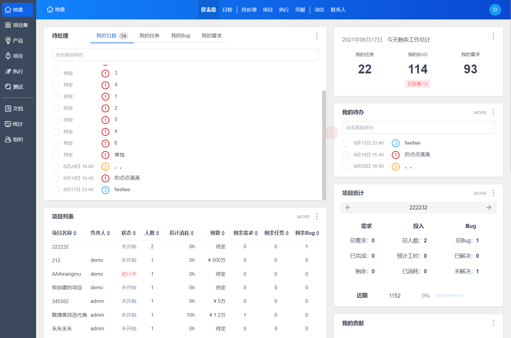
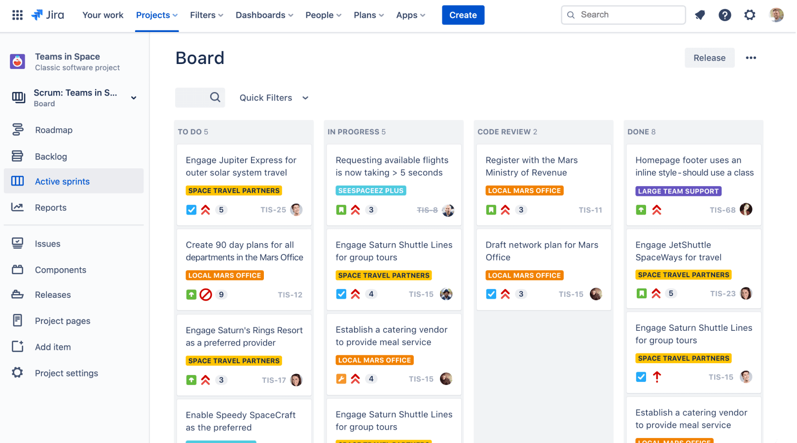
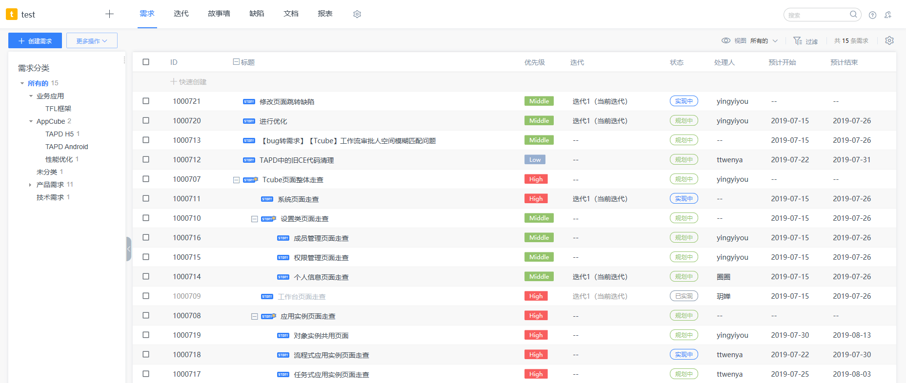
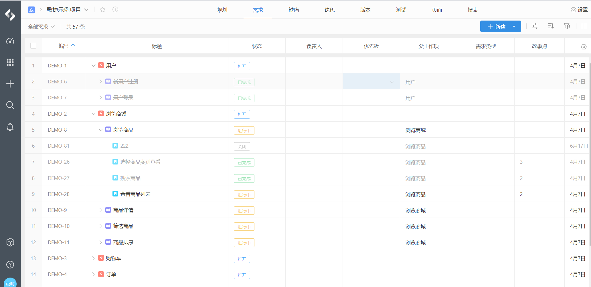

## 主流的项目管理工具

如果有哪些工具和我们的工作息息相关的，那么项目管理工具一定算其中一个，需求管理，缺陷管理，我们几乎每天都要花费时间在上面记录自己的工作。

我来盘点一下自己用的一些项目管理工具。

### 禅道

禅道是我接触的比较早的一款项目管理工具，作者王春生，在阿里时开发了bugfree，后来出来创业，专注于禅道项目，它是比较早的将敏捷的一些思想融入到项目管理工具里面的，我印象比较深入深刻的是它集成了测试用例管理，要知道在那个年代，要想管理测试用例和缺陷必须单独的工具，例如：Bugzilla、TD(TestDirector)/QC(Quality Center)、TestLink。

> 这些工具都是上古时期，测试人员手上的神器，那个年代测试人员还很热衷于这些工具的使用。

### JIRA

JIRA 的历史其实比禅道还要悠久，它也是被国内软件公司广泛使用的项目管理工具，给我的印象就是功能比较复杂，很大原因可能是我英语不好。现在这家公司早期也是使用的JIRA。

### TAPD

TAPD 是腾讯内部孵化出的敏捷管理工具，功能相对来说并不复杂，但每个板块都非常实用，他是我们公司早期内部研发协作平台借（chao）鉴（xi）的主要对象。

### PingCode

最后这一个项目工具，可能不是所有同学都知道，但它是我接触过的项目管理工具里面体验最好的，功能也很强大，我刚注册完他们的平台，第二天客服就给我打电话问使用感受，它是我们公司现阶段内部研发协作平台借（chao）鉴（xi）的主要对象。真不忍心告诉他们，我注册只是为了借鉴。

### Orion

这个你肯定没听说过，因为这是我们公司自己开发的，界面就不贴了，和pingCode很像，但体验就差很多了，有些接口很慢，有些界面风格也不统一，有些功能代码写的还一坨s，我为啥这么说，因为我是项目的早期开发者之一，最近又重新接过了这个项目的维护工作。

* 为什么要自研？

既然有那么多好用的项目管理工具了，为什么要自研？为了部门KPI吗？是也不完全是，初衷是为了更好的服务于研发团队。

比如，我们很早就做了测试环境管理，你可以在需求下面创建一个测试环境，并可以自动部署需求对应的服务。

比如，我们提供了很多测试相关的工具，发送测试报告，填写了需求ID，就可以自动生成报告模板。

再比如，在用例执行过程中提交bug，可自动化填充用例步骤为bug步骤。

得益于整个系统自研，我们可以将各种功能之间的联动做到最优。所以，这还真不是一个KPI项目。

如果，你对我们的项目感兴趣，想挑战各种各样的奇葩开发需求，大到orion项目开发、lark小程序开发、帮HR做个员工积分商城，小到做个excel表格数据清洗脚本。

欢迎投递简历：zhiheng.hu@klook.com

