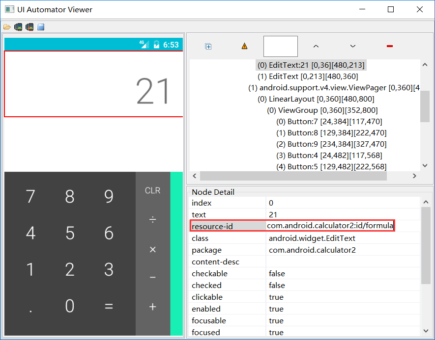

# 非通用移动测试工具


## Android 测试

在android的测试体系里遵循金字塔模型。


* 小型测试是指单元测试，用于验证应用的行为，一次验证一个类。

* 中型测试是指集成测试，用于验证模块内堆栈级别之间的互动或相关模块之间的互动。

* 大型测试是指端到端测试，用于验证跨越了应用的多个模块的用户操作流程。


__Robolectric__

我们知道Android代码是运行在Android模拟器或手机上的。Robolectric 会模拟 Android 4.1（API 级别 16）或更高版本的运行时环境，并提供由社区维护的虚假对象（称为`影子`）。 可以让你在本地运行Android测试。

Robolectric: https://github.com/robolectric/robolectric

__Espresso__

Expresso适用用于中型测试或大型测试。当然，他的运行环境需要在Android模拟器或手机上进行，因此，需要消耗更多的时间。

如果你就会知道Android项目分`代码文件`和`布局文件`。

布局页面定义一个输入框：

```xml
<EditText
    android:id="@+id/editText"
    android:layout_width="0dp"
    android:layout_height="wrap_content"
    android:hint="@string/edit_message"
    android:inputType="textPersonName"
    />
```

开发在Activity中调用输入框对象。


```java
/** Called when the user taps the Send button */
public void sendMessage(View view) {
    Intent intent = new Intent(this, DisplayMessageActivity.class);
    EditText editText = (EditText) findViewById(R.id.editText);
    String message = editText.getText().toString();
    intent.putExtra(EXTRA_MESSAGE, message);
    startActivity(intent);
}
```

注意获取元素的方式：`findViewById(R.id.editText);`


现在要使用 Espresso 来写测试用例。
```java
@Test
public void greeterSaysHello() {
    onView(withId(R.id.editText)).perform(typeText("Steve"));
}
```

有没有发现和开发使用的定位是一样，只不过操作方法有所不同。所以 Expresso 是和项目代码联系比较紧密的，一般会在项目代码中单独创建一个目录来编写 Expresso测试。


__UI Automator__

UI Automator 是一个界面测试框架，适用于整个系统上以及多个已安装应用间的跨应用功能界面测试。它适用于大型测试，把Android和应用当成一个黑盒来测试。

> 后面还有跟它重名的，你只要记住这个`UI Automator` 是Android官方自带的一个测试框架。

需要借助`uiautomatorviewer` 查看器，才能看到Android元素的属性。



```java
device = UiDevice.getInstance(getInstrumentation());
    device.pressHome();

    UiObject allAppsButton = device
            .findObject(new UiSelector().resourceId("com.android.calculator2:id/formula"));

    // Perform a click on the button to load the launcher.
    allAppsButton.clickAndWaitForNewWindow();
```

在UI Automator中的定位方式取决于你通过uiautomatorviewer看到的元素的属性。

__其他__

如果你真的准备学习Android测试，你还需要知道。

* Junit：单元测试框架。
* Mockito： mock框架。
* AndroidJUnitRunner：类是一个 JUnit 测试运行程序，可让您在 Android 设备上运行 JUnit 3 或 JUnit 4 型测试类，包括使用 Espresso 和 UI Automator 测试框架的测试类。

我曾经专门有半年时间学习Android开发与测试，门槛还是比较高的，除非专门做Android的专项测试或者测试开发，否则可以不用从这个方向学习Android测试。


## iOS 测试


iOS开发语言objective-c、swift 以及它官方的测试框架都没用过，这里就不班门弄斧了。

## Flutter 测试

Flutter的测试遵循Android的测试规范进行了分层。

* 单元测试：测试单一功能、方法或类。例如，被测单元的外部依赖性通常被模拟出来，如package:mockito。

* widget 测试：(在其它UI框架称为 组件测试) 测试的单个widget。（我们要开发一个UI界面，需要通过组合其它Widget来实现，Flutter中，一切都是Widget！）

*  集成测试： 测试一个完整的应用程序或应用程序的很大一部分。通常，集成测试可以在真实设备或OS仿真器上运行，例如iOS Simulator或Android Emulator。


__单元测试__

在这个层面，我没有找到对Flutter元素的操作，那么，我单纯的理解为基于Dart语言的测试框架，对Dart代码的测试。

```dart
import 'package:test/test.dart';

void main() {
  test('my first unit test', () {
    var answer = 42;
    expect(answer, 42);
  });
}
```

更多例子: https://github.com/dart-lang/test


__Widget 测试__

类似于单元测试的方式实现widget测试。在测试中执行与widget的交互，使用Flutter提供的WidgetTester。

```dart
import 'package:flutter/material.dart';
import 'package:flutter_test/flutter_test.dart';

void main() {
  testWidgets('my first widget test', (WidgetTester tester) async {
    // You can use keys to locate the widget you need to test
    var sliderKey = new UniqueKey();
    var value = 0.0;

    // Tells the tester to build a UI based on the widget tree passed to it
    await tester.pumpWidget(
      new StatefulBuilder(
        builder: (BuildContext context, StateSetter setState) {
          return new MaterialApp(
            home: new Material(
              child: new Center(
                child: new Slider(
                  key: sliderKey,
                  value: value,
                  onChanged: (double newValue) {
                    setState(() {
                      value = newValue;
                    });
                  },
                ),
              ),
            ),
          );
        },
      ),
    );
    expect(value, equals(0.0));

    // Taps on the widget found by key
    await tester.tap(find.byKey(sliderKey));

    // Verifies that the widget updated the value correctly
    expect(value, equals(0.5));
  });
}
```

测试用例看起来一点也不优雅简洁，它和前面介绍的 Espresso 类似，需要和被测试的项目放到一起，之所以看上去那么多缩进，其实是元素的定义层级，它不像Android是把用来写界面的部分放到了单独的布局文件中，反倒是像iOS的做法。

__编写集成测试__

Flutter Driver是flutter的UI自动化测试工具。包含两部分：

* 一个命令行工具 flutter drive

* 一个包 package:flutter_driver (API)

```dart
import 'dart:io';
// Imports the Flutter Driver API
import 'package:flutter_driver/flutter_driver.dart';
import 'package:test/test.dart';


void main() {
  group('计数器测试', () {

    final counterTextFinder = find.byValueKey('counter');
    FlutterDriver driver;

    setUpAll(() async {
      driver = await FlutterDriver.connect();
      sleep(Duration(seconds: 2));
    });

    tearDownAll(() async {
      if (driver != null) {
        driver.close();
      }
    });

    // 第一条用例
    test('starts at 1', () async {
      expect(await driver.getText(counterTextFinder), "0");
    });

    // 第二条用例
    test('increments the counter', () async {
      driver.tap(find.byTooltip("Increment"));
      expect(await driver.getText(counterTextFinder),  "1");
    });

  });
}
```

这是针对Flutter默认Demo的一个测试例子。点击+号按钮，计数器加1。


## OpenHarmonyOS 测试

__XTS__

使用它来测试你的设备是否具备兼容性。类似Android CTS。

https://gitee.com/openharmony/xts_acts

XTS子系统是OpenHarmony生态认证测试套件的集合，当前包括acts（application compatibility test suite）应用兼容性测试套件，后续会拓展dcts（device compatibility test suite）设备兼容性测试套件等

XTS子系统当前包括acts与tools软件包：

* acts，存放acts相关测试用例源码与配置文件，其目的是帮助终端设备厂商尽早发现软件与OpenHarmony的不兼容性，确保软件在整个开发过程中满足OpenHarmony的兼容性要求。

* tools，存放acts相关测试用例开发框架。

__test_developertest__

开发者测试组件主要是给开发者使用的测试工具。

https://gitee.com/openharmony/test_developertest


不了解OpenharmonyOS开发的话，单看这两个项目还是比较懵逼的。

