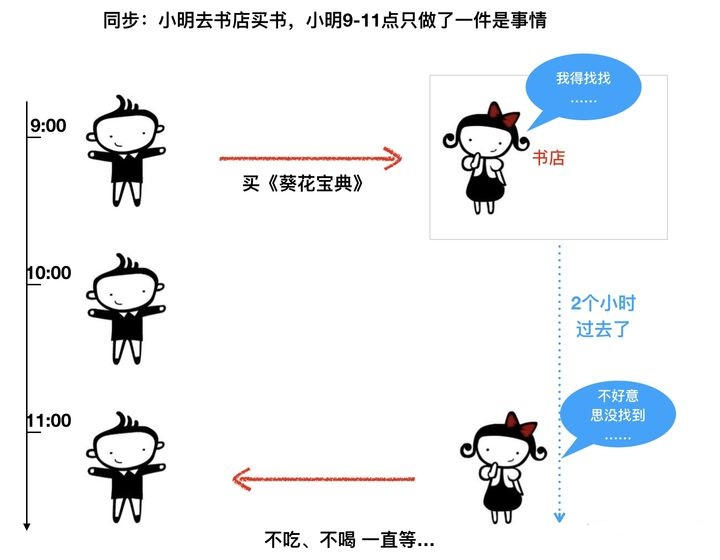
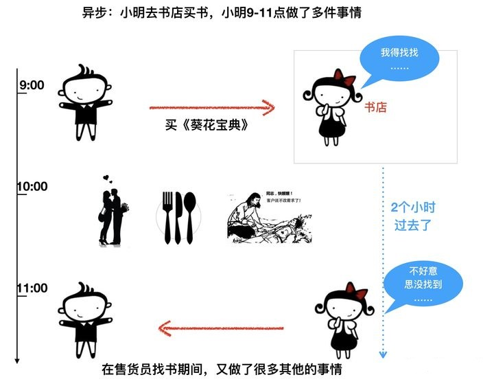

# 浅谈：python自动化测试中使用异步

很早已经在项目中使用异步了，比如使用的web框架fastapi就是支持异步写法的，然而，我只学会了 `async`/`await` 的写法，可是这种写法真的可以让你的程序变快吗？

## 异步的概念

* 同步




* 异步




## 同步 VS 异步

以模拟访问某个网站为例子，演示同步与异步的区别。

* 同步

```python
import time


def visit_url(url, response_time):
    """
    访问url
    """
    print(f"visit: {time.time()} - {url}")
    time.sleep(response_time)
    print(f"response: {time.time()}")
    return f"访问{url}, 已得到返回结果"


def run_task():
    visit_url('http://itest.info', 2)
    visit_url('http://www.testpub.cn', 3)


start_time = time.perf_counter()
run_task()
print(f"消耗时间：{time.perf_counter() - start_time}")
```

分别访问两个网址，模拟不同的耗时。运行结果如下：

```shell
visit: 1630638757.1427643 - http://itest.info
response: 1630638759.1537898
visit: 1630638759.1537898 - http://www.testpub.cn
response: 1630638762.1578455
消耗时间：5.0148674
```


* 异步

接下来采用异步的写法，重写方面的例子，加上 `async`/`await`。
```py
import asyncio
import time


async def visit_url(url, response_time):
    """访问 url"""
    print(f"visit: {time.time()} - {url}")
    await asyncio.sleep(response_time)
    print(f"response: {time.time()}")


async def run_task():
    await visit_url('http://itest.info', 2)
    await visit_url('http://www.testpub.cn', 3)


start_time = time.perf_counter()
asyncio.run(run_task())
print(f"消耗时间：{time.perf_counter() - start_time}")

```

* 为函数加上 `async`。
* 调用async函数需要`await`。

再次运行程序：

```shell
visit: 1630639557.2313683 - http://itest.info
response: 1630639559.235232
visit: 1630639559.235232 - http://www.testpub.cn
response: 1630639562.2393005
消耗时间：5.0091551999999995
```

你会发现，两次运行并无差别。

如果想达到`并发`的效果，可以通过`gather()`创建任务。修改`run_task()` 函数。

```py

async def run_task():
    url1 = visit_url('http://wangzhen.com', 2)
    url2 = visit_url('http://www.testpub.cn', 3)

    await asyncio.gather(url1, url2)
```

`asyncio.gather()` 方法将多个异步任务（两个 `url`）包装成一个新的异步任务。

再次运行程序：

```shell
visit: 1630640450.1746979 - http://itest.info
visit: 1630640450.1746979 - http://www.testpub.cn
response: 1630640452.1871428
response: 1630640453.1928813
消耗时间：3.0196878000000003
```

从结果来看达到了`并发`的效果。这和python的多线程`threading`效果类似，只不过python的异步是基于协程`coroutines` 实现并发。


## 异步测试框架

终于，进入主题，在python 3.8版本`unittest`引入`IsolatedAsyncioTestCase` 类来实现异步的自动化测试。

```python
from unittest import IsolatedAsyncioTestCase

class Test(IsolatedAsyncioTestCase):


    async def asyncSetUp(self):
        print("asyncSetUp")

    async def test_response(self):
        print("test_response")

    async def asyncTearDown(self):
        print("asyncTearDown")


if __name__ == "__main__":
    unittest.main()
```

从语法层面，就是为每个方法加上了`async`。 为了让验证这种写法，我们引入了 httpx 异步HTTP库，填充一个具体的用例。

```py
import unittest
import httpx


class AsyncTest(unittest.IsolatedAsyncioTestCase):

    async def asyncSetUp(self):
        self.cli = httpx.AsyncClient()

    async def test_response(self):
        response = await self.cli.get("http://127.0.0.1:5000/")
        self.assertEqual(response.status_code, 200)

    async def test_response2(self):
        response = await self.cli.get("http://127.0.0.1:5000/")
        self.assertEqual(response.status_code, 200)

    async def asyncTearDown(self):
        await self.cli.aclose()


if __name__ == "__main__":
    unittest.main()
```

我本地启动了一个web服务，并且将接口设置为2秒返回。

运行上面的用例。

```shell
..
----------------------------------------------------------------------
Ran 2 tests in 4.097s

OK
```

从结果来看，调用两个接口，耗时4秒钟，跟同步没啥区别。而且，我们不能简单的把他改造成 `并发` 形式，这又会影响到测试结果的统计，报告生成等问题。

## 总结

1. 站在单个用例的维度，用例的执行步骤是由顺序，我不能没打开浏览器就去操作页面元素。异步写法几乎无性能上的提升。

2. 站在多用例的维度，`并发` 可以有效提升运行速度，但这取决于测试框架是否支持并发，如果不支持并发，就算强行用了多线程运行用例，用例结果的收集和统计报告怎么办？另外，如果使用并发，每条用例一定要`绝对独立`，因为不同的用例要丢到不同的线程里面执行，所以，不能出现用例的依赖，对于web UI 自动化来说，就必须每条用例开启/关闭一次浏览器，这其实又会额外增加资源消耗。

3. 异步主要用于高并发的场景，比如 web 服务、网络爬虫、数据库IO等，使用异步会有明显的性能提升。

4. 为什么unittest要支持异步？更多的不是为了使用异步来提升自身的执行速度，而是为了更方便的帮助你编写异步代码的测试用例。

5. 我们在越来越多的项目中看到异步，`httpx`、`fastapi`、`aiofiles`、`aiomysql`、`playwright`..足以说明他是未来编程的一种趋势。