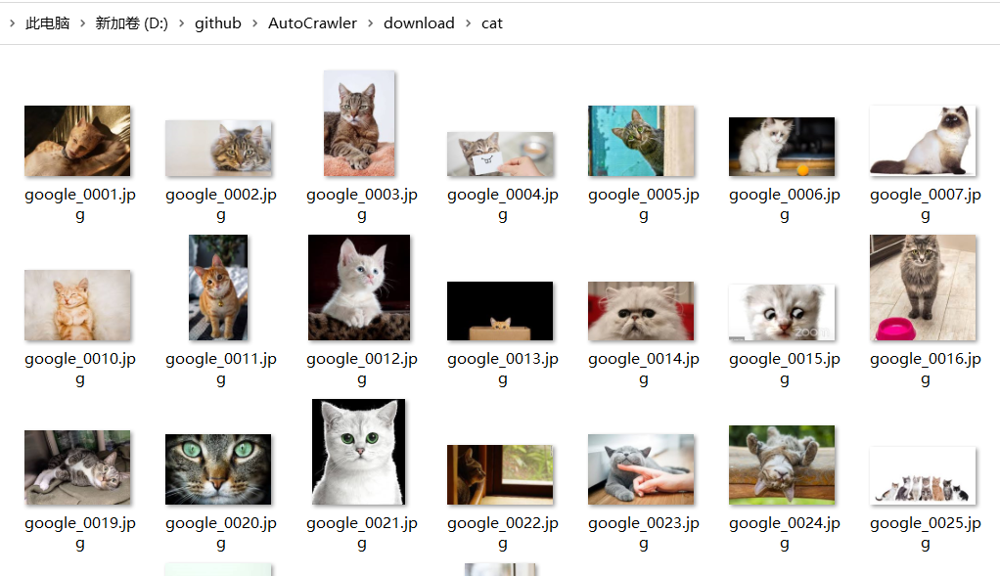

## AotucCrawler 快速爬取图片

今天介绍一款自动化爬取图片项目。

GitHub: https://github.com/YoongiKim/AutoCrawler

> Google, Naver multiprocess image web crawler (Selenium)

__关键字__

* 爬虫网站：Google、Naver （美、韩两大搜索引擎）
* 运行方式：Multiprocess（多进程）
* 爬取格式：image （图片）
* 基于自动化工具：Selenium （不解释）

### 如何使用

1. Git克隆`AutoCrawler`项目到本地

2. 自行安装 `Chrome` 浏览器

3. 安装依赖

```shell
> pip -r requirements.txt
```

 * `certifi`: 包含了很多可信任知名公司的证书/公钥。
 * `chardet`：提供自动检测字符编码的功能。
 * `idna`: 提供"对于RFC5891中定义的IDNA协议（Internationalised Domain Names in Applications）的支持"。
 * `requests`: 依赖于上面三个基础库，他主要用于根据图片链接下载图片。
 * `selenium`: 用于启动浏览器，爬取图片链接。
 * `webdriver-manager`: 用来管理selenium浏览器驱动的项目。

> 仔细分析别人项目，不管是源码还是依赖库都会有收获。`webdriver-manager` 就是我发现的一个宝藏项目，它简化的浏览器驱动的管理。

4. 打开`keywords.txt`文件，编写爬取的关键字。

```txt
cat
dog
```

5. 运行`main.py` 文件

```shell
> python main.py
```
__参数说明:__

`--skip true`：如果下载的关键字已经存在，是否跳过关键字，重新下载时需要设置。

`--threads 4`： 下载使用线程数量

`--google true`： 从`google.com` 下载。

`--naver true`: 从`naver.com` 下载。

`--full false`: 下载全分辨率图像而不是缩略图 (慢)。

`--face false`: Face search mode。

`--no_gui auto`:  使用 GUI 模式. (headless模式) 全分辨率模式可以加速, 但是缩略图模式不稳定。 默认`auto`模式，如果`full=false` 默认使用使用GUI，如果`full=true`默认Headless模式。（可用于docker linux系统）。
                   
`--limit 0`:  设置最大图片下载范围。 (0: 无限制)

`--proxy-list`: 逗号分隔的代理列表，如: `socks://127.0.0.1:1080, http://127.0.0.1:1081`，每个线程从列表中随即选择一个。

例如：

```shell
> python main.py --threads 2 --google true  --naver false --full false --limit 50
```


6. 爬取的图片保存于 `downloads/` 目录。




### 小结

1. 因为使用的是Google网站，没有梯子的同学有点郁闷。项目本身并不复杂，两个python文件加一起不到1000行代码，我们完全可以花点时间替换为国内可访问的搜索引擎。

2. 下载图片只是为了欣赏猫猫狗狗吗？当然不是，我们可用下载的图片训练 AI，当然你也可以测试文件上传的时候用。
