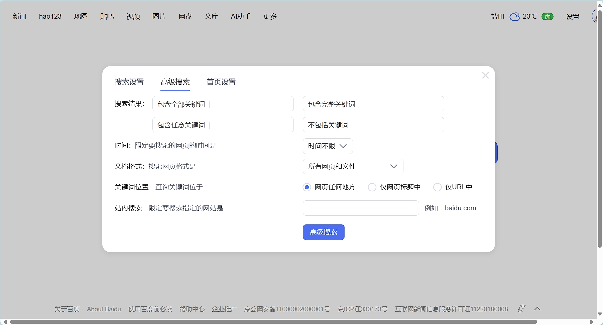

# 非常适合练习自动化测试的5个网站

当我们在学习自动化测试工具的时候，经常需要找一些网站页面快速的验证自动化测试的API，有些页面功能并不是特别好找，例如，鼠标悬停、文件上传、元素滑动等。

本文帮你盘点了5个网站，涵盖了90%的页面元素，适合我们练习自动化测试。

## sahitest

Sahi Tests是一个web测试工具，允许你在不同的web应用程序上创建和运行测试。

Sahi Pro 是一个成熟的，商业化的测试自动化平台，用于UI密集型应用程序的功能测试。

sahitest.com 是sahi提供的一个demo网站，上面提供了大量的常用的Web页面元素，包括：表单、输入框、下拉框、按钮、连接、文件上传、表单嵌套等。非常适合我们练习自动化测试学习。

网址：https://sahitest.com/demo/

## seleniumbase demo_page

Seleniumbase基于Selenium开发，是web自动化活动的专业工具包。专为测试网站，绕过验证码，提高生产力，完成任务和扩展业务而构建。

demo_page 是专门为seleniumbase提供的demo页面，网站将所有页面元素都集中到一个页面，方便我练习这些元素的操作。

网址：https://seleniumbase.io/demo_page

## playwright todomvc

Playwright 为现代 Web 应用提供可靠的端到端测试。

todomvc 是一个todolist的demo，虽然功能稍显单一，但是是一个完整可用的功能。可以学习到playwright中如何操作页面元素。

网址：https://demo.playwright.dev/todomvc

## mabl demo

Mabl 是一个综合性的自动化测试平台，旨在简化和加速软件测试过程，特别是Web应用的测试。它利用人工智能和机器学习技术来提供智能化、自动化的测试解决方案。

mable demo 提供的是一个可以登录的系统，这个就非常接近我们实际使用的场景了，我们大部分的系统也是需要登录功能的。

https://walkthrough.mabl.com/login

> 默认账户&密码： QUALITY/demo123

### baidu

最后，自然是百度网站，作为最常用的网站之一。他其实页包含了最最常见的页面元素，包括：输入框、按钮、链接、悬停菜单、下拉选择框、单选框、警告框等。也非常适合自动化练习。

网址：https://www.baidu.com

学习xpath/css语法：

https://www.w3school.com.cn/xpath/xpath_syntax.asp

https://www.w3school.com.cn/cssref/css_selectors.asp

xpath/ css 备忘单：

https://devhints.io/css

https://devhints.io/xpath
