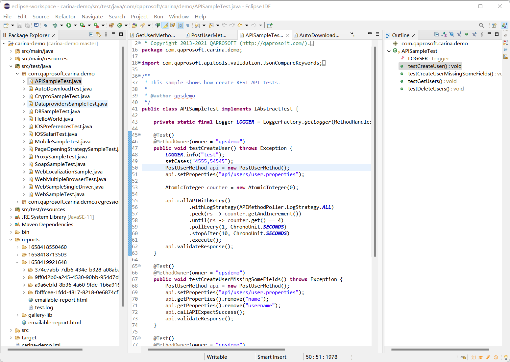
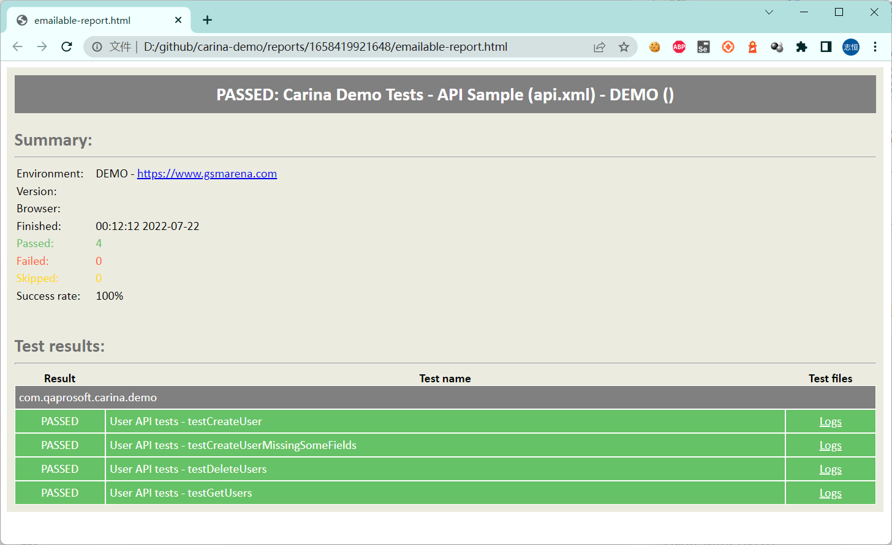

# 全功能测试框架 - Carina


Carina是一个基于Java的测试自动化框架，它将所有测试层结合在一起：移动应用程序（web、本机、混合）、web应用程序、REST服务和数据库。

github：https://github.com/zebrunner/carina

## 特点

* Carina框架构建在最流行的开源解决方案（如Selenium、Appium、TestNG）之上，可以减少对特定技术堆栈的依赖。

* Carina支持所有流行浏览器（即Edge、Safari、Chrome、Firefox）和移动设备（iOS/Android）。移动域的一个特殊特性是：它在IOS/Android之间重用测试自动化代码，高达70-80%。

* Carina是跨平台的。测试可以在Unix或Windows操作系统上轻松执行。您只需要安装JDK 11。

* 该框架支持不同类型的数据库——关系数据库和非关系数据库（MySQL、SQL Server、Oracle、PostgreSQL），提供了使用MyBatis ORM框架实现DAO层的惊人体验。

* API测试基于Freemarker模板引擎。它在生成REST请求方面具有很大的灵活性，并且响应由传入参数动态更改。


## 安装环境

* 安装和配置JDK 11+

> JDK安装配置参考其他资料

```shell
> java -version
java version "11.0.15" 2022-04-19 LTS
Java(TM) SE Runtime Environment 18.9 (build 11.0.15+8-LTS-149)
Java HotSpot(TM) 64-Bit Server VM 18.9 (build 11.0.15+8-LTS-149, mixed mode)
```

* 安装和配置Apache Maven 3.6.0+

> Maven安装配置参考其他资料

```shell
> mvn -version
Apache Maven 3.8.6 (84538c9988a25aec085021c365c560670ad80f63)
Maven home: D:\Java\apache-maven-3.8.6
Java version: 11.0.15, vendor: Oracle Corporation, runtime: C:\Program Files\Java\jdk-11.0.15
Default locale: zh_CN, platform encoding: GBK
OS name: "windows 11", version: "10.0", arch: "amd64", family: "windows"
```

* 下载最新版本的Eclipse和 TestNG插件，maven-dependency-plugin插件 和 lombok（可选）

> 从官方给的文档资料，比较执着于 Eclipse，众所周知，IntelliJ IDEA 现在更加主流一些。 为此，我又花费不少时间重新熟悉新版的 Eclipse, 当然，你坚持IDEA也问题不大，只是不同的IDE而已。


## 官方例子

为了帮助我们快速的熟悉carina项目，官方贴心的提供了demo项目。

github: https://github.com/zebrunner/carina-demo

* 克隆项目

```shell
> git clone https://github.com/zebrunner/carina-demo
```

* 生成eclipse项目

进入`crina-demo`项目目录，`clean`清除目标目录中的生成结果，`eclipse:eclispse`生成 Eclipse 项目文件及包引用定义。

```
> mvn clean eclipse:eclipse
```

* 安装依赖

安装的依赖已经在`pom.xml`文件中声明好了，`install` 安装相关依赖。

```shell
> mvn install
```

* 通过eclipse导入`carina-demo`项目。




截图是一段HTTP接口测试的代码，代码设计还是非常优雅的，做了很好的封装，接口所用到的测试数通过`json`等文件进行管理。

> 这篇算初体验，有时间再详细阅读代码的一些设计思想。

## 运行测试

最后，是运行测试，通过`mvn` 命令执行api测试用例。

* 运行测试

```shell
> mvn clean test -Dsuite=api

[INFO] Scanning for projects...

...

[INFO] Tests run: 4, Failures: 0, Errors: 0, Skipped: 0, Time elapsed: 43.318 s - in TestSuite
[INFO]
[INFO] Results:
[INFO]
[INFO] Tests run: 4, Failures: 0, Errors: 0, Skipped: 0
[INFO]
[INFO] ------------------------------------------------------------------------
[INFO] BUILD SUCCESS
[INFO] ------------------------------------------------------------------------
[INFO] Total time:  54.180 s
[INFO] Finished at: 2022-07-22T01:01:34+08:00
[INFO] ------------------------------------------------------------------------
```

整个运行过程会打印接口的详细信息。


* HTML报告

报告就比较朴实无华了，提供了一些比较基本的信息。




## 总结

* Carina被定义为全功能的测试框架，这其实是测试框架的发展方向，从单一支持 Web 测试 或接口测试，向更多测试类型支持。甚至是与平台整合。

* 由于时间原因，还没有详细看 Carina 的API，所以，这篇文章写得比较简单。

* 这个框架非常适合Java流的测试学习和使用。
