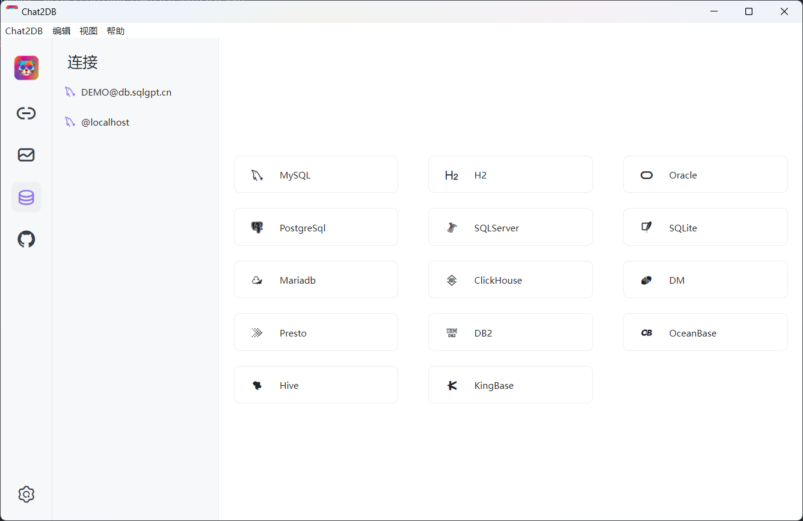
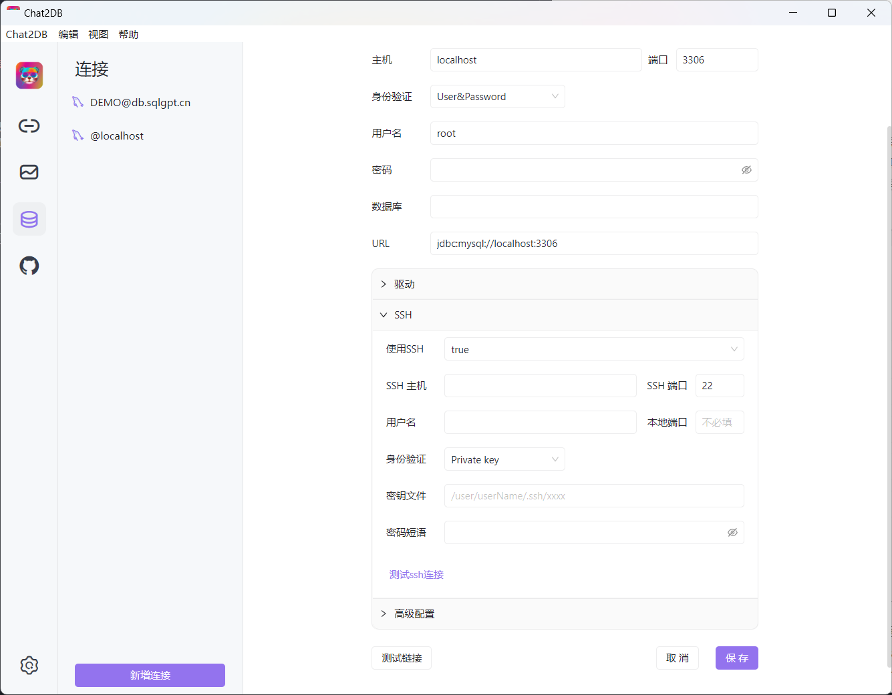
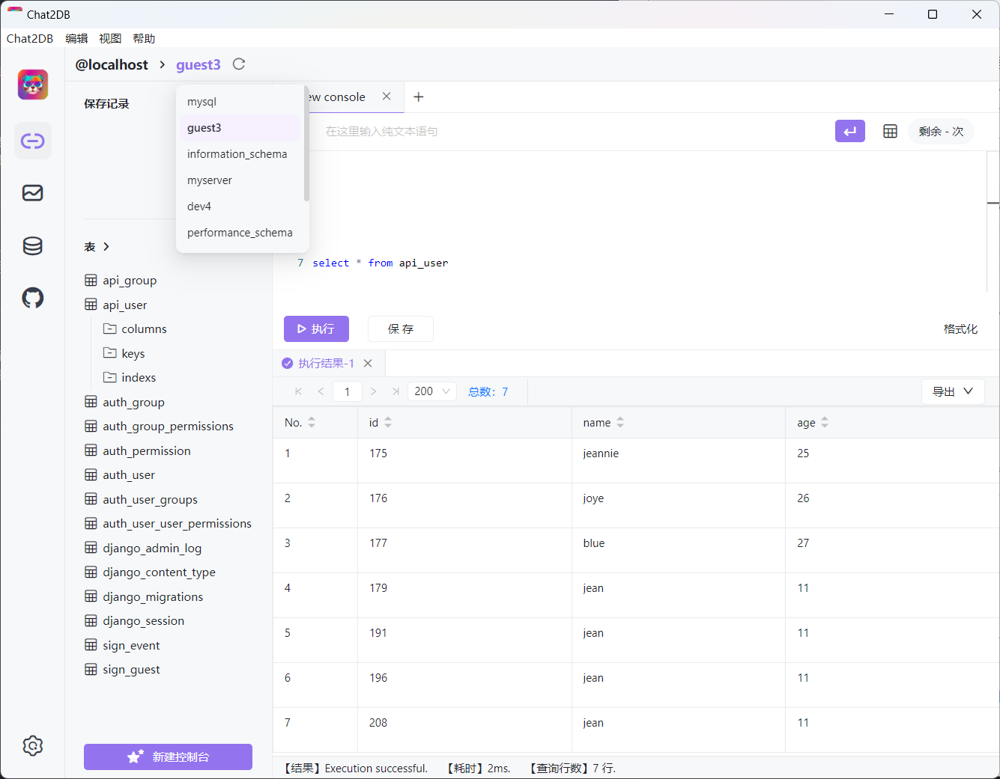
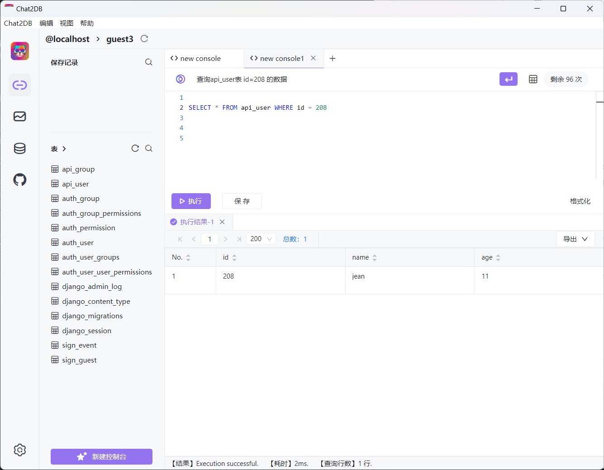
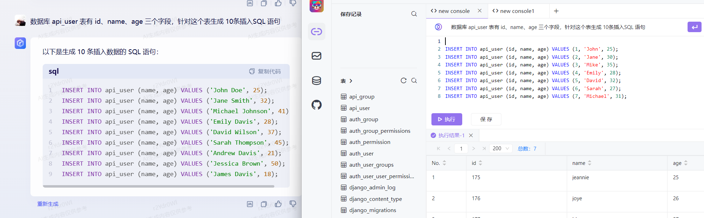

## 开源数据库客户端工具 chat2DB 使用体验

官网：https://chat2db.ai/

Chat2DB一款开源免费的多数据库客户端工具，支持windows、mac本地安装，也支持服务器端部署，web网页访问。

github地址：https://github.com/chat2db/Chat2DB/

## 使用体验

Chat2DB 基于 Electron 和 Java 开发，Electron的优点是支持跨平台，前不久 QQ for Linux 也是基于 Electron 进行了重新开发，终于不是上古界面和功能了，当然了，Electron毕竟是基于Chromium 和 NodeJS 整合为一个运行时环境。启动速度相比操作系统原生的 GUI 工具确实会慢一些。

chat2DB的整体界面比较清爽，而且支持了丰富的数据库类型，相信可以满足你需求，作为一个工作10+的测试工程师，主要使用过的只有 MySQL、Oracle、和 SQLite 三款数据库。所以，在数据库类型上，只要满足日常开发需求，我想可以卸载我的各个数据库客户端了。

真对 MySQL 数据库支持 SSH 远程连接数据库，这一点对我来说非常重要，因为我的工作中的数据库连接就用到了SSH，有日常开发中需要用到相关的库支持，比如，python的 sshtunnel库来连接数据库。

进入数据库后，整个界面非常简洁，目前提供的功能非常有限：

* 选择数据库。
* 查看数据库表列表。
* 创建控制台，通过命令操作数据库。

除此之外，我长用到的数据库客户端操作，包括：

* 数据的创建、删除等。
* 可视化的界面，创建和修改表结构。
* 数据表可视化操作，不通过SQL语句对数据库进行查询和更新、删除等。
* 数据库表的导入、导出，可以选整个数据库的表导出，只导出表结构 或 包含表数据等。

目前我主要使用的 工具是 Sequel Pro， 相比较而言，chat2DB 的功能太少了，目前还很难覆盖我的日常需求。

chat2DB 支持自然语言生成SQL语句，我九简单测试了以下，生成一条查询语句。当然，体验之前需要扫码关注他们的公众号，这一点我是可以接受的，但是， 100 次的使用次数，就让人很无语了。 当前不少AI大模型都已经放开使用了，chat2DB 的 100 次使用次数，显得很鸡肋。

对比 文心一言的 生成， chat2DB 在 SQL 方面并无太多优势，当然，由于我的表都比较简单。没有验证复杂的 SQL 生成能力，再一个，有些SQL语句描述起来，并不比 手写一个简单太多。

## 小结

通过简单的上手体验，Chat2DB 距离一款成熟好用的数据库客户端还又很长的路要求，扭扭捏捏提供的AI能力也让人无力吐槽。

官方文档，目前也很不完善，总之，目前还处于早期阶段，期待后续的更新。我大概只会在使用SQLite 的时候，才会尝试用这个工具。

