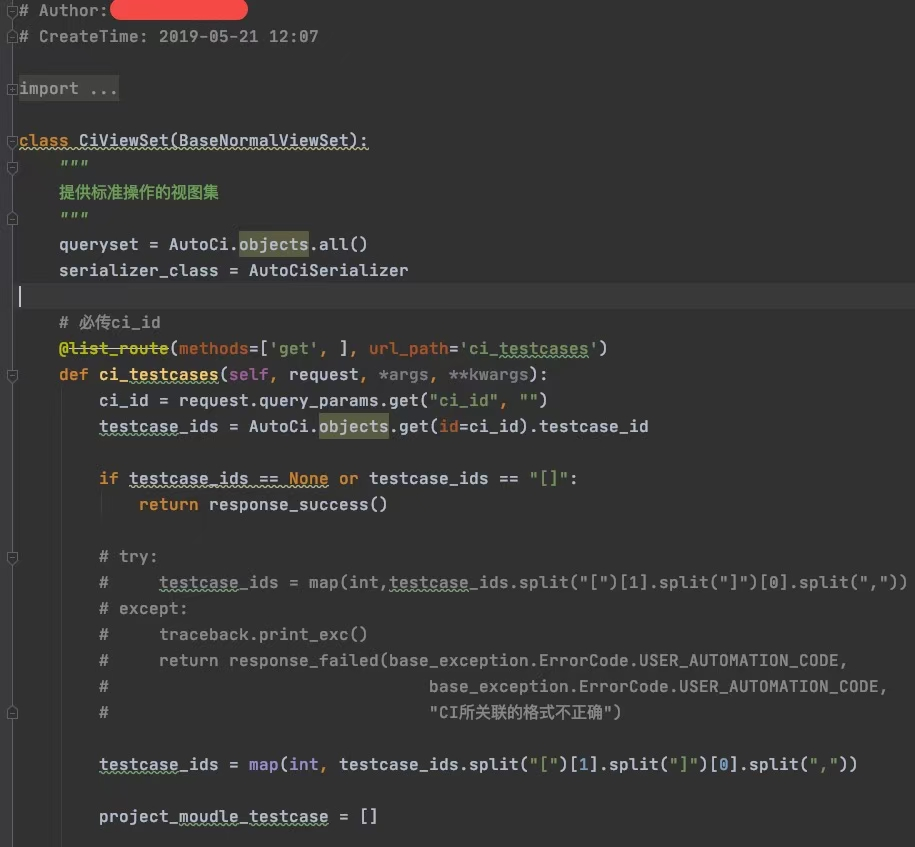

## 程序员高质量代码

背景是这样的，最近半年接手了一个内部平台的开发维护工作，由于缺少必要的开发文档，踩了不少坑，更重要的是其中一部分业务的代码写的非常垃圾，以至于我在维护期间，不停的在心里诅咒那位写出如此垃圾代码的前同事。

代码片段鉴赏：

不要考虑代码实现的功能和复杂度，单纯从代码整洁度上来看就惨不忍睹。

1. 空行不规范，参考Pep8，类与类之间空两行。
2. 变量命名不规范，要么驼峰`TestCase`、`testCase`，要么下划线`test_case`。
3. 使用即将废弃的API，~~`@list_route()`~~ 说明即将被废弃，避免后续升级问题，尽量使用新的API。（我是参考项目指定版本安装的库，并没有特意升级版本，导致这个警告！）
4. 随意注释废弃的代码，不用的代码要及时删除，如果从来没有被使用过，它就不应该出现在项目中，如果曾经被使用过，可以在git中找历史记录，随意注释不用的代码非常恶心。跟随意乱丢垃圾一样恶心。
5. 判断`None` 类型因该用`is` 而非 `==`。感兴趣百度二者区别。
6. `try...except` 使用不规范，异常捕捉需要指明类型，"Too broad exception clause. PEP 8: E722 do not use bare 'except'. "。
7. 还有更低级单词拼接错误，`moudle` ->`module`

__pep8规范__

https://www.python.org/dev/peps/pep-0008/

有同学可能会有疑问，功能实现不就完了吗？就算把上面的错误都改了，性能也没有提升。为什么要死抠代码规范？

对于个人来说，你的领导可能只关心功能有没有实现，界面是否好看，压根不关心代码整洁度，因此，写出漂亮的代码并不会因此而升职加薪。

甚至，因为追求代码代码整洁度和代码可读性，因此导致编码速度下降，比如，要写个双层循环，你直接用 `i` 、`j` 作为循环变量，而我可能要以下命名命名 `user`、`age`。 因为你写代码慢，需要加班，甚至，怀疑你的开发效率。别说升职加薪了，可能还会给你降薪，甚至走人。

真的是这样吗？实际情况可能并不是这样。

1. 整洁的代码，体现个人素养。有句话叫`见字如面`，套用到程序员身上就是`见码如面`，你的代码不是写给自己，总有同事需要阅读和修改你的代码。干净整洁的代码更能得到同事的认可，从而上升到认可你这个人。

2. 整洁的代码，更容易被阅读。如上面的代码，其实会增加阅读成本，不管是实现代码的开发者，还是被别的同事阅读，都会增加阅读和理解的成本。

3. 整洁的代码，降低维护成本。短期来看追求代码整洁会影响编码速度，长期来看其实会降低阅读和被修改的成本，毕竟，谁能保证你的代码是永远不会被修改的呢？

上面这段是我三年前写的一段代码，现在读起来依然觉得很好理解。

个人认为，代码整洁度是一个程序员的基本素养。如果想要维护好项目，要做还有很多。

1. 增加必要的注释，注释对于理解代码非常有帮助，当然，也不用每行代码都要注释，但每个文件，每个类/方法需要简要描述用途。

2. 命名规范，好的命名胜于冗余的注释。

3. 开发文档，每个项目都需要一个`README.md` 文件，描述项目介绍，开发安装步骤/部署方式。

4. 少用设计模式，除非你明确知道设计模式会给程序带来哪些好处，如果单纯是为了`炫技`，最好还不要用了。 

5. 自测，自测真的非常重要，这往往也是被开发最容易忽略。这其实是推动自己提升高质量代码的很好的方式。

6. `code review`，非常非常重要，敢拿出来评审的代码才是好代码，往往能从代码评审中收获很多好的建议。

7. 不断重构，重构不是到了项目已经无法适应新的业务的时候才开始，这个时候重构必然非常痛苦，甚至会遇到无数个坑；正确的做法是在日常开发中，不断`重构`你的项目，以便达到`最优`的状态。

8. 欢迎补充... 

最近，一位同事吐槽，这个框架不好，那个语言太慢。好的规范和设计会大大的增加项目的可维护性和生命周期。`Instagram可以用Django服务于上亿用户`足以说明框架和语言压根不是你编写垃圾代码的借口。如果没有好的编程素养和规范，不管用什么语言框架最终都会把他搞成一大堆非常难维护的垃圾。

好了，如果你要立志成为一个优秀的开发，那么先从代码整洁度来要求自己吧！

最后，当我把上面的吐糟发到朋友圈的时候，来看看的一位做了十几年开发的朋友的回复：

> 代码是人机沟通的媒介，任何高效的沟通最重要的诀窍就是双方要降维到同一个平面上。人机沟通中，常见的菜鸡会出现两种情况，偷懒和炫技。偷懒就是人在机器平面以下，认为应该不用多废话，机器都懂，不用考虑异常，边界，不用穷举所有场景并充分告知机器该如何处理。炫技是人在机器平面以上，不尊重机器，认为机器就是个憨憨，自己最聪明优秀，不断挑战机器的语法极限，以及语言未明确定义的部分，4级词汇能表达的事情非要用6级词汇，刚学了什么最新技术通通往机器上胡乱堆积。。程序员编程久了，埋的坑多了，自然而然小心翼翼，简单直接。代码如人生，也是修行的过程。

