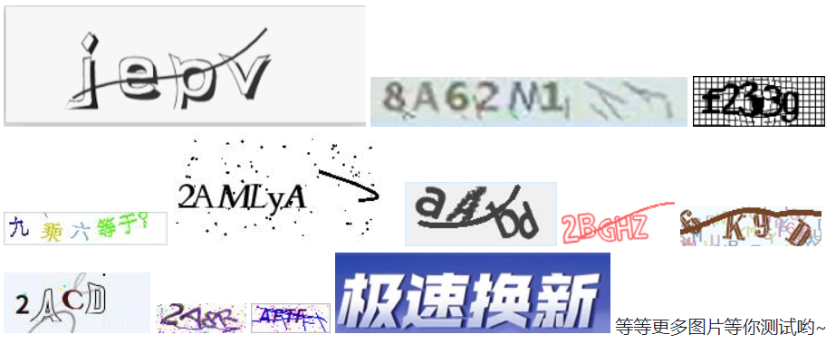

### ddddocr 验证码识别

相信做自动化测试的同学一定不可忽视的问题就是验证码，他几乎是一个网站登录的标配，当然，我一般是不建议在这上面浪费时间去做识别的。

> 举个例子，现在你的目的是进入自己家的房子，房子为了防止小偷进入于是上了一把锁。我们没必要花费力气去研究开锁技术。去找锁匠配置一把万能钥匙（让开发设置验证码的万能码），或者干脆先去上锁匠把验证码去掉（让开发暂时屏蔽验证码）。严格来说识别验证码不是我们自动化测试的重点。 除非你是验证码厂商的员工，破解识别验证码是你的工作。

那么，如果有很简单的方式去识别验证码的话，我们其实就可以不用麻烦开发针对验证码做屏蔽开关了。

ddddocr: 带带弟弟OCR通用验证码识别SDK 就是这样一款强大验证码识别工具。

> 为什么我会想到：hhhhhhhh  红红火火恍恍惚惚， 哈哈~！


### 传统验证码

传统验证就是数字、字母、汉字等，把背景搞得模糊一些，这些验证码在他前面就是个弟弟。



以第一个为例，要想识别他非常容易了。

```py
import ddddocr

ocr = ddddocr.DdddOcr(old=True)

# 第一个验证截图保存：verification_code_1.png
with open("./verification_code_1.png", 'rb') as f:
    image = f.read()

res = ocr.classification(image)
print(res)
```

运行结果：

```
iepv
```

### 滑动验证码

当然，传统验证码现在已经比较少网站在使用了，几年前开始流行滑动验证码，当时，也有类似的识别方案，主要通过selenium模拟滑动。

首先，需要准备两张图片

* 有缺口的图片


* 滑块缝合的图片


```py
import ddddocr
import cv2


slide = ddddocr.DdddOcr(det=False, ocr=False)

# 滑块缝合的图片
with open('./verification_code_2-2.png', 'rb') as f:
    target_bytes = f.read()

# 有缺口的图片
with open('./verification_code_2-1.png', 'rb') as f:
    background_bytes = f.read()

# 滑块缝合的图片
img = cv2.imread("./verification_code_2-2.png")

res = slide.slide_comparison(target_bytes, background_bytes)

print(res)
```

运行结果

```
{'target': [17, 78]}
```

从文档中没找到这个坐标是滑块的初始坐标还是滑到正确位置的坐标。

当然，这种方案想要运行到自动化中还是比较难的，首先我们很难得到滑块缝合的图片，除非你将验证码的所有图片和缺口图片都保存下来，当验证码随机生成一张图片后，先截图和本地保存的图片对比，然后，找到对应的滑块缝合的图片。通过ddddocr找到元素坐标。

总之，太麻烦了，我选择放弃~！

### 文字点选验证码


这种验证码现在也比较常见，我们需要按照顺序点击图片中的文字。

```py
import ddddocr
import cv2

det = ddddocr.DdddOcr(det=True)

# 验证码图片
with open("./verification_code_3.png", 'rb') as f:
    image = f.read()

poses = det.detection(image)
print(poses)

# 验证码图片
im = cv2.imread("verification_code_3.png")

for box in poses:
    x1, y1, x2, y2 = box
    im = cv2.rectangle(im, (x1, y1), (x2, y2), color=(0, 0, 255), thickness=2)


# 结果图片
cv2.imwrite("result.jpg", im)
```

运行结果：


```
[[17, 28, 82, 92], [55, 95, 118, 158], [39, 160, 103, 222]]
```

这里给出的坐标就是识别的三个文字的图片坐标。

这种方案同样会面临两个问题；

1. 文字的识别顺序不一定是要你点击的顺序。例如识别出来的文字顺序是: 荷叶饭， 验证码可能提示你点击的顺序是：叶饭荷。

2. 生成的坐标只是图片的坐标，不管是web还是app，验证码图片只是屏幕的一部分，除非你截取整个屏幕。那么识别率就无法控制了。


## 总结

1. ddddorc 针对传统的输入验证码还是很好用的。

2. 针对新型的验证码，识别率还行，但是，如何与自动化结合是个难题。

3. OCR技术本来就是以图片文字识别为主，他并不包含模拟鼠标点击、滑动、键盘输入等动作。
