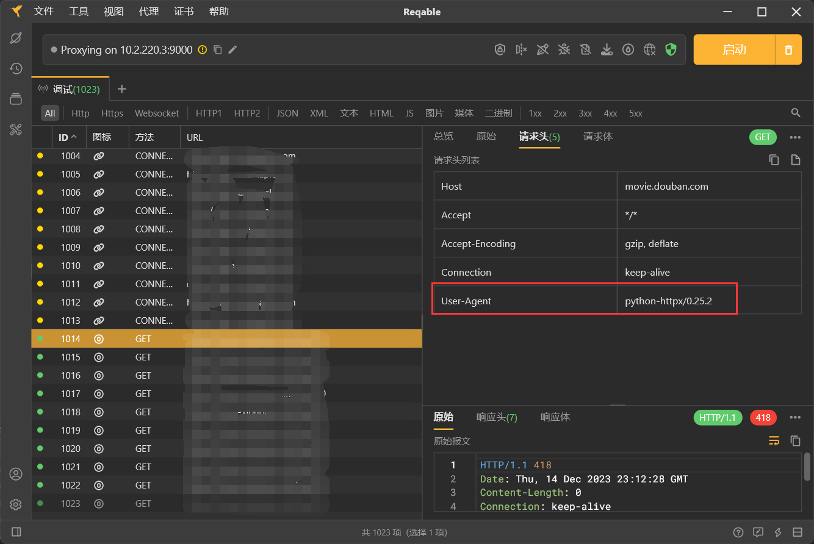
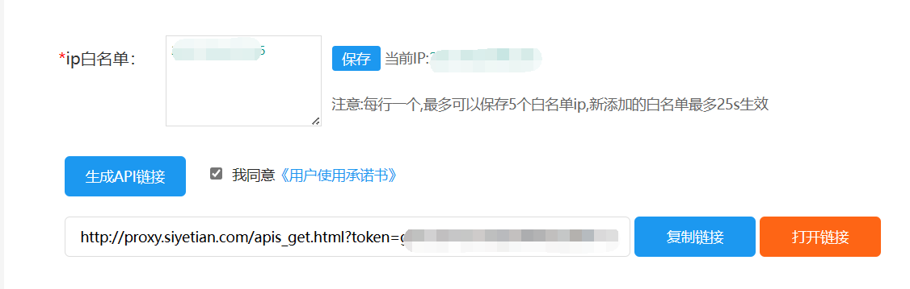

## 如何稳定爬取接口数据

数据爬取和反爬取是一场攻防战，虽然整体技术难度不深，但非常有意思。

### python爬虫工具


Python下面用于做爬虫的工具很多:


* 专门的爬虫的框架：

Scrapy: 一个基于Python的开源网络爬虫框架，用于快速高效地提取网站数据。

BeautifulSoup: 一个用于解析HTML和XML文档的Python库，可以帮助用户从网页中提取数据。

* 网页自动化工具：

Selenium: 一个自动化测试工具，也可以用于网页爬取，可以模拟用户在浏览器中的操作，如点击、输入等。

playwright: 通样可以用于网页爬取和数据提取，它提供了丰富的功能和灵活的操作方式，使得开发者可以轻松地编写复杂的网页爬取脚本。

* http请求工具：

Requests: 一个简单易用的HTTP库，可以用于发送HTTP请求和获取网页数据。

HTTPX: 一个基于Python的现代、高性能的HTTP客户端库，用于发送HTTP请求和处理响应。


我刚好前段时间得到了一个爬虫的需求，基于需求简单介绍一下使用。

### HTTPX调用接口

* 安装

```bash
pip install httpx
pip install h2
```

之所以选择 HTTPX 是因为Web 框架是用异步实现的，爬取数据是Web项目的一个子需求，最重要的是可以通过调用接口获取想要的数据。

```py
import asyncio
import httpx


async def main():

    async with httpx.AsyncClient(verify=False, http2=True) as client:
        for i in range(1000):
            try:
                response = await client.get("https://api-xx.samaple.com/api/some/list", timeout=10)
                details = response.json()
                print(details)
            except BaseException as e:
                print(f"请求超时、异常: {e}")


if __name__ == '__main__':
    asyncio.run(main())
```

__说明：__

* verify参数的默认值为True，表示开启证书验证。如果设置为False，则会关闭证书验证，这样可以在一定程度上提高请求速度，但也会降低安全性。

* h2参数用于指示是否启用HTTP/2协议。

### 伪造 User-Agent

但是，很快请求就异常报错，但是通过浏览器调用接口是可行的。



fake-useragent 是专门用于伪造  User-Agent的一个库。

Github: https://github.com/fake-useragent/fake-useragent

* 安装

```bash
pip install fake-useragent
```

使用方式：

```py
import asyncio
import httpx
from fake_useragent import UserAgent


async def user_agent():
    """
    随机生成请求头：User-Agent
    :return:
    """
    ua = UserAgent()
    user_agent_ = ua.random
    return user_agent_


async def main():

    async with httpx.AsyncClient(verify=False, http2=True) as client:
        for i in range(10):
            ua = await user_agent()
            headers = [("User-Agent", ua)]
            try:
                response = await client.get("https://api-xx.samaple.com/api/some/list",  headers=headers, timeout=10)
                details = response.json()
                print(details)
            except BaseException as e:
                print(f"请求超时、异常: {e}")


if __name__ == '__main__':
    asyncio.run(main())
```

这样每次调用的时候都会随机生成一个请求头。


### 使用代理IP

使用固定IP很容易被封，那么就需要随机使用代理IP。很多网站提供这种功能。

例如：https://www.siyetian.com/

需要实名认证，每天可以领取20个代理IP。



输入你当前电脑的IP地址，生成API 链接。该链接每次调用可以生成一个IP。


使用方式：

```py
import asyncio
import httpx


async def fetch_proxy() -> str:
    """
    获取代理IP
    """
    proxy_api_url = 'http://proxy.siyetian.com/apis_get.html?token=xxxxx'
    async with httpx.AsyncClient() as client:
        resp = await client.get(proxy_api_url, timeout=5)
        ip = resp.text
        return ip


async def main():
    proxy_ip = fetch_proxy()
    proxies = {
        "all://": f"http://{proxy_ip}",
    }
    async with httpx.AsyncClient(proxies=proxies, verify=False, http2=True) as client:
        for i in range(10):
            try:
                response = await client.get("https://api-xx.samaple.com/api/some/list", timeout=10)
                details = response.json()
                print(details)
            except BaseException as e:
                print(f"请求超时、异常: {e}")


if __name__ == '__main__':
    asyncio.run(main())
```

到此，这个接口就可以比较稳定的爬取接口数据了。


声明：本文内容不针对任何网站，介绍技术仅供学习。

