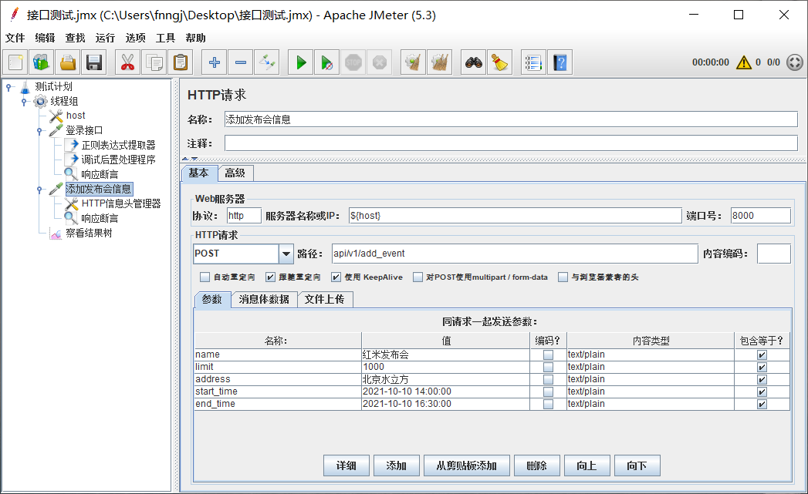

# 接口测试的N中玩法

在我看来接口测试相对其他类型的测试是比较简单的。对于最常见的HTTP接口，只需要知道接口的 `URL`、`方法`、`参数类型`、`返回值` ... 就可以对接口进行测试了。


## apifox

如果你是入门级选手，那么`apifox`应该很适合你，它是一款类似`postman`的接口测试工具。而且功能也很强大，定位 `Postman + Swagger + Mock + JMeter`。你值得尝试。


为什么不postman? 嗯，你说的都对！


## HttpRunner

如果你不想用工具，也不想写代码。想更加简单高效的编写接口测试用例，那么HttpRunner2.x 就很适合你了。

```json
{
    "config": {
        "name": "testcase description",
        "variables": {},
        "verify": false
    },
    "teststeps": [
        {
            "name": "/api/v1/hello/",
            "request": {
                "url": "http://127.0.0.1:8000/api/v1/hello/",
                "method": "GET"
            },
            "validate": [
                {"eq": ["body.code", 10200]},
                {"eq": ["body.message", "success"]}
            ]
        }
    ]
}
```

httpRunner已经更新3.x，HtppRunner 3.x还支持写代码了，还支持接口性能测试。我知道了，谢谢你的提醒！

### Robot Framework

Robot Framework是一款通用了的测试框架，支持各种`Library`，如果你对它很熟悉的话，拿来做接口自动化手到擒来！


我在网易云课堂有免费视频哦！
https://study.163.com/course/introduction/1004056051.htm


### JMeter

JMeter是用来做性能测试的，在当前大部分系统都前后端分离的情况下，服务端性能 ~= 接口性能。

那么我把并发数设置成`1`，那么它就变身成为了接口自动化工具。



设置成`100`, 它又变成了接口性能工具，在`功能/性能`之间来回切换的大佬。可盐可甜！

### Gauge

Gauge是基于BDD测试框架。拿它来做接口测试，怎么说呢，不是不行。就像妹子叫一个程序员修电脑。

* 定义行为文件（测试数据）

```markdown
login interface
===============
this is login api


test login
----------

* test post "/login" api
     |username  | password | code | message |
     |----------|----------|------|---------|
     | null | |10103|username or passwrord is null|
     |  | null |10103|username or passwrord is null|
     | error |error |10104|username or password error|
     | admin |a123456 |10200|login success|
```

* 执行测试

```python
from getgauge.python import step
from .utils.base import Base
import requests


@step("test post <url> api <table>")
def test_post_request(url, table):
    username = [str(user)
                for user in table.get_column_values_with_name("username")]
    password = [str(pawd)
                for pawd in table.get_column_values_with_name("password")]
    code = [int(code) for code in table.get_column_values_with_name("code")]
    message = [str(msg)
               for msg in table.get_column_values_with_name("message")]
    for i in range(len(username)):
        data = {"username": username[i], "password": password[i]}
        r = requests.post(Base.url + url, data=data)
        result = r.json()
        print(result)
        assert result["code"] == code[i]
        assert result["message"] == message[i]
```

看不懂？！没关系，妹子也看不懂你是如何把电脑修好的，总之，看上去很厉害的样子就对了。


### httpx

如果你喜欢写代码，还有什么是比httpx库更简单好用的吗？ httpx本身只是一个HTTP测试库而且，要做自动化还需要单元测试框架配合，如 `pytest`。

```python
import httpx

def test_case():
    r = httpx.put('http://httpbin.org/put', data = {'key':'value'})
    assert r.status_code
    assert r.json() is dict()
```

有人高喊：你一定是偷了Requests家东西！httpx 涨红着脸说：参考不能算偷，偷....程序员的事情，能算偷吗？接连便是高大上的话，什么"支持异步了，下一代HTTP库..."， 引得众人都哄笑起来。

还不服是吧！？就凭`httpx` 只要敲5个字符，而`requests` 要8个字符，就是httpx赢！

### MeterSphere

metersphere是一个开源的测试平台，由商业公司维护，比起一些个人的测试平台项目，稳定性和易用性上面做的还是不错的。


你完全可以基于MaterSphere做二次开发，它用的非常主流的 Java(spring) + JavaScript(vue.js) 的技术开发。


## 总计

接口测试的工具还有很多，本文相当于每种玩法都介绍了一种。不管用哪种工具，只要足够精通，那么都可以解决工作中的大部分问题。
