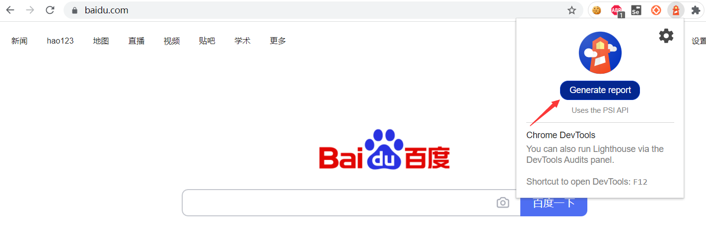
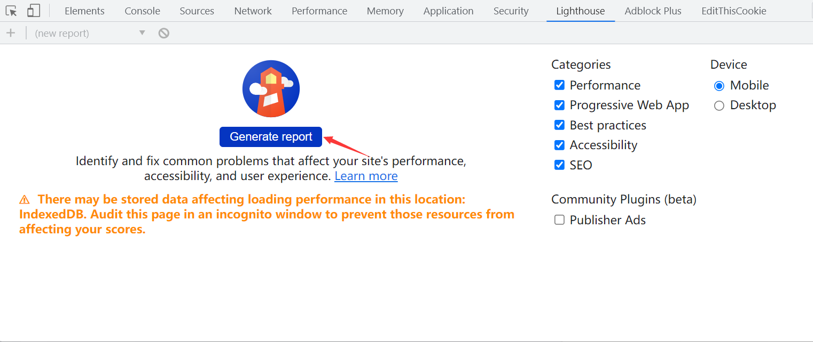
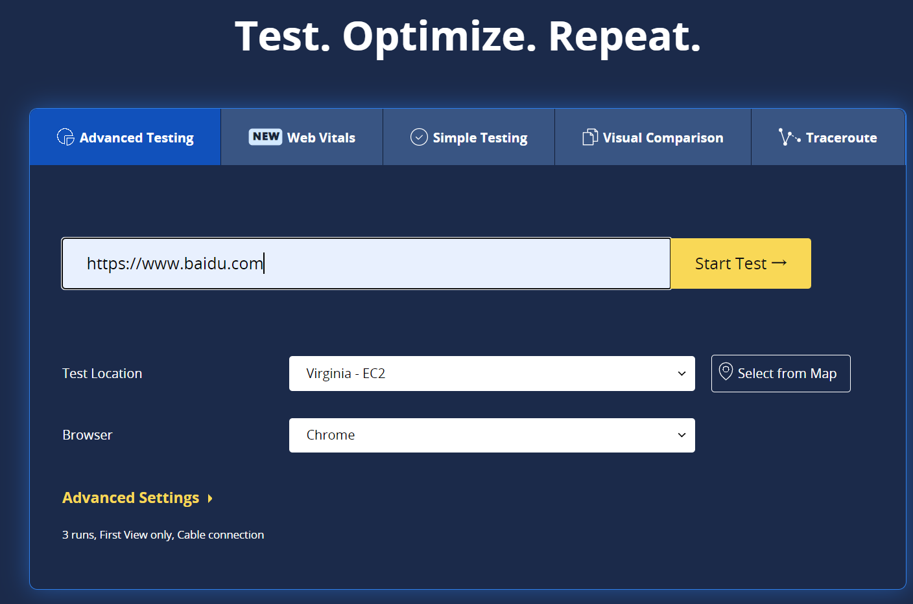

## web性能检测工具lighthouse

> About Automated auditing, performance metrics, and best practices for the web.

Lighthouse 可以自动检查Web页面的性能。

你可以以多种方式使用它。

## 浏览器插件

作为浏览器插件，访问chrome网上商店 搜索`Lighthouse` 插件安装。以两种方式使用。

* 方式一



安装成功后，访问想要检查的页面，开发插件，点击`Generate report`，稍等片刻，你将会得到一份页面的检查报告。

* 方式二

访问想要检查的页面，打开开发者工具，切换到`Lighthouse` 标签使用。




## Node CLI

以Node CLI方式使用Lighthouse可以得到最大灵活性，Lighthouse提供了许多参数使用。

> Linghthouse 需要Node 14 LTS（14.x） 或更高版本。

* 安装

```shell
> npm install -g lighthouse
```

* 查看帮助

```shell
> lighthouse --help
```

* 使用

```shell
> lighthouse https://www.baidu.com --output html --output-path ./report.html
√ We're constantly trying to improve Lighthouse and its reliability.
...
```

`--output` 指定报告的类型；`--output-path` 指定报告的路径。 

### 以编程模式使用

创建`lighthouse_demo.js` 文件，脚本如下：

```js
const fs = require('fs');
const lighthouse = require('lighthouse');
const chromeLauncher = require('chrome-launcher');

(async () => {
  const chrome = await chromeLauncher.launch({chromeFlags: ['--headless']});
  const options = {logLevel: 'info', output: 'html', onlyCategories: ['performance'], port: chrome.port};
  const runnerResult = await lighthouse('https://www.baidu.com/', options);

  // `.report` is the HTML report as a string
  const reportHtml = runnerResult.report;
  fs.writeFileSync('lhreport.html', reportHtml);

  // `.lhr` is the Lighthouse Result as a JS object
  console.log('Report is done for', runnerResult.lhr.finalUrl);
  console.log('Performance score was', runnerResult.lhr.categories.performance.score * 100);

  await chrome.kill();
})();
```

有没有自动化既视感，还可以设置 `headless`模式。

* 运行

```shll
> node lighthouse_demo.js
```

最终，会在当前目录下生成 `lhreport.html` 结果文件。


## Web网站

有一些Web网站基于lighthouse 提供服务，你可以登录这些网站输入URL检测网络性能。

* Web Page Test 
https://www.webpagetest.org/

* Calibre 
https://calibreapp.com/

* Debug bear
https://www.debugbear.com/


* Lighthouse Keeper
https://lighthouse-keeper.com/

...

以 web page test 为例：


