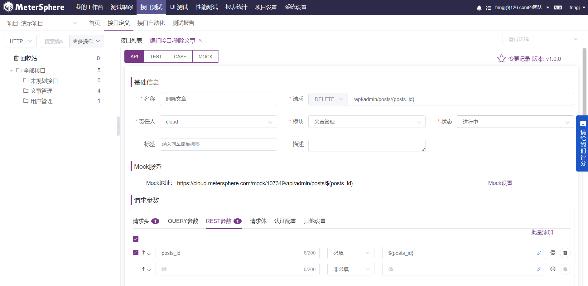

## MeterSphere 开源持续测试平台

> MeterSphere 是一站式的开源持续测试平台，涵盖测试跟踪、接口测试、UI 测试和性能测试等功能，全面兼容 JMeter、Selenium 等主流开源标准，有效助力开发和测试团队充分利用云弹性进行高度可扩展的自动化测试，加速高质量的软件交付。

github地址: https://github.com/metersphere/metersphere/


你可能已经知道或听说过了MeterSphere平台，我仍然想简单介绍一下这个开源测试平台。 浏览testerhome 社区上的开源项目，应该可以轻松找出 20+ 开源测试平台，大部分以接口测试为主。可惜大多都没有持续维护。Meterphere 是其中佼佼者，因为由商业公司维护，比起个人项目好太多了。做了4、5年的平台开发，深知道做成 metersphere 目前的功能，需要投入人力（财力）成本是不小的。


初次了解 metersphere 是在 2020 年的 MTSC 移动测试开发者大会，不久之后我们开发开发自己的压测平台，后端参考了Metersphere的设计；上周 我们重新部署 Metersphere 内部试用，从功能层面已经几乎涵盖到了测试的流程和类型。

接下来做个简单的体验和使用介绍。


## 安装&访问

作为一个复杂的平台，如果一个服务一个服务的安装依赖 和 部署，那么需要对项目有一定的了解。metersphere提供了部署。


准备一台linux，并提前安装 `curl` 和 `wget` 两个工具。

* 执行命令

```shell
curl -sSL https://resource.fit2cloud.com/metersphere/metersphere/releases/latest/download/quick_start.sh | bash
```

整个过程会通过docker 启动前后端服务。

* 访问系统

浏览器访问: http://目标服务器IP地址:8081

* 默认账号&密码

`admin` / `metersphere`


## 功能介绍

* 系统设置

系统设置中包含了用户管理，完善的角色&权限管理，工作空间和项目。


* 测试追踪

测试追踪就我们最常用的测试相关功能：测试计划、测试用例、缺陷管理 等。值得一提的是 用例支持 列表 和 脑图两种模式，对习惯用xMind 写用例的同学非常友好。其他功能中规中矩吧，功能都比较完善。


* 接口测试

接口测试属于比较早期的功能了，是比较常规的方式，类似线版postman，这种方式就是在应对复杂的场景测试 配置比较繁琐，胜在不用写代码，门槛比较低。



* UI测试

UI 测试就是先创建元素库，然后将元素拼装成用例步骤；个人始终觉得 平台尝试做 UI 是有点离谱的。灵活度远低于 selenium/playwright 直接写代码。比如 数据驱动、逻辑判断 if/for ，生成随机数、函数调用、控制header、cookie 等，丧失太多特性了。


* 性能测试

性能测试也比较早的功能，后端直接调用 JMeter API实现性能压测，也是我们之前做压测平台参考的系统。需要做压测平台的，这是相对来说比较成熟的方案。


试用时间比较短，算是一个初步体验感受吧！

## 总结

* 适用人群

如果你们公司测试团队人力不足，技术不强，直接部署一套 metersphere 平台内部使用，可以很好的解决平台研发或购买成本，并且从使用层面也可以规范化测试流程，有效提升效率。

* GPL v3 开源许可协议

> GPL允许自由地“使用、复制、修改和发布”，但修改和发布后的软件也必须是可以自由“使用、复制、修改和发布”的。

metersphere 采用 GPL v3 开源许可协议, GPL 协议对于需要二次开发的团队并不友好，二次开发之后私有化使用，甚至是二次开发之后商业化都会有法律风险。

