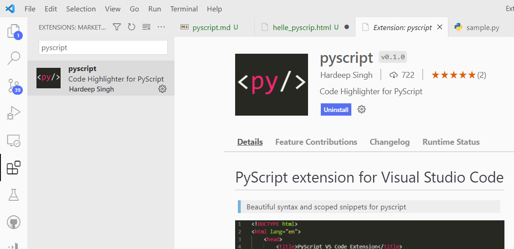
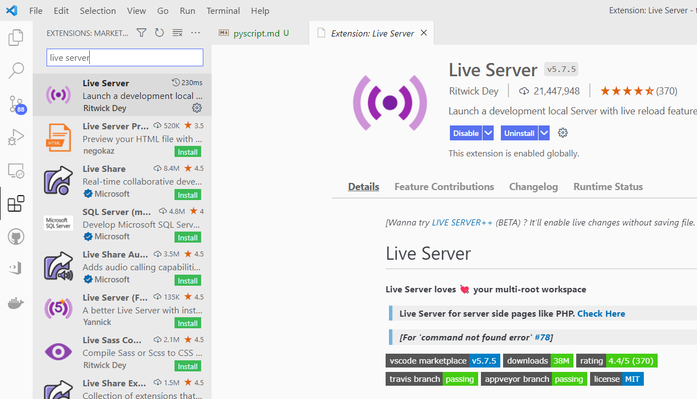
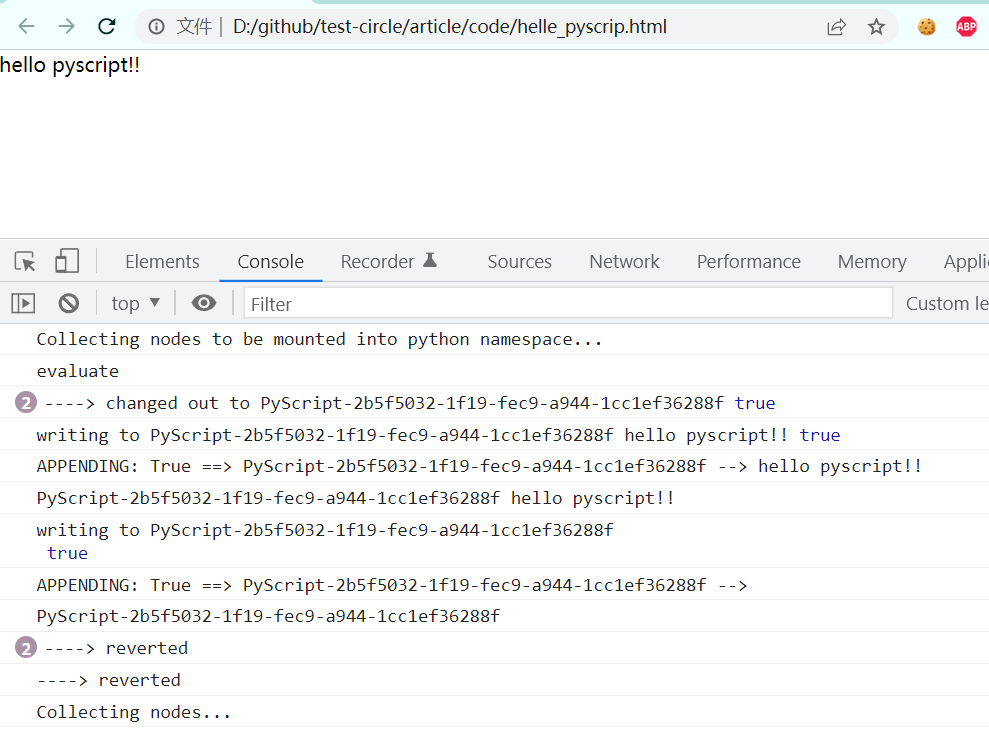
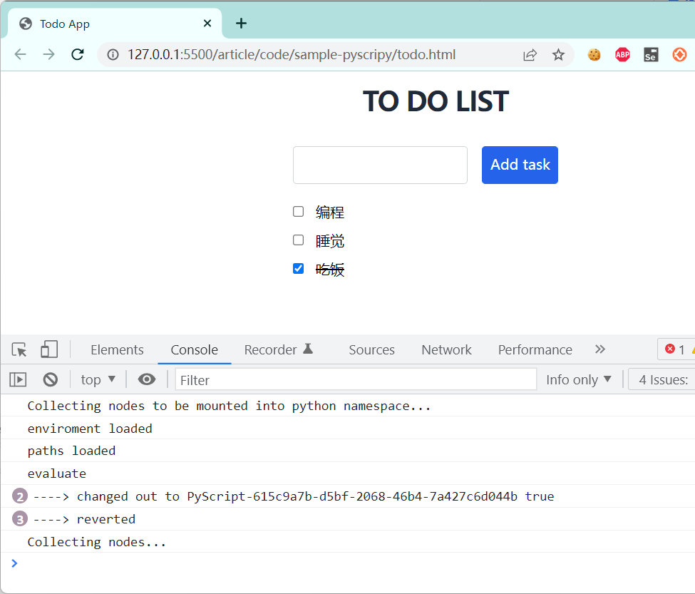

## PyScript 

官网：https://pyscript.net/

PyScript是一个框架，允许用户使用Python与标准HTML的混合在浏览器中创建丰富的Python应用程序。PyScript旨在为用户提供一流的编程语言，该语言具有一致的样式规则，更具表现力，并且更易于学习。

在浏览器中运行Python听上去有点不可思议，在PyScript中的介绍中：

> Python in the browser: Enable drop-in content, external file hosting (made possible by the Pyodide project, thank you!), and application hosting without the reliance on server-side configuration

启用插入内容、外部文件托管(这是由Pyodide项目实现的，谢谢!)和不依赖服务器端配置的应用程序托管。

* Pyodide

> Pyodide is a Python distribution for the browser and Node.js based on WebAssembly

Pyodide是一个基于WebAssembly的针对浏览器和Node.js的Python发行版。由Mozilla公司开发，相信你对他家的Firefox浏览器并不陌生。

* WebAssembly

WebAssembly(缩写 Wasm)是基于堆栈虚拟机的二进制指令格式。Wasm为了一个可移植的目标而设计的，可用于编译C/C+/RUST等高级语言，使客户端和服务器应用程序能够在Web上部署。

WebAssembly得到主流浏览器的支持，已经成为了官方标准，他是继HTML、CSS和JavaScript之后的第四种Web语言。

### PyScript 安装

我们将注意力拉回到PyScript中，来安装和使用他。

* 使用在线CDN（推荐）

```html
<link rel="stylesheet" href="https://pyscript.net/alpha/pyscript.css" />
<script defer src="https://pyscript.net/alpha/pyscript.js"></script>
```

* 下载到本地引用

> 根据官方的下载地址进行下载，然后解压。然后，在本地引用。

```html
<link rel="stylesheet" href="path/to/pyscript.css" />
<script defer src="path/to/pyscript.js"></script>
```

###  VSCode 插件

如果你使用的VSCode编辑器，可以搜索安装下面两个插件。

* pyscript

默认在HTML中内嵌大段的python代码是没有代码着色的，阅读起来比较痛苦。



* Live Server

这个插件主要用于以服务的方式运行HTML文件的。




### PyScript 使用

__简单例子__

首先，创建一个HTML文件：`hello_pyscript.html`


```html
<html>
<head>
    <title>Sample</title>
    <link rel="stylesheet" href="https://pyscript.net/alpha/pyscript.css" />
    <script defer src="https://pyscript.net/alpha/pyscript.js"></script>    
</head>
<body>
    <py-script>
        print("hello pyscript!!")
    </py-script>
</body>
</html>
```

通过浏览器打开`hello_pyscript.html` 文件运行。




__todo小功能__

完成一个简单的todo，参考官方例子。

https://github.com/pyscript/pyscript/blob/main/pyscriptjs/examples

这个例子比较复杂，涉及三个文件：

* `utils.py`
* `todo.py`
* `todo.html`

重点看一下`todo.html`文件。

```html
<html lang="en">
  <head>
    <meta charset="utf-8" />
    <meta name="viewport" content="width=device-width,initial-scale=1" />

    <title>Todo App</title>

    <link rel="icon" type="image/png" href="favicon.png" />
    <title>Sample</title>
    <link rel="stylesheet" href="https://pyscript.net/alpha/pyscript.css" />
    <script defer src="https://pyscript.net/alpha/pyscript.js"></script>    
    <py-env>
    - paths:
      - ./utils.py
    </py-env>
  </head>

  <body class="container">
    <!-- <py-repl id="my-repl" auto-generate="true"> </py-repl> -->
  <py-script src="./todo.py">  </py-script>

  <main class="max-w-xs mx-auto mt-4">
    <section>

    <div class="text-center w-full mb-8">
      <h1 class="text-3xl font-bold text-gray-800 uppercase tracking-tight">To Do List</h1>
    </div>
    <div>
      <input id="new-task-content" class="border flex-1 mr-3 border-gray-300 p-2 rounded" type="text">
      <button id="new-task-btn" class="p-2 text-white bg-blue-600 border border-blue-600 rounded" type="submit" pys-onClick="add_task">
        Add task
      </button>
    </div>

    <py-list id="myList"></py-list>
    <div id="list-tasks-container" class="flex flex-col-reverse mt-4">
  </div>

    <template id="task-template">
        <section class="task bg-white my-1">
            <label for="flex items-center p-2 ">
              <input class="mr-2" type="checkbox" class="task-check">
              <p class="m-0 inline"></p>
            </label>
        </section>
      </template>

  </section>
  </main>
</body>
</html>
```

分析：

```html
<py-env>
    - paths:
      - ./utils.py
</py-env>
```

用于引入外部库，甚至是第三方常见库：`numpy`, `pandas` 等。

```html
<py-script src="./todo.py">  </py-script>
```

用于引入python脚本，我不需要在HTML写大量的python代码，只需要通过`<py-script>` 标签引入即可，这一点和JavaScript的引入类似。

在VSCode中，通过 __Live Server__ 启动`todo.html`文件。




## 总结

1. 浏览器执行起来比较慢，每次刷新页面都会有 1~2秒延迟。
2. 这适合只会 python 和 HTML的用户尝鲜？JavaScript其实和Python入门难度差不多，还是去用JavaScript吧~！
3. 这是一次有趣的尝试。


