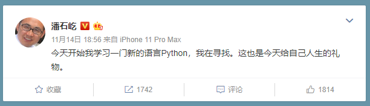
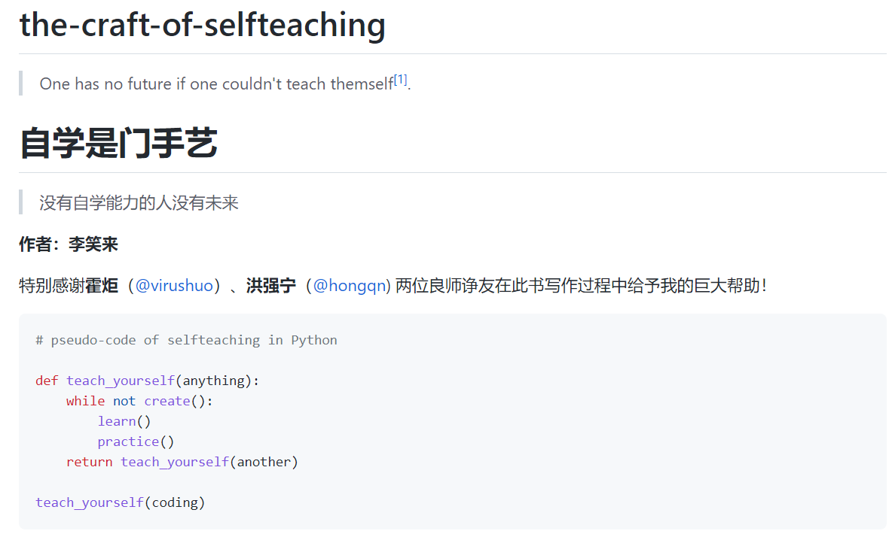
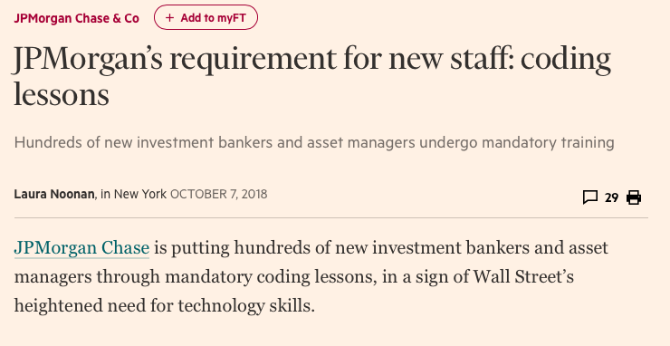
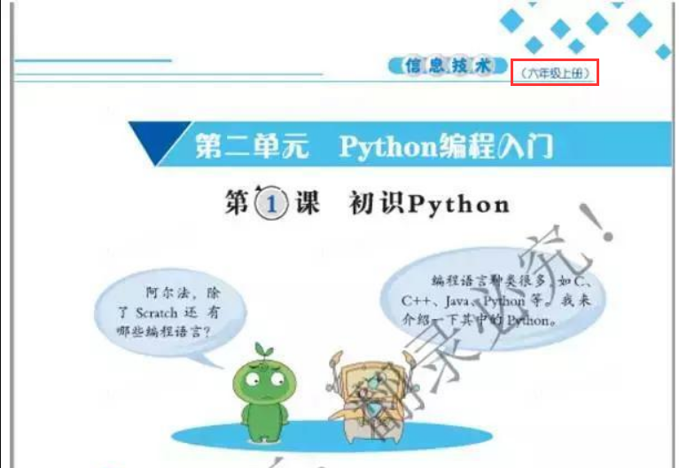
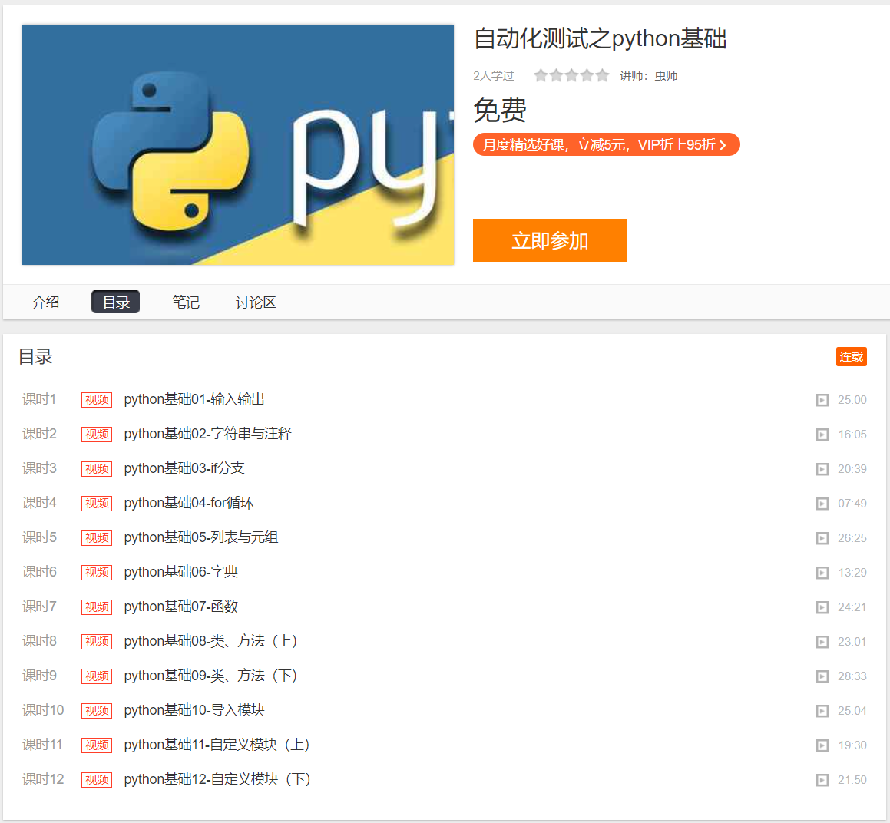

## 这套python基础教程拿走

Python因为简单易学已经出圈了吧。

* 房地产大佬在学python。

* 币圈大佬也开始教python了。

https://github.com/selfteaching/the-craft-of-selfteaching

* 投行分析师也被要求学python。

> 摩根大通花费108亿美元在技术培训和技术人员招聘上，并强制自家分析师参与Python课程学习。

* 小学生也在学python

当然，他也已经成为了测试人员必备的编程语言。

我在网易云课堂上架了《自动化测试之Python基础》

你没看错！真的`免费`，没有套路，不赚钱，交个朋友。

扫描（长按）二维码打开课程链接：

快去发朋友圈告诉身边的朋友！大家卷起来~！

