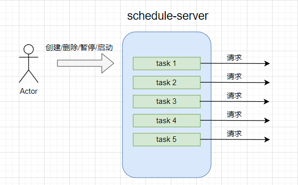

## 动态定时任务服务 schedule-server

### 背景

在测试平台一般会有定时任务去执行`测试任务`的功能，定时任务本身并不复杂，python下面有 schedule 这样的库，linux下面有crontab工具。不过，这样的工具都是预先设置好定时任务，然后开始执行。 `测试任务` 是可以动态创建、删除的，那么他的定时任务也应该是可以动态添加、删除，甚至暂停、重启等功能。显然，schedule、crontab都不满足这样的需求。

经过这段时间的搜索，APScheduler几乎是python下面功能最强大的定时任务库了。各个web框架都做了支持，例如：flask-apscheduler、django-apscheduler等。当然，APScheduler本身也有很恶心的地方，集成到web服务中，如果创建多个 worker 或 使用了分布式，一定会出现重复执行的问题，为此还要用锁去解决。

是否有单独的项目来实现一个定时任务服务？ 可惜没有找到，那么我自己上手做一个。

https://github.com/SeldomQA/schedule-server


### 工作原理



工作方式非常简单，我们可以向schedule-server 动态添加（删除/暂停/启动）定时任务，定时任务根据定时触发规则，到点就发送请求。请求就是一个URL地址（接口），这个接口可以是运行测试任务，或者是别功能，你可以自行实现，这与定时任务并无直接关系。

你可以理解为定时炸弹，你买来炸山开石，还是当绑匪炸人质，与炸本身无关，定时炸弹的作用到点-> peng ~！

### 技术选型

* APScheduler: APScheduler是python下面功能最强大的定时任务库了。
* fastapi：用来快速实现定时任务的相关接口。
* redis/redlock：为了解决 APScheduler 重复执行的问题，需要用到 redlock 锁。
* requests: 定时任务到时间触发 接口请求。


### 如何启动服务

* running

```shell
> cd schedule_server
> python main.py
```

* api doc

url: http://127.0.0.1:8000/docs


### 实现功能（接口）

APScheduler支持三种类型的定时任务：

* date: 固定某一时间触发。
* interval： 循环触发。
* cron： linux下面的crontab定时工具。


__固定时间触发__

* http://127.0.0.1:8000/scheduler/date/add_job

```json
{
  "job_id": "date_job_111",
  "url": "https://httpbin.org/get?id=1",
  "year": 2022,
  "month": 11,
  "day": 18,
  "hour": 7,
  "minute": 0,
  "second": 0
}
```

* job_id: 设置一个唯一的`job_id`，后面可以通过`job_id` 删除/暂停/重启 定时任务。 
* url: 定时任务触发的url。
* datatime: 设置 `2022-11-18 07:00:00` 触发一次。这里用的是UTC时间，所以，北京时间你需要手动加8小时。


__间隔时间触发__

* http://127.0.0.1:8000/scheduler/interval/add_job

```json
{
  "job_id": "interval_job_222",
  "url": "https://httpbin.org/get?id=2",
  "weeks": 0,
  "days": 0,
  "hours": 0,
  "minutes": 0,
  "seconds": 10
}
```

每次间隔 `10秒` 触发一次。


__crontab定时触发__


crontab的时间格式比较复杂，可以参考这个网站学习：

https://tooltt.com/crontab-parse/


* http://127.0.0.1:8000/scheduler/cron/add_job

```json
{
  "job_id": "cron_job_333",
  "url": "https://httpbin.org/get?id=3",
  "second": "0",
  "minute": "*/1",
  "hour": "*",
  "day": "*",
  "month": "*",
  "day_of_week": "*"
}
```

每次间隔 `1分钟` 触发一次。


__其他接口__

* 删除定时任务：`http://127.0.0.1:8000/scheduler/remove_job?job_id=interval_job_222`
* 暂停定时任务：`http://127.0.0.1:8000/scheduler/pause_job?job_id=interval_job_222`
* 恢复定时任务：`http://127.0.0.1:8000/scheduler/resume_job?job_id=interval_job_222`


### 后续

接下来，我将会实现一个前端，通过前端界面可以更加方便的对定时任务进行管理。

