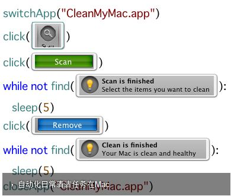
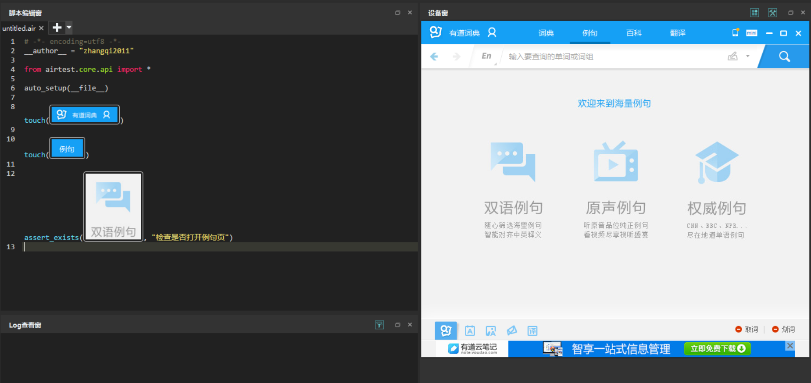
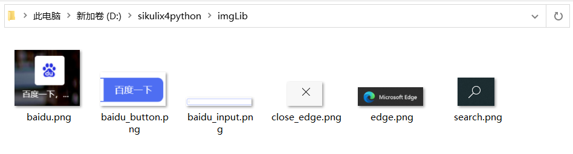

## 在Python中使用sikuli

Sikuli是一款的图形脚本语言，可以说是基于图形识别的自动化工具。10年前，初次见到这款工具时还是比较惊奇的，还可以这样玩？



当然，后来网易也开源了类似的工具airtest时。




本文要介绍的项目是：`sikulix4python`，sikuli是一个款基于Java开发的库。 `Py4J` 是一个神奇的项目。他在Python和Java之间建立一个桥梁，可以允许Python调用Java的API。

RaiMan（sikuli作者）老爷子利用`py4j` 开源了`sikulix4python`，老爷子似乎不怎么会用Python，我为什么敢说他不怎么懂Python，就问你见过在Python里用`;` 给行结尾的吗？貌似对这个项目也不会上心，有问题就让提问者自己解决。 于是，我把他的项目克隆了过来，稍加润色。

https://github.com/seldomQA/sikulix4python

## 安装

* 下载 sikulixapi.jar(2.0.5+)https://raiman.github.io/SikuliX1/downloads.html)

* 利用Java运行 `sikulixapi.jar`

```shell
> java -jar .\sikulixide-2.0.5.jar -p
[info] SikulixAPI: Running py4j server on port 25333
...
```

* 安装 py4j
```shell
> pip install py4j
```

## 简单封装

sikulix4python 不提供`pip`安装，甚至连 `setup.py` 安装文件都没有，怎么办呢？只能把项目克隆下来用了，API写的非常有Java风格。还没时间深入理解，不管了，先在原`Screen`类上封装一个`MyScreen`。

```python
import os
from sikulix4python import Screen


class MyScreen:

    def __init__(self, img_dir):
        self.scr = Screen()
        self.img_dir = img_dir

    def get_image(self, img_name: str) -> str:
        img_path = os.path.join(self.img_dir, img_name)
        return img_path

    def click(self, image_name: str) -> None:
        """ click """
        img_path = self.get_image(image_name)
        print(f"click: {img_path}")
        self.scr.click(img_path)

    def type(self, image_name: str, text: str) -> None:
        """ input text """
        img_path = self.get_image(image_name)
        print(f'type "{text}": {img_path}')
        self.scr.type(img_path, text)
```

简单封装一个`click()`点击，`type()`输入。


接下来，把自己要操作的元素截图保存。



接下来调用自己封装`MyScreen`类，

```py
import os
from time import sleep

def main():
    """简单的测试"""
    BASE_DIR = os.path.join(os.path.dirname(os.path.abspath(__file__)))
    IMG_DIR = os.path.join(BASE_DIR, "imgLib")
    scr = MyScreen(IMG_DIR)
    scr.click("search.png")
    scr.click("edge.png")
    scr.click("baidu.png")
    scr.type("baidu_input.png", "sikulix for python")
    scr.click("baidu_button.png")
    sleep(2)
    scr.click("close_edge.png")


if __name__ == '__main__':
    main()
```

## 运行

运行上面的脚本。


## 总结

sikuli其实有很多不足够，比如 对屏幕分辨率有要求，上面的脚本修改系统分辨率就跑不通了，比如，对截图的精准度，颜色也有要求。

那为啥还要用它，基于图形自动化工具其实会打破 web/App/GUI的技术边界，也就是会如果要做Web自动化只能选类似Selenium的自动化工具，如果做Windows GUI自动化只能选AutoIt v3 这样的工具。而sikuli不关心你是啥，只要能识别就能操作。这就适合处理一些跨界的界面，比如 Web 页面弹出的上传文件弹窗。

