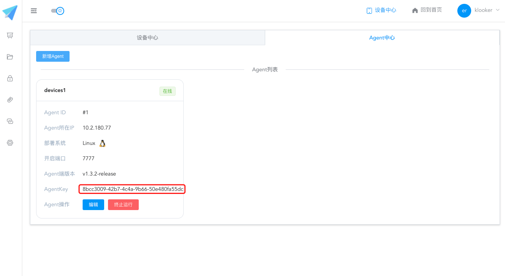
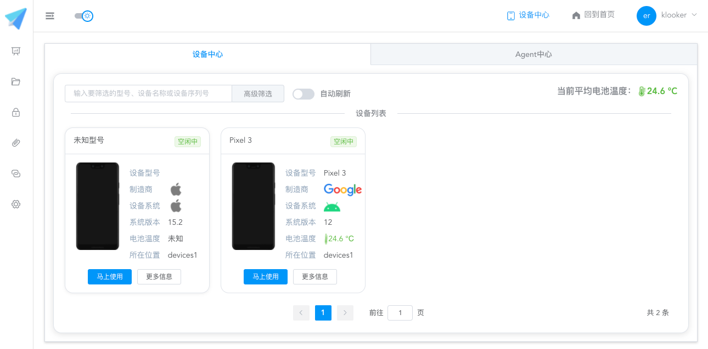
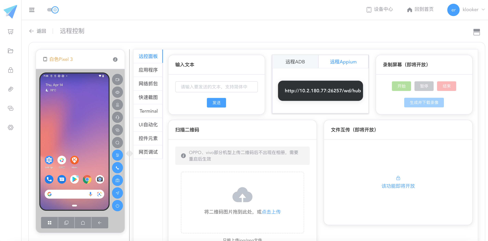

# Sonic 基于Linux 部署文档

sonic是最近很火的开源云真机平台，支持分布式部署，功能也非常丰富，我们需要一套环境不远程执行自动化测试，于是，就部署了一套。当然，官方有项目详细的部署文档，本文结合我们自己的情况选择一台Linux主机上完成整个部署。

官网：
https://sonic-cloud.gitee.io/#/Home

github:
https://github.com/SonicCloudOrg

## 准备工作

__硬件__

* Linux主机：就放我的办公桌旁边的一个机箱，内置ubuntu系统。
* Android手机：需要开启debug调试模式。
* iOS手机：需要安装WebDriverAgent。
* 两条USB数据线：用于将连接Linux主机。
* 一台macOS电脑：用于给iOS手机安装WebDriverAgent应用。

__软件__

* Docker: Linux系统需要有docker。
* MySQL: Linux需要安装MySQL，当然可以用docker启动。
* XCode: macOS需要安装Xcode.
* WebDrirverAgent: iOS需要安装。

## Sonic架构

项目架构介绍：
http://testerhome.com/opensource_projects/sonic

文章介绍的很复杂，我就简单描述一下：


> sonic前端 -> sonic 后端 -> sonic Agent代理 -> 移动设备

* sonic前端：就是访问sonic平台看到的界面。
* sonic后端：当然是服务sonic前端的后端服务。
* sonic Agent: 这是个代理节点，可以有多个，可以是本机或远程主机，主要是来管理移动设备。Agent通过`AgentKey` 接入sonic平台。
* 移动设备：就是远程云真机的`真机` 。

## 部署流程

下面开始手动部署

### linux主机

1. 通过ssh登录Linux主机。 

```shell
> ssh test@10.22.33.44 
```

现在，务必记住这这台Linux主机的IP地址：`10.22.33.44`

2. 安装docker

> 请参考docker相关教程，在ubuntu上安装docker

### sonic 平台

sonic把服务都制作成了`docker-compose.yaml` ，这大大降低了服务部署的难度。

1. 下载`sonic-server-simple` ，该项目用于启动sonic前后端服务。

```shell
> wget https://github.com/SonicCloudOrg/sonic-server-simple/archive/refs/tags/v1.3.2-release.tar.gz    # 下载
> tar -zxvf v1.3.2-release.tar.gz   # 解压
> cd sonic-server-simple-1.3.2-release  # 进入目录
> vim docker-compost.yaml  # 编辑文件内容
```

2. 编辑`docker-compost.yaml` 服务。

```yaml
version: '3'
services:
  sonic-server-simple:
    image: "sonicorg/sonic-server-simple:v1.3.2-release"
    environment:
      #以下为MySql配置，localhost请替换为自己MySql服务的ipv4地址
      - MYSQL_HOST=10.22.33.44   #需要修改
      - MYSQL_PORT=3360          #需要修改
      - MYSQL_DATABASE=sonic     #需要修改
      - MYSQL_USERNAME=root      #需要修改
      - MYSQL_PASSWORD=test@123  #需要修改
      #在服务器部署的话，localhost改为服务器ip，port更改为sonic-server-simple暴露的port（一般不变）
      - SONIC_API_HOST=10.22.33.44  #需要修改
      - SONIC_API_PORT=8094
      - SONIC_NETTY_PORT=8095
      #token加密的key值
      - SECRET_KEY=sonic
      #身份验证token有效天数
      - EXPIRE_DAY=14
      #前端页面访问地址，不填默认为http://localhost:3000
      - CLIENT_HOST=http://localhost:3000
      #文件保留天数（指测试过程产生的文件，包括图片、录像等等）
      - FILE_KEEP_DAY=60
      #测试结果保留天数
      - RESULT_KEEP_DAY=60
      #以下均为Cron表达式
      #清理文件定时任务
      - FILE_CRON=0 0 12 * * ?
      #清理测试结果定时任务
      - RESULT_CRON=0 0 12 * * ?
      #发送日报定时任务
      - DAY_CRON=0 0 10 * * ?
      #发送周报定时任务
      - WEEK_CRON=0 0 10 ? * Mon
    networks:
      - sonic-network
    volumes:
      - files:/keepFiles/
      - files:/imageFiles/
      - files:/recordFiles/
      - files:/packageFiles/
      - files:/logs/
    ports:
      - "8094:8094"
      - "8095:8095"
  sonic-client-web:
    image: "sonicorg/sonic-client-web:v1.3.2-release"
    environment:
      #192.168.1.1改为你的ipv4，port更改为sonic-server-simple暴露的port（一般不变）
      - SONIC_API_HOST=10.22.33.44   #需要修改
      - SONIC_API_PORT=8094
    networks:
      - sonic-network
    ports:
      - "3000:80" 

volumes:
  files:

networks:
  sonic-network:
    driver: bridge
```

配置文件不复杂，备注说得很清楚的，需要修改的配置，我都备注了`需要修改`。主要修改：

1. sonic前端IP和端口
2. sonic后端IP和端口
3. MySQL数据库连接配置


3. 启动服务

拉取soncie-server镜像

```
> docker-compose up -d
```

等待docker拉去镜像启动容器，那么服务就启动起来了。

4. 访问平台

http://10.22.33.44:3000/Login 


## 接入移动设备

1. 接入Android设备

Android设备的接入非常简单，安装`adb`即可

```shell
> sudo apt-get install android-tools-adb   # 安装
> adb devices -l   # 检测设备
List of devices attached
xxxxx  device usb:3-5 product:blueline model:Pixel_3 device:blueline transport_id:1
```

如果检测不到，请检查手机是否开启debug调试模式，不同型号的Android手机开启方式有所不同，自行查找 

2. 接入iOS设备

iOS接入Linux系统会比较复杂一些。 

（详细过程看官方部署文档）

官方部署文档：
https://sonic-cloud.gitee.io/#/Deploy

3. sib工具

需要说一下的是`sib`（sonic-ios-bridge）工具，听说过`taobao-iphone-device` 吗？`sib`和它类似，不过是用go实现的。

https://github.com/SonicCloudOrg/sonic-ios-bridge

SIB 使用方式 

```shell
> ./sib app list        #查看接入的iPhone手机上的App
知乎 com.xxx.xxxx 5
WebDriverAgentRunner-Runner com.facebook.WebDriverAgentRunner.zh.xctrunner 1
```
注：此处需要特别记下 WebDrvierAgent 的修改之后的签名`com.facebook.WebDriverAgentRunner.zh.xctrunner`。 


## sonic Agent

sonic Agent主要是用来管理移动设备的。你可以选择部署到任意主机，并且可以部署多Agent。

1. 创建项目& AgentKey



注：此处要特别注意`AgentKey`，Agent接入平台就靠这个。 


2. 部署Sonic-Agent服务 

下载 sonic-agent 的 `docker-compose.yaml` 文件。 

```shell
> wget https://github.com/SonicCloudOrg/sonic-agent/releases/download/v1.3.2-release/docker-compose.yml 
```

修改sonic-agent 的`docker-compose.yaml`文件。 

```yaml
    # 替换为部署Agent机器的ipv4
    - AGENT_HOST=10.22.33.44  # 需要修改
    # 替换为Agent服务的端口，可以自行更改
    - AGENT_PORT=7777
    # 替换为前端新增Agent生成的key
    - AGENT_KEY=8bcc3009-42b7-4c4a-9b66-50e480fa55dc  # 需要修改
    # 这个host改成后端的host
    - SERVER_HOST=10.22.33.44  # 需要修改
    # 这个port改成后端文件中心的port（一般不变）
    - SERVER_FOLDER_PORT=8094
    # 这个port改成后端传输中心的port（一般不变）
    - SERVER_TRANSPORT_PORT=8095
    # 是否使用安卓模块
    - ANDROID_ENABLE=true
    # 是否开启远程adb调试功能
    - USE_ADBKIT=true
    # 是否使用iOS模块
    - IOS_ENABLE=true
    # 替换为你自己使用的wda的bundleId，如果没有.xctrunner后缀会自动补全，建议使用公司的开发者证书
    - WDA_BUNDLE_ID=com.facebook.WebDriverAgentRunner.xctrunner.zh  # 需要修改
    # 是否启用Appium
    - APPIUM_ENABLE=true
    # 默认为0会自动寻找随机端口启动，如果需要指定appium server端口，请在这里设置
    - APPIUM_PORT=0
    # 是否启用webview调试功能
    - WEBVIEW_ENABLE=true
    # 谷歌调试端口，一般不需要修改（默认0使用随机端口，如果需要开启防火墙给外部使用，请设置固定端口如7778）
    - CHROME_DRIVER_PORT=0
```

需要修改的配置，我都备注了`需要修改`。主要修改：

* AgentKey: 前端平台创建的。
* WebDriverAgent: iOS设备 WebDriverAgent修改之后的签名。

拉取soncie-agent镜像 
```
> docker-compose up -d
```

3. 查看日志 

启动的sonic-agent很可能检测不到设备。那么就需要进入docker 查看启动日志。 

进入soncie-agent 镜像 

```shell
> docker ps  # 查看镜像
60b58ea8da3b   registry.cn-hangzhou.aliyuncs.com/sonic-cloud/sonic-agent-linux:v1.3.2-release   "/root/jdk-17.0.2/bi…"   2 hours ago     Up 2 hours

> docker exec -it 60b58ea8da3b bash   # 进入镜像
```

查看日志 

进入docker镜像之后，找到logs 目录查看日志。 

```shell
root@klooktest: cd logs/
root@klooktest:~/logs# ls
sonic-agent.log

root@klooktest:~/logs# cat sonic-agent.log
```

如果agent部署失败或无法识别移动设备都可以从日志中查看。

2.5 使用云真机 

前面部署过程一切顺利~！ 那么就可以登录sonic平台使用设备了。 

* 设备列表



* 使用云真机




## 最后

这是我写的最不通俗易懂的文章了，部署过程涉及的知识点挺多的，比如 `sib` 工具就可以单独拿出来讲讲，比如 iOS配置`WebDrierAgent`也挺麻烦的，还有`docker-compose`文件定义规则。

不要吐槽这和官方部署教程有啥区别，部署之前我不确定linux能否接入iOS，答案是可以的。如果你没听说过sonic，把它当成sonic的推广文吧！


