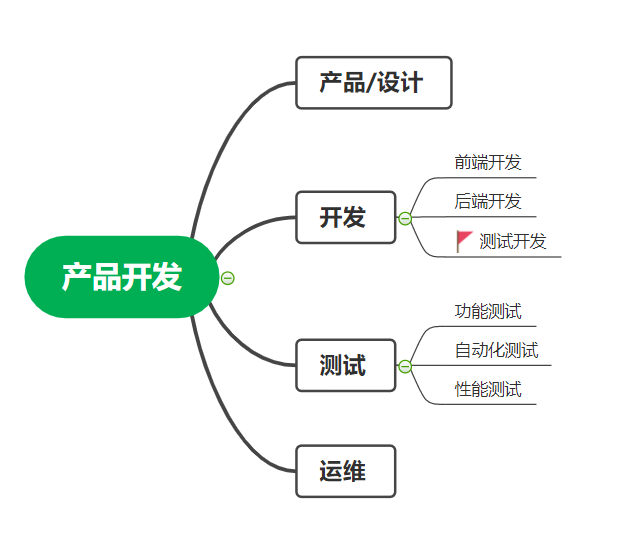
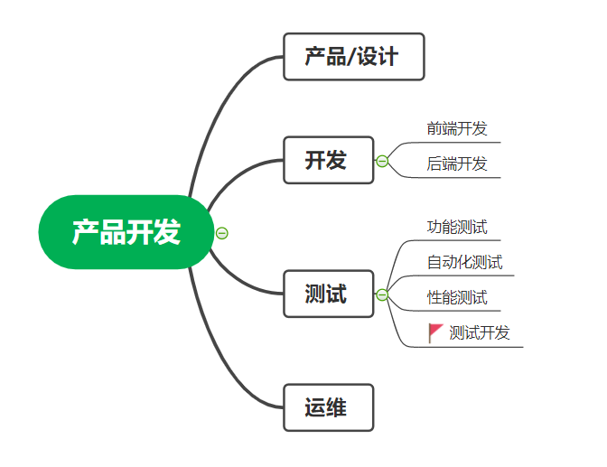

## 测试开发定位

知乎上看到一个很有意思的话题：

> 测试开发是代表 “懂测试的开发” 还是“懂开发的测试”？

这是个很有意思的话题：

我一开始画了这么一张图：

就我自身的工作而言，用着开发的技术，做着开发差不多的工作。归为`开发`一类并无不妥！

后来，我细细琢磨了一下，改为了下图。

其实答案也非常明显：不管是做自动化的测试，还是开发工具/平台的测试，又或者做着基层管理工作的测试，大家的身份认同应该首先还是“测试工程师”。

《2020互联网测试开发者大会》吸引了大批的测试开发来分享他们开发的工具、平台和技术。其实，这些分享绝大部分都是开发的技术，如果他们的身份认同是软件开发，那么应该就不会来参加这个大会了。

那么，这么明显的问题，为什么还会有人来讨论。

早期的测试职位定位非常清晰，至少在我2010年刚做测试的时候，每天关注的话题是测试方法、用例设计、测试计划、测试报告，如何使用bugfree、禅道、bugzilla、QC 这类工具，高级一些的话题是UI自动化、性能测试。大部分情况下我们基本不需要写代码。如果SQL（结构化查询语言）也是一门编程语言的话，那么我们写得最多的是SQL。-- 此时，我们和开发的技术栈并没有太多交集。

> 张华当上了Java开发工程师；李萍是一个运维工程师；我在做软件测试：我们都有光明的前途。

然而，大家的岗位重要程度不同，岗位要求不同，薪资也不同。你可以看看你们公司的HR/行政/前台/这些岗位，其实普遍比测试低。

有意思的来了：大家都计算机专业科班出身，大家都是`软件生产过程`当中的参与者，那么负责不同工序，薪资差异明显，那么测试必然会向更高价值的开发渗透，不仅仅是测试，运维也一样，看看近几年的`自动化运维/devops/docker/k8s..` 这些有多热门。

所以，测试/运维岗位逐渐趋同于开发，这是一个必然的驱动。

* 开发：我要开发一个业务系统。

* 测试：我要开发一个自动化测试平台。

* 运维：我要开发一个自动监控/部署系统。

大家在各自的领域为运用开发技术，增加自己的`岗位门槛`和`附加价值`。

那么，测试的`岗位门槛`，建立一个`测试开发`的岗位，需要具备更多的开发技能。通过技术手段去增加`附加价值`，即通过开发技术提高质量和效率。

* 质量
* 效率

这就是测试岗位最重要的价值所在，至于修炼自己在测试思维，设计更好的用例，测试过程改进；自动化，工具平台开发，本质都是在为这两个价值服务。

