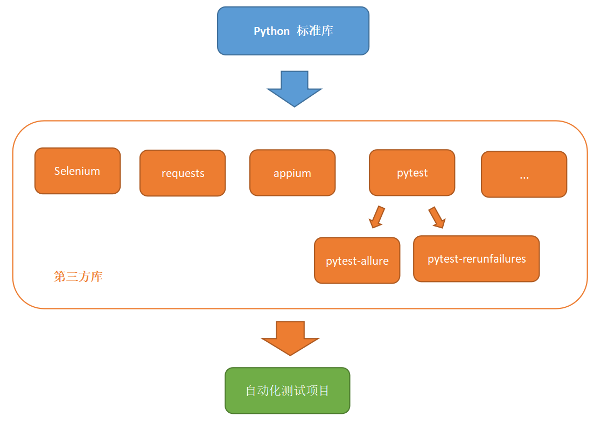
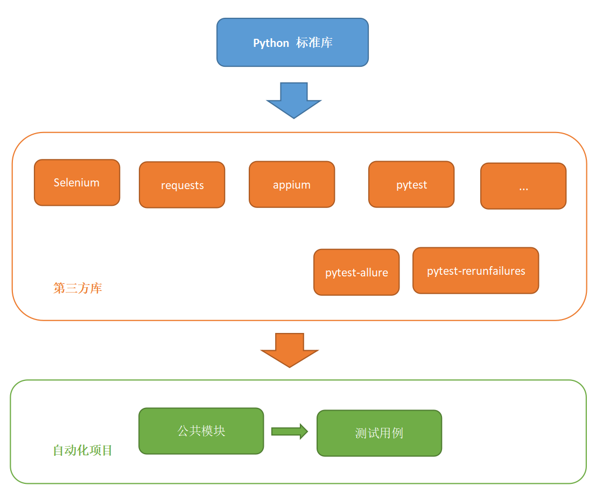
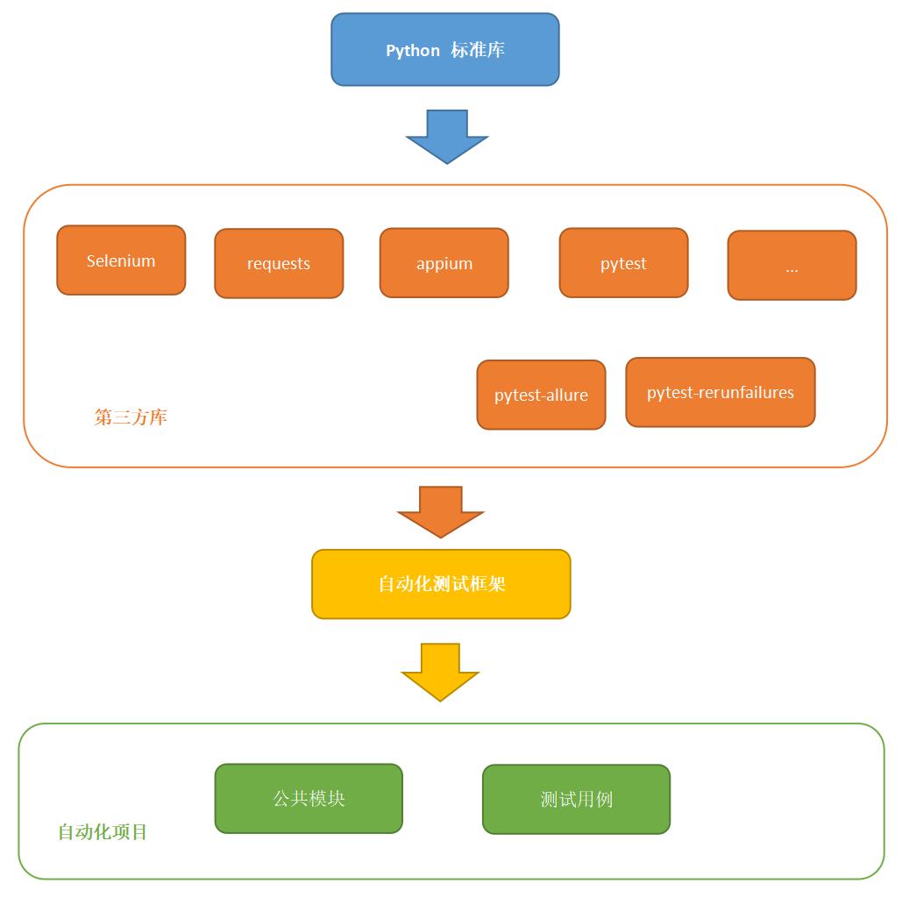

## 浅谈自动化测试框架开发


在自动化测试项目中，为了实现更多功能，我们需要引入不同的`库、框架`。



首先，你需要将常用的这些库、框架都装上。

```
pip install requests
pip install selenium
pip install appium
pip install pytest
pip install pytest-rerunfailures
pip install allure-pytest
...
```

然后，在项目中使用他们。
```py
import pytest
import yagmail
from selenium import webdriver


class MyTest:

    def setup(self):
        self.browser = webdriver.Chrome()

    def test_case(self):
        browser.find_element_by_id("user").send_keys("admin")
        browser.find_element_by_id("pawd").send_keys("admin123")
        # ...
        page.close()


if __name__ == "__main__":
    pytest.main(["-s", "-v", "./test_case.py",
        "--html", "./test_report.html",
        "--reruns", "3"
    ])
    yagmail.SMTP()
    # ...

```

## 设计与封装

例如上面的自动化项目代码，我们写多了之后，就会发现常用的库就是那么几个，而且用法大同小异，俗称样板代码。

这个时候你就可以考虑去做一些封装，然后把那些常用的功能封装成了一堆公共方法，在你的项目代码中调用，这样可以更快速的完成开发任务，并且便于应对需求的变化。



```py
import pytest
from common import mail
from test_data import TestData
from page import LoginPage


class MyTest:

    def test_case(self, browser):
        page = LoginPage(browser)
        page.username.send_keys(TestData.admin)
        page.passowrd.send_keys(TestData.admin_pawd)
        # ...
        page.close()


if __name__ == "__main__":
    pytest.main(["-s", "-v", "./test_case.py",
        "--html", "./test_report.html",
        "--reruns", "3"
    ])
    mail.SMTP()
    # ...

```

## 自动化测试框架

自动化测试框架和你在项目中封装的公共模块有着一些不同。

* 它实现的功能更通用：例如，你可以在`项目`中封装一个登录的公共模块，用于所以用例的登录，但不能在`框架`里面封装一个登录，因为，你们的项目登录是用账号密码，别人家用的是手机号+验证码，你封装的登录脱离了你的项目就不可用了，显然不应该放到框架里。

* 它应该是和项目分离：因为它要给更多的人使用，并且不能轻易被修改，因此，它应该是独立安装的，不应该和项目代码混到一起。如果一个框架被使用者轻易的改来改去。请问，如何升级？使用者想体验新的版本怎么办？

* 它应该有一些设计创新：我可不可以把selenium的`get()`方法改个名字叫`open()`封装到自己的框架里。当然可以，如果整个框架都是在把别人的API自己换个名字包一层，这和`红芯浏览器`有什么区别？





假设我们开发的自动化测试框架叫`xtest`。

首先，需要安装xtest。

```
pip install xtest
```

使用xtest编写测试用例。

```py
import xtest
from xtest import TestData
from page import LoginPage


class MyTest:

    def test_case(self, browser):
        page = LoginPage()
        page.username.send_keys(TestData.user)
        page.passowrd.send_keys(TestData.pawd)
        # ...

if __name__ == "__main__":
    xtest.main(mail=True)
```

它应该以更简单的方式实现更强大的功能。当然，不同类型的框架，难易程度也是不同的，实现一个web框架的所需要知识更多，实现一个机器学习框架就更难了，自动化测试框架是站在一堆人的肩膀上来实现，难度系数要低很多。

