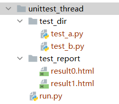
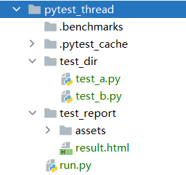

## Python多线程运行测试用例

这是时常被问到的问题，尤其是UI自动化的运行，过程非常耗时，所以，所以多线程不失为一种首先想到的解决方案。

> 多线程是针对的测试用例，所以和selenium没有直接关系，我们要关心的是单元测试框架。

## unittest

首先，应该说明的是unittest本身是不支持多线程的。当然，如果你学过Python的threading模块，也未必不行。不过我在`stackoverflow` 找了半天，大多是介绍unittest 测试多线程模块，并非是unittest本身如何多线程运行用例。

> “我如何学习葵花宝典” 和 “我如何验证 `张三` 学会了葵花宝典”是两回事，而我显然要解决的问题是前者。

又重新百度，结果就找了答案。核心借助 `tomorrow3` 的测试库，再配合`HTMLTestRunner` 生成测试报告。

https://github.com/SeldomQA/HTMLTestRunner
https://github.com/dflupu/tomorrow3



* 测试用例

测试用例如下，你可以复制多份测试。

```py
# test_a.py
import time
import unittest
from selenium import webdriver


class Test1(unittest.TestCase):

    @classmethod
    def setUpClass(cls):
        cls.driver = webdriver.Chrome()

    def test_01(self):
        self.driver.get("https://www.bing.com/?mkt=zh-CN")
        elem = self.driver.find_element_by_id("sb_form_q")
        elem.send_keys("多线程")
        elem.submit()
        time.sleep(2)
        self.assertIn("多线程", self.driver.title)

    @classmethod
    def tearDownClass(cls):
        cls.driver.quit()


if __name__ == "__main__":
    unittest.main()
````

* 运行文件

核心在`tomorrow3`提供的`threads`装饰器，用于装饰测试运行方法。

```py
import unittest
import os
from TestRunner import HTMLTestRunner
from tomorrow3 import threads

# 定义目录
BASE_DIR = os.path.dirname(os.path.realpath(__file__))
TEST_DIR = os.path.join(BASE_DIR, "test_dir")
REPORT_DIR = os.path.join(BASE_DIR, "test_report")


def test_suits():
    """
    加载所有的测试用例
    """
    discover = unittest.defaultTestLoader.discover(
        TEST_DIR,
        pattern="test_*.py"
    )
    return discover


@threads(2)  # !!!核心!!!! 设置线程数
def run_case(all_case, nth=0):
    """
    执行所有的用例, 并把结果写入测试报告
    """
    report_abspath = os.path.join(REPORT_DIR, f"result{nth}.html")
    with open(report_abspath, "wb+") as file:
        runner = HTMLTestRunner(stream=file, title='多线程测试报告')
        # 调用test_suits函数返回值
        runner.run(all_case)


if __name__ == "__main__":
    cases = test_suits()
    # 循环启动线程
    for i, j in zip(cases, range(len(list(cases)))):
        run_case(i, nth=j)  # 执行用例，生成报告
```

#### 总结：

确实可以（根据设置的线程数）同时开启两个浏览器运行，同时带来了两个问题。

1. 程序会根据线程数，生成多份测试报告，每个测试报告统计当前线程所运行的测试结果。
2. 如果去掉`nth`参数，设置为一个报告，那么第二个线程运行的结果不能正确展示的一张报告上。
3. 至少每个线程中的用例要保证有浏览器的启动/关闭。

> 第3点，你可能不理解，我举个例子，小时候见过妈妈/奶奶缝衣服。假设一件衣服拿一根针来缝制，缝衣服最麻烦就是穿针引线，针眼很小，每次都要费半天功夫，小孩子眼神好，我时常被叫去穿针引线。那为了节约时间怎么办，我当然是把线弄的长长的，最好是一根针线可以缝制多件衣服。
> 
> 在Selenium 中，定义的浏览器驱动`driver`，每一条用例都定义一次驱动，伴随而来的就每个用例都开启/关闭一次浏览器，这当然是非常耗时的，为了缩短这个时间，我们最好是启动一次浏览器把所有用例都跑完才关闭。
> 
> 那么问题来了，当我们使用多线程之后，相当于多个人同时缝制衣服，共用一根针线肯定不行啊。至少需要每人一根针线吧！而且缝制衣服的人是变化的，为了赶时间就多两个人（多开两个线程），用例比较少就少几个人（少启两个线程），为了适应这种变化，那么最好一件衣配置一根针线，每件衣服是最小单位，一个人必须要独立的把一件衣服缝好。
> 
> 为了使用多线程，我们就必须每条用例开启/关闭一次浏览器，这其实是另一种时间的浪费，为了弥补这里的浪费，你必须把线程开得足够多才行。
> 
> 最后，你必须再配置一位统计员，去统计每个人缝制衣服的数量，合计到一个报告中。

## pytest

多线程运行用例在 pytest 中就相对容易太多了，`pytest-xdist` 插件就可以完成这件事情。

https://github.com/pytest-dev/pytest-xdist



* 测试用例

测试用例如下，你可以复制多份测试。

```py
# test_a.py
import time
from selenium import webdriver


def test_01():
    driver = webdriver.Chrome()
    driver.get("http://www.baidu.com")
    elem = driver.find_element_by_id("kw")
    elem.send_keys("unittest")
    elem.submit()
    time.sleep(2)
    assert driver.title == "unittest_百度搜索"
    driver.quit()


def test_02():
    driver = webdriver.Chrome()
    driver.get("http://www.baidu.com")
    elem = driver.find_element_by_id("kw")
    elem.send_keys("python")
    elem.submit()
    time.sleep(2)
    assert driver.title == "python_百度搜索"
    driver.quit()

```

* 运行文件

核心就是安装 `pytest-xdist` 插件，通过`-n`参数设置线程数即可。

```py
import os
import pytest

# 定义目录
BASE_DIR = os.path.dirname(os.path.realpath(__file__))
TEST_DIR = os.path.join(BASE_DIR, "test_dir")
REPORT_DIR = os.path.join(BASE_DIR, "test_report")


if __name__ == '__main__':
    report_file = os.path.join(REPORT_DIR, "result.html")
    pytest.main([
        "-n", "2",  # ！！核心！！！设置2个线程
        "-v", "-s", TEST_DIR,
        "--html=" + report_file,
        ])
```

#### 总结：

相对于unittest，在pytest实现多线程非常简单，最终线线程的测试结果也可以很好在一个测试报告中展示。

1. 存在的问题，正如我上面讨论的，你必须为每个用例设置开启/关闭。除了额外消耗启动时间外，如果想统一配置用例通过哪个浏览器执行也会比较麻烦。
2. 你的每一条用例应该保持绝对独立，不能出现这条用例依赖上条用例的执行结果。因为，这两条用例可能会分配由不同的线程执行。
3. 正如上一条的原因，你不能控制用例的执行顺序。


