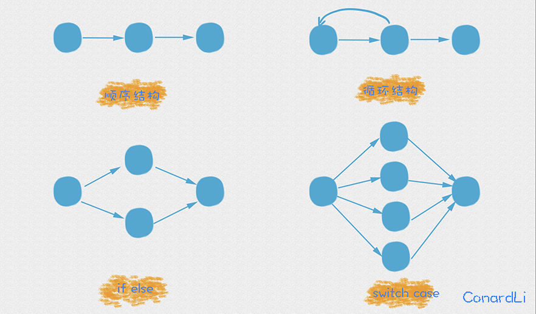

# 代码度量 - 圈复杂度

* 背景


> 成立于1976年的McCabe&Associates公司开发出了McCabe Cyclomatic Complexity Metric（圈复杂度）技术。Metric以软件复杂度测量的数目为基础，能帮助工程师识别难于测试和维护的模块，圈复杂度已经成为评估软件质量的一个重要标准。人们可以用圈复杂度对软件的复杂度和质量进行衡量，来安排工程进度，在成本、进度和性能之间寻求平衡。

* 定义

圈复杂度定义为测量`源代码函数中的决策逻辑数量`。 也称为条件复杂度，简而言之，通过计算代码中独立路径的数量的方法来测量代码复杂度。


* 示例



针对上面的结构，python示例代码：

* 顺序结构

```py
def cc1():
    a = 1
    b = 2
    c = a + b
```

* 循环结构

```py
def cc2():
    for i in range(10, 2):
      print(i)

    print("end")
```


* if else

```py

def cc3():
    if randint(0,1):
        print("条件为真")
    else:
        print("条件为假")

    print("end")
```


* switch case

```py

def cc4():
    match randint(1, 4):
        case 1:
             print("不及预期")
        case 2:
            print("符合预期")
        case 3:
            print("超出预期")
        case 4:
            print("非常优秀")

    print("end")
```

## 计算公式

圈复杂度的计算公式有多种，以下是其中几种常用的计算方式：

* 点边计算法：`V(G)=E-N+2P` / `V(G)=E-N+2`。其中，e表示控制流图中边的数量，n表示控制流图中节点的数量，P表示图的连接组件数目（图的组件数是相连节点的最大集合）。


* 分支节点计算法：`V(G)=P+1`。其中，P表示控制流图中分支节点的数量。


* 区域计算法：`V(G)=R` 。其中，R表示控制流图的区域数。


> 判定法：公式太过复杂，可以简单粗暴的使用判定法。
> 当程序遇到这些判定条件时，圈复杂度在原有基础上加 1 即可；
> * if 语句
> * while 语句
> * for 语句
> * case 语句
> * catch 语句
> * and 和 or 布尔操作
> * ? : 三元运算符

在日常工作中，首先，圈复杂度只代码复杂度和质量的一个衡量维度。其次，圈复杂度的计算公式也好多种，我也不清楚哪种是标准的计算公式。如果每实现一个方法，都要去人工算圈复杂度，那显然是本末倒置了。


## 计算工具

圈复杂度的计算方法具体取决于所使用的编程语言和工具。当然是借助于工具来计算圈复杂度，这样才方便快捷。

### radon

Radon 是一个 Python 工具，可以从源代码计算各种指标。 可以计算：
* McCabe 复杂度，即圈复杂度
* 原始指标（包括 SLOC、注释行、空白行等）
* 霍尔斯特德指标（全部）
* 可维护性指数（Visual Studio 中使用的）


pip 安装

```bash
pip install radon
```

实现一段代码：

```py
# cc_demo.py

def cc5():
    for i in range(100):
        if i % 2 == 0:
            print(f"偶数: {i}")
        elif i == 79:
            # 特殊逻辑：等于79跳出循环
            break
        else:
            print(f"奇数: {i}")
    else:
        print("skip for loop")
```

通过radon 计算圈复杂度

```py
> radon cc cc_demo.py -a

cc_demo.py
    F 38:0 cc5 - A

1 blocks (classes, functions, methods) analyzed.
Average complexity: A (5.0)
```

* `cc`: 分析Python模块并计算圈复杂度。
* `-a`: -a 告诉 radon 最后计算平均复杂度。 请注意，平均值是在所示块之间计算的。

最后，`cc5()`方法计算圈复杂度为5，知道是怎么得到的吗？ for、if、elif、else、else 都是控制流语句，所以圈复杂度为5。


## 圈复杂度评估标准

我找到了两个标准，可以拿来做参考：

* 圈复杂度与风险评估

|  Cyclomatic Complexity  |  Risk Evaluation   |
|:----------|:-----------|
| 1-10 | 一个没有太大风险的简单模块 |
| 11-20 |具有中等风险的更复杂模块|
| 21-50 |高风险的复杂模块|
| 51 and greater	 |风险极高的不稳定项目|

* 圈复杂度与可维护性

|  圈复杂度  |  代码状况   | 可测性 | 维护成本|
|:----------|:-----------|:-------|:-------|
| 1-10 | 清晰 | 高 | 低 | 
| 10-20 | 复杂 | 中 | 中 | 
| 20-30 | 非常复杂 | 低 | 高 | 
| > 30  | 不可读 | 不可测 | 非常高 |


## 圈复杂度的意义

对于开发工程师开说，通过圈复杂度评估代码是编写代码时的一种很好的方法。尤其是在写降低圈复杂度的方法部分时，其中的一些方法和对应的情况在之前练习编写代码时遇到过很多次，比如简化条件表达式和提炼函数等。使用这些方法确实能够很大程度上增强代码的可读性和可维护性

对于测试工程师来说，圈复杂度也是很有用的。圈复杂度可以作为用例覆盖率的一个参考指标。