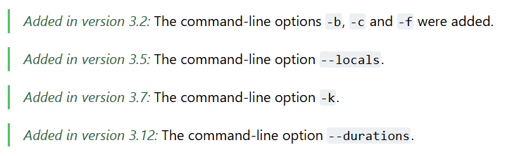

# 这可能是最完整的unittest课

`unittest`作为Python标准库中的单元测试框架，仍然可以满足我们的绝大部分单元测试相关工作。很多时候我们直接放弃使用`unittest`，不是因为 unittest 做不到，只是因为功能更强大的 `pytest` 在前面。主观上已经放弃了 `unittest`。

我们会在 unittest 官方文档看到。

作为Python的亲儿子，至少Python官方并没有放弃unittest的更新维护。

__unittest 优势__

* `标准库集成`：unittest 是 Python 标准库的一部分，安装 Python 时默认可用，不需要额外安装。

* `面向对象的设计`：通过继承 `unittest.TestCase` 组织测试代码，结构清晰，便于扩展和维护。

* `丰富的断言方法`：提供了多种断言方法，方便进行各种类型的测试检查。

作为unittest比较资深的用户，并且基于 unittest 开发过各种扩展和源码重写，包括：

* `XTestRunner`定制化的HTML/XML报告。
* 实现黑白名单用例标签。
* 实现强大的数据驱动，支持各种数据驱动文件。
* 实现代码用例平台化的改造。

unitest仍未过时，unittest提供了很多好用的功能，而且也非常容易的扩展和重写，我来为 unittest 正名。

于是，我做了一件一直以来想做的事，开源`Learn-unittest-class`项目，这可能是最完整的 `unittest` 课了。

* github地址：

https://github.com/defnngj/Learn-unittest-class

目前基础内容已更新完成。更新中，记得加 星 。

* B站视频：

https://www.bilibili.com/video/BV1JM4m167oR

文字太类，也可以观看我的B站视频，更新中。记得三连 + 关注。我会有动力更新更多免费的视频课程。

> 声明：本文并非反 pytest，我后面同样有计划出 pytest 课。
