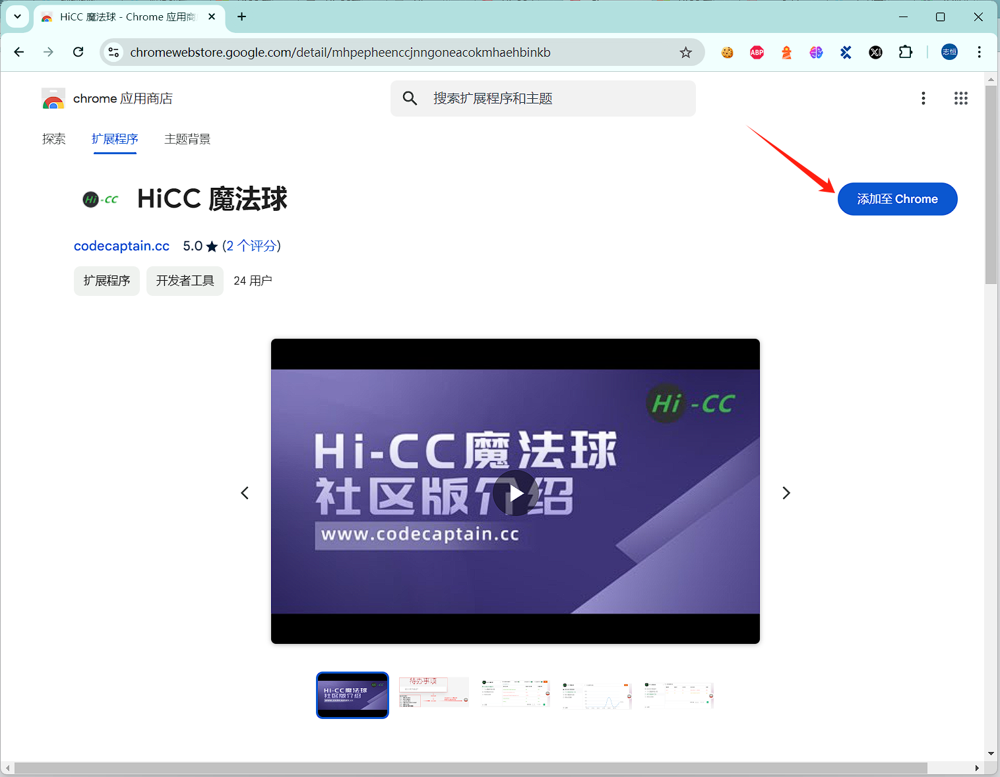
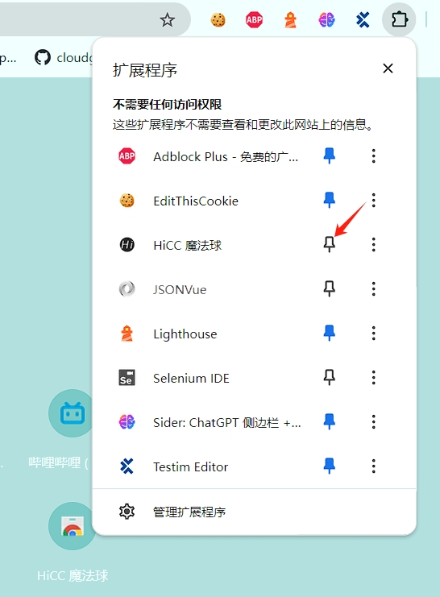
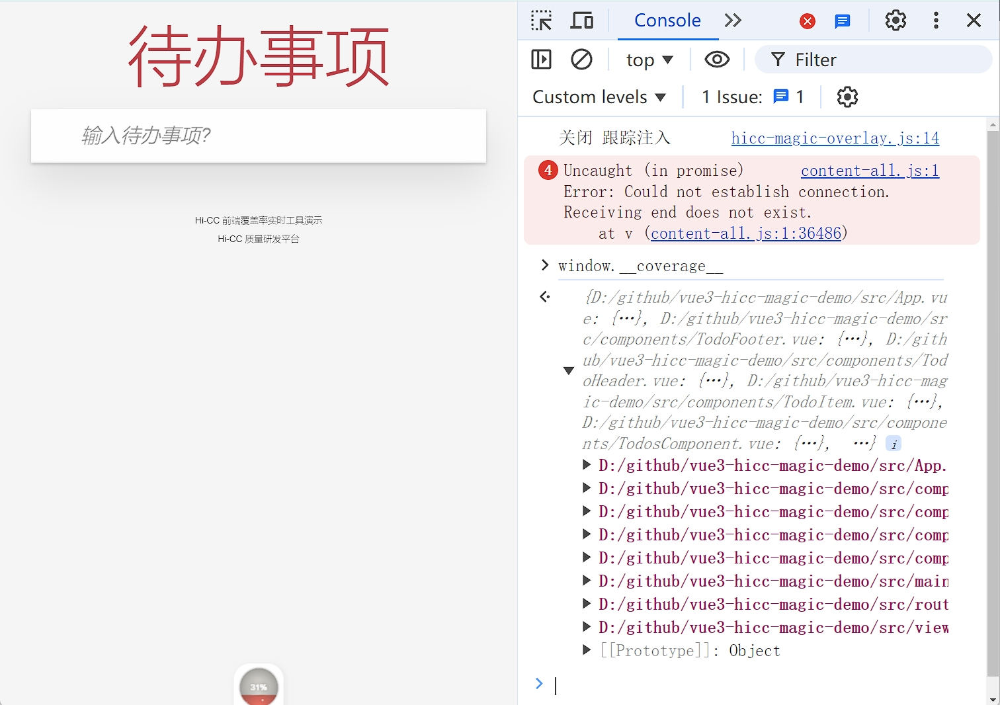
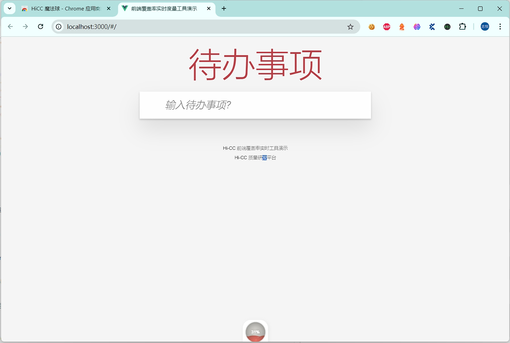
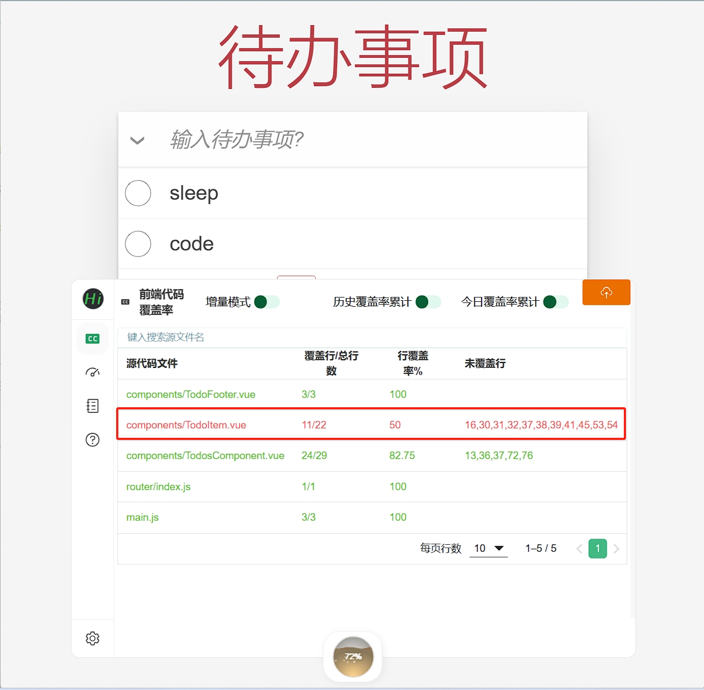
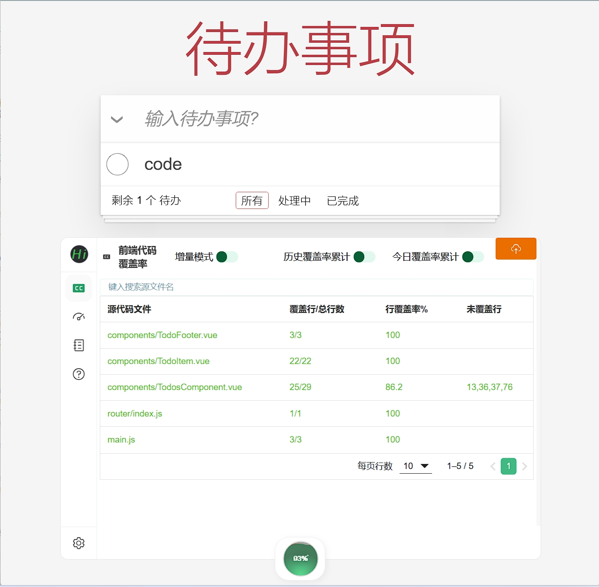
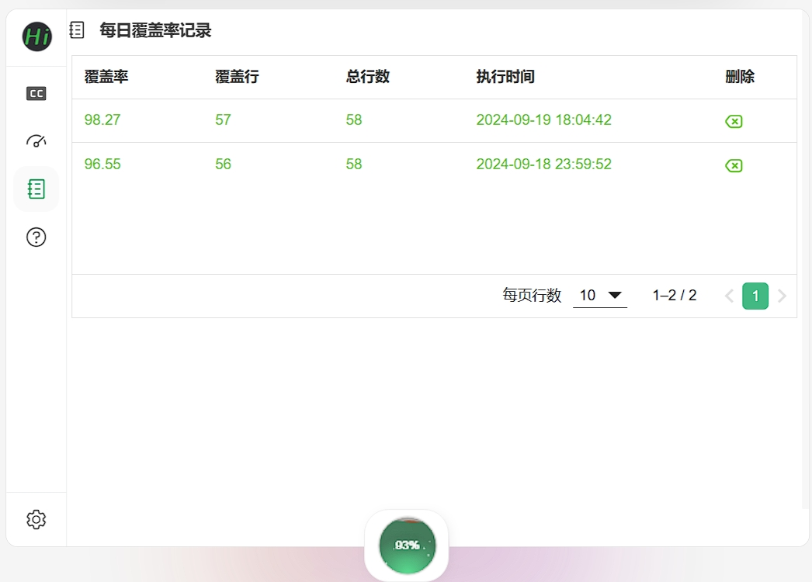

# HiCC前端覆盖率工具

##  简介

- Hi-CC魔法球是前端测试覆盖率度量展示工具，通过浏览器插件方式，能实时获知被测页面的代码覆盖率情况，是研发测试的防漏测神器。
- Hi-CC魔法球提供测试历史覆盖率记录，可累计当天最高覆盖率，累计近期最高覆盖率等更多功能。
- Hi-CC魔法球支持现代前端的三大主流框架 Vue/Anguarl/React。

## 安装浏览器插件

Hi-CC支持Edge和Chrome 浏览器，推荐使用 Edge 浏览器，因为不需要梯子。



可选：固定插件到浏览器工具栏，方便使用。



当然，如果是封闭内网的话，Hi-CC插件也支持插件下载安装：

https://gitee.com/thm1118/hi-cc-magic/releases

## 实现原理

* 前端代码在部署前需要 使用`istanbul`工具对代码"插桩"。

* “插桩”后的代码在浏览器运行时会输出覆盖率数据，在浏览器中打开`console`，键入 `window.__coverage__`可看到覆盖率数据。



* Hi-CC魔法球基于此数据计算并呈现。

> 注：在览器扩展安装后，如果检测到`window.__coverage__`是有效存在的，则会应显示浏览器扩展的魔法球，未检测到，不会显示魔法球。


前端代码在部署前需要 使用`istanbul`工具对代码`"插桩"`。

## 准本项目

Hi-CC提供了不同框架的演示项目。这里我选用自己比较熟悉的Vue3项目。

https://gitee.com/thm1118/vue3-hicc-magic-demo

* 克隆项目

```shell
git clone https://gitee.com/thm1118/vue3-hicc-magic-demo.git
```

* 安装依赖包

```shell
yarn install
```

* 安装插装插件

```shell
yarn add -D vite-plugin-istanbul
```

在vite.config.js中配置插桩插件。

```js
import { fileURLToPath, URL } from 'node:url'

import { defineConfig } from 'vite'
import vue from '@vitejs/plugin-vue'
import istanbul from 'vite-plugin-istanbul';  // 引入插桩插件
// https://vitejs.dev/config/
export default defineConfig({
  base: "./",
  plugins: [
    vue(),
    istanbul({
      include: 'src/*',
      exclude: ['node_modules', 'test/'],
      extension: ['.js', '.ts', '.vue'],
      requireEnv: false,
      forceBuildInstrument: true
    }),
  ],
  resolve: {
    alias: {
      '@': fileURLToPath(new URL('./src', import.meta.url))
    }
  }
})

```

* 打包构建

```shell
yarn run build
```

* 安装serve命令

```shell
yarn global add serve
```

* 运行项目

```shell
cd dist/   # 进入dist/构建目录
npx serve  # 启动本地服务
```

默认本地启动：http://localhost:3000/ 服务，通过浏览器访问：




## 覆盖率统计

### 覆盖率统计

测试 **待办事项** 功能， 实时查看底部的覆盖率小球会有覆盖率和颜色变化。点击覆盖率小球，可以查看当前页面的覆盖率数据。



通过覆盖信息发现，TodoItem.vue 组件有代码没有覆盖到。

下面我将没执行到的代码拷贝出来，并加上了行号：

```ts
const editModel = computed({
    get() {
        return props.todo.title;
    },
    set(value) {
        editText.value = value;  // 16行
    },
});

function startEdit() {
    editing.value = true;  // 30行
    nextTick(() => {       // 31行
        editInput.value.focus();  // 32行
    });
}

function finishEdit() {
    editing.value = false;  // 37行
     if (editText.value.trim().length === 0) // 38行
        deleteTodo(); // 39行
    else
        updateTodo(); // 41行
}

function cancelEdit() {
    editing.value = false; // 45行
}
```

通过代码可以看到，主要的事项的`编辑`功能。我们补充相关的功能测试用例。



### 每日覆盖率

此外，Hi-CC还支持每日的覆盖率统计，可以查看当天最高覆盖率，最近一次更新时间，以及累计最高覆盖率。


