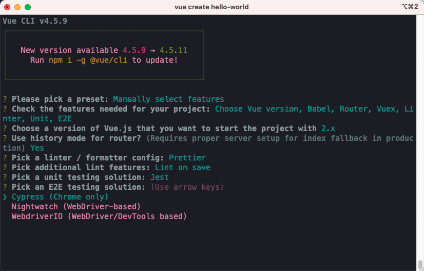
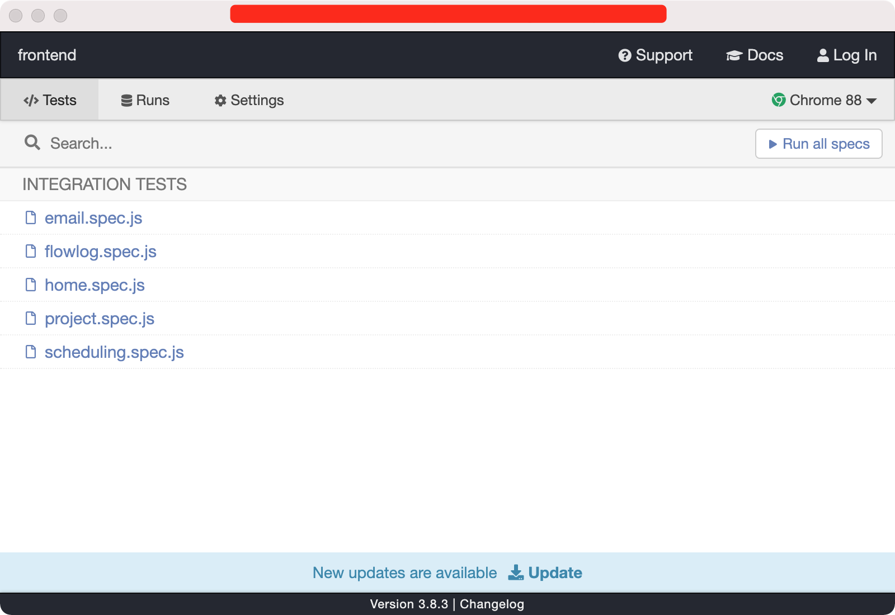
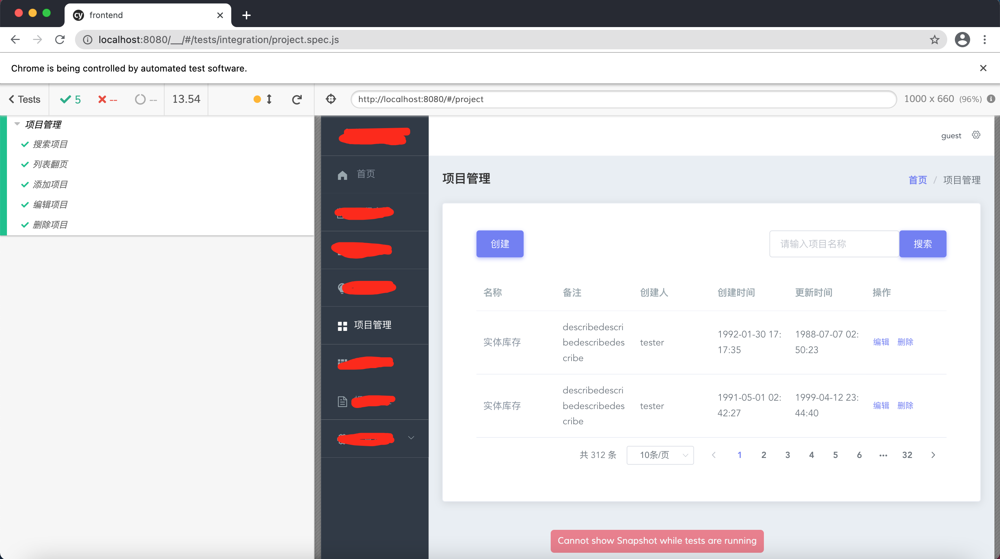
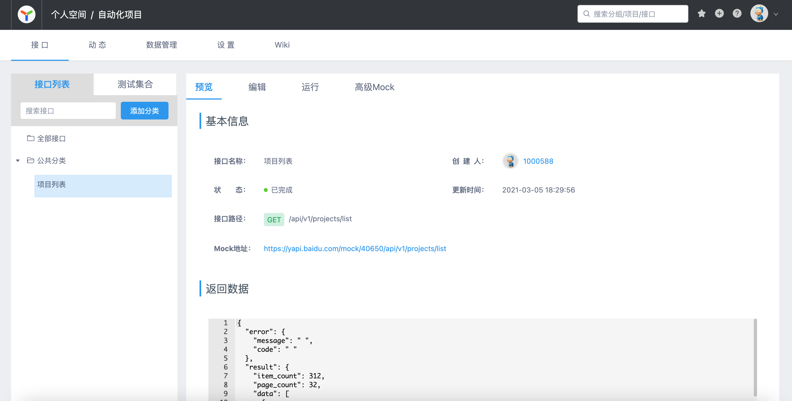
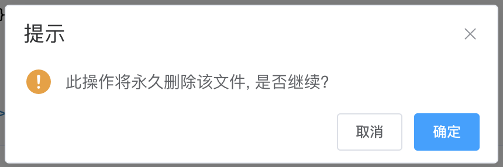
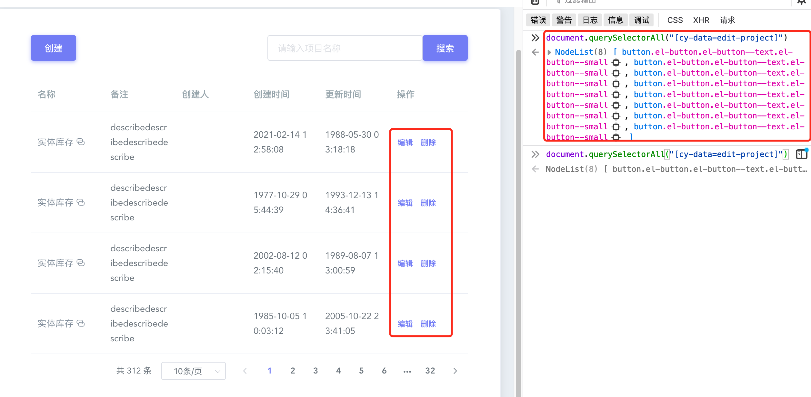

# 前端开发：基于cypress的自动化实践

作为一个伪开发，在一个平台项目中负责前端的开发工作，开发框架为vue，本文我会站在前端开发的角度介绍，我是如何使用cypress的。

- [x] 如何在vue中使用cypress
- [x] 如何运行cypress
- [x] 如何编写测试用例
- [x] 如何解决测试数据的问题
- [x] 遇到的元素定位的问题
- [x] 如何看待cypress
- [x] cypress是否为最佳工具
- [x] 测试怎么办？

## 如何在vue中使用cypress

vue提供了`vue-cli` 可以快速的创建vue项目。

```shell
vue create hello-world
```

在选择安装项里面选择: `E2E testing` -> `cypress`。




## 如何运行测试

1. 通过命令启动

```shell
> npm run test:e2e
```

1. 开启cyprss 管理窗口



1. 点击`Run all specs` 或 某个测试文件运行



这里以`项目管理` 模块为例，运行5条用例只需要14s，速度还是非常快的。


## 如何编写测试用例

站在前端开发的角度上编写UI自动化用例，总体感受还是非常方便的！

首先，为所有要操作的元素设置统一的属性。

```html
<el-button cy-data="create-project" type="primary" @click="showCreate">创建</el-button>
...
<el-button cy-data="edit-project" type="text" size="small" @click="showEdit(scope.row)">编辑</el-button>
<el-button cy-data="delete-project" type="text" size="small" @click="deleteProject(scope.row)">删除</el-button>
...
```

不建议占用HTML提供的的 `id`、`name`、`class`... 这些属性，他们一般都会有指定的用途，比如，`class` 是用来引用css样式的。 那么通过`cy-data=xxxx`即可以避免冲突，又更加统一和规范。

接下来，就是编写 cypress 自动化代码了
```js
describe('项目管理', () => {
  it('添加项目', () => {
    cy.visit('/#/project')
    cy.get('[cy-data=create-project]', { timeout: 3000 }).click()
    cy.wait(1000)
    cy.get('[cy-data=project-name]', { timeout: 3000 }).type('项目名称')
    cy.get('[cy-data=project-desc]', { timeout: 3000 }).type('项目备注信息')
    cy.get('[cy-data=save-button]', { timeout: 3000 }).click()  // 保存项目
  });
  // ...
})
```

## 如何解决测试数据的问题

我们编写自动化测试用例，不管是接口还是UI都会面临测试数据的问题。比如，我要测试登录，得先去创建一个用户数据，我要测试搜索，先去创建一批可以搜索的数据。

为此，我们不得不在自动化里面 使用`setUp/treaDown`这些fixture去写大量的前置或后置动作，来完成这些准备工作。站在测试的角度，这无疑让我们的测试用例变得复杂，然后，也很容易因为测试数据造成自动化用例的失败。

那么，站在前端开发是如何解决的？在此之前我们要先了解一下开发过程：

在项目开发过程中。前端为了更顺利的完成开发工作，不能等到后端开发好了接口，再手写前端功能，所以，会和后端定义好接口之后，通过mock来模拟接口数据，--__面向mock开发__。

那么在面向mock开发的过程中，避免不了，前后端需要调整接口参数的情况，比如，前端需要增加一个字段，或后端说需要把数据结构调整一下。



你可以直接通过下面的链接来访问mock接口：

https://yapi.baidu.com/mock/40650/api/v1/projects/list

如何vue项目当中配置不同的环境？你需要去学习vue开发...


## 遇到的元素定位问题

然而，为每个元素添加定位方式，有时并不是我们想象的那么简单。

如果你是使用过前端UI（例如 element-ui）库就会发现，并不是所有的页面元素都是通过HTML纯手写的。 例如，下面的弹窗。



通过 element-UI的实现方式是这样子的。

```js
<template>
  <el-button type="text" @click="open">点击打开 Message Box</el-button>
</template>

<script>
  export default {
    methods: {
      open() {
        this.$confirm('此操作将永久删除该文件, 是否继续?', '提示', {
          confirmButtonText: '确定',
          cancelButtonText: '取消',
          type: 'warning'
        }).then(() => {
          this.$message({ type: 'success',  message: '删除成功!' });
        }).catch(() => {
          this.$message({ type: 'info', message: '已取消删除' });          
        });
      }
    }
  }
</script>
```

弹窗完全通过 element-UI 渲染，我们无处给 `确定`、`取消` 等按钮加上定位专用属性。 这个时候，前端开发就没什么优势了，必须老老实实的去前端页面上定位元素，写复杂的css定位。

然而，就算我自定义了定位，有时候元素也不是唯一的。例如



对于上面的列表，通过`自定义定位`得到的是一组元素。然而，如果只是一组元素的问题就就没必要单独拿出来说了，正如上图，列表中看到的是 4 个元素，通过定位方式得到的是8个元素，前4个是隐藏的，这和使用的 element-UI 库有关，因为数据是YAPI随机生成的，不能写死对第5个显示元素进行操作。 cypress 提供的 `force` 非常有用，他会强制对隐藏的元素进行操作。

```js
cy.get('[cy-data=edit-project]', { timeout: 3000 }).first().click({ force: true })
```

##  如何看待cypress

__前端开发视角__

作为一名前端开发，客观的说，使用cypress的过程并没有遇到太多阻力。我来总结一下。

1. 因为使用了yapi，不需要考虑测试数据的准备。
2. 不需要写依赖步骤，主要是目前的业务功能也没有太长的操作过程。
3. 大部分情况下可以自定义元素属性，在定位上不需要花费过多的时间，也不需要写太长的定位。
4. 测试运行速度可以接受，28条用例运行耗时80秒左右。

__测试视角__

作为一名自动化测试，如果让我使用cypress。

1. 为了验证数据的正确性，我不能要求开发使用 yapi 假数据，所以，还是要自己准备数据。
2. 根据业务的情况，必须要的前置/后置动作不可避免。
3. 虽然，说服开发统一自定义元素有点难，对来我说并不是不可办到！
4. cypress 做UI自动化确实比selenium要快一些，但是他相比selenium，不支持更多的浏览器，不支持Grid远程调用，甚至不能根据自己的熟练度选择语言。所以，cypress 优势并没有压倒性优势，具体还是要看需求。

## cypress是否为最佳工具

cypress是否为所有UI自动化的最佳工具？

在面向前端的开发框架`Vue/React`中 确实很好的整合cypress，使我们的使用更加方便。

在我接触到的偏后端的django Web框架中就很好的整合了Selenium，同样可以达到类似的效果。 我之前看过一本《Test-Driven Development with Python》 ，书中就很好的将基于Selenium的UI测试与Django开发很好的结合起来了。

所以，结论是结合你的开发框架去选择合适的 E2E 测试工具。

## 测试怎么办？

一直以来，我们都天然的认为UI自动化测试就应该是测试来做的，并以能做UI自动化测试为高级目标！但从我上面的实践中，我们会发现其实开发来做UI自动化优势很明显。那么测试怎么办？我们只能老老实实的回去测功能了吗？当然不是。

1. 并不是每个开发都懂得编写UI自动化测试，虽然，这对他们来并不是特别难，我们完全在这方面成为“教练”，教开发如何编写UI自动化测试，如何设计更全面的测试用例。


2. 并不是每个团队的开发都有时间编写UI自动化测试，也可能是他们不愿意写，那么我们为何不加入他们？以我前面介绍的方式，深度地参与到项目的自动化测试编写中。而不是现在这样，将项目开发和自动化测试完全割裂开分别进行。

春节期间重读了《google测试之道》，有了新的感受，在测试开发能力足够的前提下，当团队的目标是提高产品的保证质量时，自动化测试到底由谁来做的问题变得不那么重要了。


