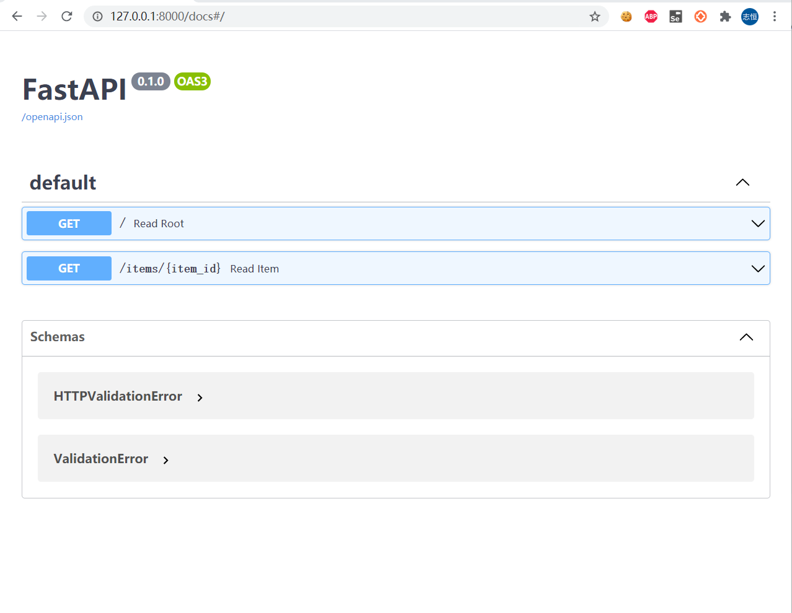
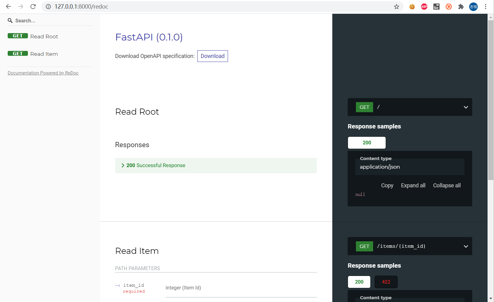

# 浅谈web框架之fastapi

我目前的工作和web开发关联性能很强，那么自然会关注web开发技术，这里就分享一下新接触到的fastapi框架。

## web框架

近些年，web框架也经历了很大的变化，从之间的大而全，向现在的专注于后端接口服务转变。比如PHP的codeigniter（我只用过这个），比如 Python的django框架，都是基于MVC的web框架，一个框架就把前后端的事情全干了。随着基于javascript语言的大前端的爆发，后端web框架已经让出了V（视图），专注于干MC的工作了，当然，前端也能干MC的工作，但先从后端开发同学的尸体上踏过去再说。


python语言下面的Web框架非常的多。

* 从大而全的Django。

* 小而且美的Flask。

* 很早就支持异步的 Tornado。

* 性能更进一步的异步框架 sanic。


以上几款Web框架我多少都有使用过，我一度觉得 sanic是python web框架的未来，支持异步，性能好，类flask的语法，代码简单，没想到被fastapi截胡了，fastapi在github的上星速度非常快。它在如何把后端api做好的这件事情上，做的比sanic更全面，更彻底。


个觉得fastapi在以下几个方面做得很优秀。

### 性能

先做个简单的性能对比：

* flask

```py
# flask==2.0.1
from flask import Flask
from flask import jsonify
 
app = Flask(__name__)


@app.route("/")
def hello_world():
    return jsonify({"hello": "world"})

```

* fastapi

```py
# fastapi==0.65.1
from fastapi import FastAPI

app = FastAPI()


@app.get("/")
def read_root():
    return {"Hello": "World"}

```

虽然两个框架都支持异步（flask 2.0 支持异步），但我们使用的都是同步代码。

JMeter配置：并发（500）* 循环（100）* 启动时间（1s） = 总请求数（50000）

| 结果 |  flask   | fastapi  | gin |
| ---  |  ----  | ----  | --- |
| 运行时长  |  67s  | 28s  |  5s |
| 最大值  |  37197ms  | 641ms  |  270ms |
| 平均值  |  582ms  | 266ms  |  40ms |
| 吞吐量  |  751.s/sec | 1798.3/sec  | 9817.4/sec

虽然是简单的对比，fastapi 在各项性能指标，都有非常明显的性能优势。

> 然而，我有点飘了，在相同的环境上开启了gin(go语言) 服务又跑了一遍。 gin 在go 主流的几款 web框架下性能表现都是很强的，碾压python Web框架简直太容易了。最后一列数据看看就好。

### api 文档

fastapi直接支持OpenAPI(前身是Swagger) 和redoc 两种文档格式。

```py
# main.py
from typing import Optional

from fastapi import FastAPI

app = FastAPI()


@app.get("/")
def read_root():
    return {"Hello": "World"}


@app.get("/items/{item_id}")
def read_item(item_id: int, q: Optional[str] = None):
    return {"item_id": item_id, "q": q}

```

启动服务：

```shell
> uvicorn main:app --reload
INFO:     Uvicorn running on http://127.0.0.1:8000 (Press CTRL+C to quit)
INFO:     Started reloader process [19224] using statreload
INFO:     Started server process [23320]
INFO:     Waiting for application startup.
INFO:     Application startup complete.
```

* 访问：http://127.0.0.1:8000/docs



* 访问：http://127.0.0.1:8000/redoc



对于开发来说，简直不要太爽了，代码即文档，压根不用写接口文档。试问：还是谁？


### 类型检查

我们知道python是弱类型的语言，直到python 3.5 才加入类型系统。而我们在做接口参数校验的时候，必定要写大量代码验证参数是否为空，类型是否正确。

* flask

```python 
import json
from flask import Flask
from flask import jsonify
from flask import request

app = Flask(__name__)

@app.route('/items/<int:item_id>', methods=['GET', 'POST', "PUT", "DELETE"])
def update_item(item_id):
    if request.method == "PUT":
        try:
            data = json.loads(request.get_data())
        except json.decoder.JSONDecodeError:
            return jsonify({"code":10101, "msg": "format error"})
        try:
            name = data["name"]
            price = data["price"]
            is_offer = data["is_offer"]
        except KeyError:
            return jsonify({"code": 10102, "msg": "key null"})

        if not isinstance(name, str):
            return jsonify({"code": 10103, "msg": "name not is str"})

        if not isinstance(price, float):
            return jsonify({"code": 10104, "msg": "price not is float"})

        if not isinstance(is_offer, bool):
            return jsonify({"code": 10105, "msg": "is_offer not is bool"})

        return jsonify({"item_name": name, "item_id": item_id})

```

为了验证参数是否为空，已经参数的类型，flask的代码如上。

* fastapi

```python
from typing import Optional
from fastapi import FastAPI
from pydantic import BaseModel

app = FastAPI()


class Item(BaseModel):
    name: str
    price: float
    is_offer: Optional[bool] = None


@app.put("/items/{item_id}")
def update_item(item_id: int, item: Item):
    return {"item_name": item.name, "item_id": item_id}

```

fastapi 通过 pydantic 检查参数类型，简直不要太简单。

## 总结

fastapi 凭借上面几个优点，真的非常适合做后端API开发的工作，不管是从性能，还是开发效率上面优势非常明显，受到大家的追捧也是必然的。
