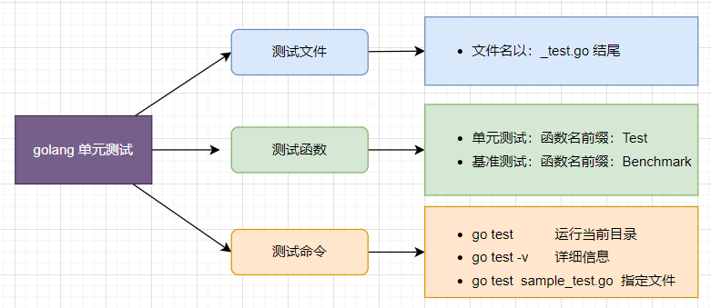

## 学会golang单元测试

最近，需要用golang实现一些后端服务，趁着下班时间，重新温习一下golang，当然，从`hello world` 开始肯定是不必要的。接触一门语言最快方式就是做项目，其次，就将自己熟悉的领域，换这门语言再学一遍，比如，单元测试。

golang开发环境搭建好之后，开始熟悉go单元测试。




(一张图熟悉go test 基本概念)

### 简单的例子

创建测试文件`gocode/src/test_case/sample_test.go` 

```go
package test

import "testing"

func TestSample(t *testing.T) {
	if testing.Short() {
		t.Skip("skipping test in short mode.")
	}
}
```

单元测试函数的格式：

1. 测试函数格式：`func TestName(t *testing.T) {}` 

2. 测试函数的名字必须以`Test`开头，可选的后缀名必须以大写字母开头

3. 测试函数必须导入`testing`包

4. 参数`t`用于报告测试失败和附加的日志信息

5. `testing.Short()` 用例来绕开一些测试

6. `t.Skip()` 跳过测试


__运行测试__

```bash
> cd gocode/src/test_case/
> go test -v sample_test.go
=== RUN   TestSample
--- PASS: TestSample (0.00s)
PASS
ok      command-line-arguments  0.039s
```


### 测试模块

1. 编写被测模块：`gocode/src/utils/flow.go` 

```go
package utils

import (
	"fmt"
)

func StudentMark(num int) string {
	fmt.Println("你的分数是:", num)
	var ret string
	if num > 90 {
		ret = "优秀"
	} else if num > 70 {
		ret = "良好"
	} else if num > 60 {
		ret = "及格"
	} else {
		ret = "不及格"
	}
	fmt.Println("你的评级为:", ret)
	return ret
}

```

功能很简单，不做解释了。

2. 编写测试文件：`gocode/src/test_case/flow_test.go` 

```go
package test

import (
	"gocode/src/utils"
	"testing"
)

type Test struct {
	in  int
	out string
}

var tests = []Test{
	{55, "不及格"},
	{61, "及格"},
	{78, "良好"},
	{88, "优秀"},
}

func TestStudentMark(t *testing.T) {
	for i, test := range tests {
		mark := utils.StudentMark(test.in)
		if mark != test.out {
			t.Errorf("%d: StudentMark(%d)=%s; want %s", i, test.in, mark, test.out)
		}
	}
}
```

用`for`循环是一种偷懒的做法，最好每条数据一个测试方法，或者用数据驱动，但估计不支持~！

__运行测试__

```bash
> go test -v flow_test.go
=== RUN   TestStudentMark
你的分数是: 55
你的评级为: 不及格
你的分数是: 61
你的评级为: 及格
你的分数是: 78
你的评级为: 良好
你的分数是: 88
你的评级为: 良好
    flow_test.go:24: 3: StudentMark(88)=良好; want 优秀
--- FAIL: TestStudentMark (0.00s)
FAIL
FAIL    command-line-arguments  0.039s
FAIL
```

### 断言

`go test` 是个非常简陋的单元测试框架，所以，没有断言方法。emmm...

不过，我们可以自己封装一个。

创建测试文件：`gocode/src/test_case/assert_test.go` 

```go
package test

import (
	"strings"
	"testing"
)

// A poor assertion function.
func assertEqual(t *testing.T, x, y interface{}) {
	t.Helper()
	if x != y {
		t.Errorf("Not Equal, %d %d", x, y)
	}
}

func TestSplit(t *testing.T) {
	words := strings.Split("a:b:c:d", ":")
	assertEqual(t, len(words), 3)
}
```
说明：

`assertEqual()` 便是我们封装的断言方法拉。

__运行测试__

```bash
 go test .\assert_test.go
--- FAIL: TestSplit (0.00s)
    assert_test.go:12: Not Equal, 4 3
FAIL
FAIL    command-line-arguments  0.040s
FAIL
```

是不是还挺好用的，快去封装：`assertNotEqual()`、`assertIn()`...

### fixture

断言都没有，就不要指望`setUp/tearDown`了。但是，这又有什么关系呢？当然是自己动手封装了。

1. 编写被测模块：`gocode/src/utils/calculate.go` 

```go
package utils

import "fmt"

func Addition(num1 int, num2 int) int {
	fmt.Println("Addition: ", num1, "+", num2)
	var sum int = num1 + num2
	return sum
}
```

同样的功能很简单，不做解释~！


1. 创建测试文件：`gocode/src/test_case/fixture_test.go` 

```go
package test

import (
	"gocode/src/utils"
	"log"
	"os"
	"testing"
)

func TestMain(m *testing.M) {
	tearDownAll := setUpAll()

	code := m.Run()

	tearDownAll() // you cannot use defer tearDownAll()
	os.Exit(code)
}

func setUpAll() func() {
	log.Printf("============setUpAll============")
	return func() {
		log.Printf("============tearDownAll============")
	}
}

func setUp(t *testing.T) func(t *testing.T) {
	log.Printf("-----------setUp-----------")

	return func(t *testing.T) {
		log.Printf("-----------tearDown-----------")
	}
}

func TestAdditon1(t *testing.T) {
	tearDown := setUp(t)
	defer tearDown(t)
	log.Printf("test: TestAdditon1")
	num1 := 1
	num2 := 2
	result := 3
	ret := utils.Addition(num1, num2)
	if ret != result {
		t.Errorf("Addition(%d, %d) != %d", num1, num2, result)
	}

}

func TestAdditon2(t *testing.T) {
	tearDown := setUp(t)
	defer tearDown(t)
	log.Printf("test: TestAdditon1")
	num1 := 10
	num2 := 22
	result := 32
	ret := utils.Addition(num1, num2)
	if ret != result {
		t.Errorf("Addition(%d, %d) != %d", num1, num2, result)
	}

}
```

1. `setUpAll/tearDownAll` 是全局的，会在所有测试（包括别的测试文件）开始/结束执行。

2. `setUp/tearDown` 针对每个测试函数开始/结束执行。

__运行结果__

```bash
 go test -v .\fixture_test.go
2022/09/01 23:35:34 ============setUpAll============
=== RUN   TestAdditon1
2022/09/01 23:35:34 -----------setUp-----------
2022/09/01 23:35:34 test: TestAdditon1
Addition:  1 + 2
2022/09/01 23:35:34 -----------tearDown-----------
--- PASS: TestAdditon1 (0.00s)
=== RUN   TestAdditon2
2022/09/01 23:35:34 -----------setUp-----------
2022/09/01 23:35:34 test: TestAdditon1
Addition:  10 + 22
2022/09/01 23:35:34 -----------tearDown-----------
--- PASS: TestAdditon2 (0.00s)
PASS
2022/09/01 23:35:34 ============tearDownAll============
ok      command-line-arguments  0.275s
```

## 总结

到此，对golang的单元测试有了初步的了解，基本上算能用，但远远谈不上好用，尤其和 testNG、pytest 那种强大的第三方单元测试框架相比。

其实上面的例子包含了不少go的基础执行知识，变量定义，格式化输出、if判断、for循环，结构体，模块导入...，不需要刻意学习语法，通过单元测试的学习就掌握了这些语法。


