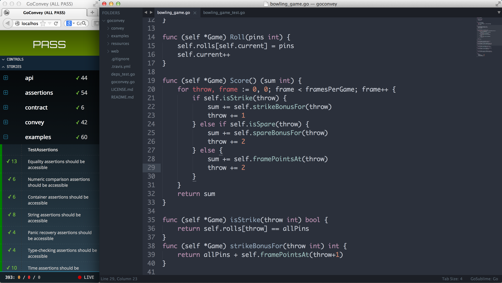

# 盘点Golang测试相关库

 
## go-check

Github:https://github.com/go-check/check

gocheck是一个单元测试框架，在golang官方的testing package之上丰富了很多功能，不久我介绍过Golang官方的单元测试框架，功能确实比较简陋。gocheck在此基础上提供了一些特性：

1. 丰富了assert 断言 + 判断动词: deep multi-type 对比，字符串比较以及正则匹配。
2. 按suite组织测试用例，支持suite级别的 setup() 和 teardown()。
3. 对于临时文件支持创建、删除临时文件和目录。

__示例：__

```go
package test

import (
	"io"
	"testing"

	. "gopkg.in/check.v1"
)

//继承testing的方法，可以直接使用go test命令运行
func Test(t *testing.T) {
	TestingT(t)
}

// 创建测试套件结构体
type MySuite struct{}

var _ = Suite(&MySuite{})

func (s *MySuite) TestHelloWorld(c *C) {
	c.Assert(42, Equals, "42")
	c.Assert(io.ErrClosedPipe, ErrorMatches, "io: .*on closed pipe")
	c.Check(42, Equals, 42)
}
```

## requests

https://github.com/asmcos/requests
https://github.com/wangluozhe/requests

Golang自带的有 `net/http`包来发送HTTP请求，对于用过requests(python)的人就很难用了；requests是python下面的明星项目，其设计争相被其他语言模仿，我找到了两个golang下面的模仿项目。


* 示例1（asmcos/requests）

```go
package main

import "github.com/asmcos/requests"


func main (){

    data := requests.Datas{
      "name":"requests_post_test",
    }
    resp,_ := requests.Post("https://www.httpbin.org/post",data)
    println(resp.Text())
}
```

* 示例2（wangluozhe/requests）

```go
package main

import (
	"fmt"
	"github.com/wangluozhe/requests"
	"github.com/wangluozhe/requests/url"
)

func main() {
	req := url.NewRequest()
	headers := url.NewHeaders()
	headers.Set("User-Agent","123")
	req.Headers = headers
	req.Proxies = "http://127.0.0.1:8888"
	//req := &url.Request{}
	r, _ := requests.Get("https://httpbin.org/get",req)
	//r, _ := requests.Get("https://httpbin.org/get",nil)
	fmt.Println(r.Text)
}
```

## selenium

https://github.com/tebeka/selenium

selenium对我而言就像一位多年的老友，学习一门语言我一定去看看有没有selenium client支持，那怕第三方的库也成。 因为官方没有提供Golang的selenium client, 这个项目是一个第三方库。

* 示例

```go
package main

import (
	"fmt"
	"os"
	"time"

	"github.com/tebeka/selenium"
)

const (
	chromeDriverPath = "D:\\webdriver\\chromedriver.exe"
	port             = 8080
)

func main() {
	// Start a WebDriver server instance
	opts := []selenium.ServiceOption{
		selenium.Output(os.Stderr), // Output debug information to STDERR.
	}
	selenium.SetDebug(true)
	service, err := selenium.NewChromeDriverService(chromeDriverPath, port, opts...)
	if err != nil {
		panic(err) // panic is used only as an example and is not otherwise recommended.
	}
	defer service.Stop()

	// Connect to the WebDriver instance running locally.
	caps := selenium.Capabilities{"browserName": "chrome"}
	wd, err := selenium.NewRemote(caps, fmt.Sprintf("http://localhost:%d/wd/hub", port))
	if err != nil {
		panic(err)
	}
	defer wd.Quit()

	// Navigate to the simple playground interface.
	if err := wd.Get("https://cn.bing.com/"); err != nil {
		panic(err)
	}

	time.Sleep(time.Duration(2) * time.Second)

	// Get a reference to the text box containing code.
	elem, err := wd.FindElement(selenium.ByCSSSelector, "#sb_form_q")
	if err != nil {
		panic(err)
	}
	// Remove the boilerplate code already in the text box.
	if err := elem.Clear(); err != nil {
		panic(err)
	}

	// Enter some new code in text box.
	err = elem.SendKeys(`go selenium`)
	if err != nil {
		panic(err)
	}
	time.Sleep(time.Duration(2) * time.Second)

	if err := elem.SendKeys(selenium.EnterKey); err != nil {
		panic(err)
	}

	time.Sleep(time.Duration(2) * time.Second)

	title, err := wd.Title()
	fmt.Println("title", title)

}
```

## playwright

github: https://github.com/playwright-community/playwright-go

playwright是巨硬（微软）公司推出的开源Web自动化功能，官方同样没提供Golang的playwright，我也找到了一个用Golang实现playwright。

* 示例

```go
package main

import (
	"fmt"
	"log"

	"github.com/playwright-community/playwright-go"
)

func main() {
	pw, err := playwright.Run()
	if err != nil {
		log.Fatalf("could not start playwright: %v", err)
	}
	browser, err := pw.Chromium.Launch()
	if err != nil {
		log.Fatalf("could not launch browser: %v", err)
	}
	page, err := browser.NewPage()
	if err != nil {
		log.Fatalf("could not create page: %v", err)
	}
	if _, err = page.Goto("https://news.ycombinator.com"); err != nil {
		log.Fatalf("could not goto: %v", err)
	}
	entries, err := page.QuerySelectorAll(".athing")
	if err != nil {
		log.Fatalf("could not get entries: %v", err)
	}
	for i, entry := range entries {
		titleElement, err := entry.QuerySelector("td.title > span > a")
		if err != nil {
			log.Fatalf("could not get title element: %v", err)
		}
		title, err := titleElement.TextContent()
		if err != nil {
			log.Fatalf("could not get text content: %v", err)
		}
		fmt.Printf("%d: %s\n", i+1, title)
	}
	if err = browser.Close(); err != nil {
		log.Fatalf("could not close browser: %v", err)
	}
	if err = pw.Stop(); err != nil {
		log.Fatalf("could not stop Playwright: %v", err)
	}
}

```


## webdriverAgent

https://github.com/ElectricBubble/gwda

这是用Golang实现的WebdriverAgent，做iOS移动自动化测试的同学我想对 webdriverAgent 并不陌生。在`testerhome`看到有同学分享的，这就是有意义的好轮子，嗯！

* 示例

```go
package main

import (
	"github.com/electricbubble/gwda"
	"log"
)

func main() {
	// var urlPrefix = "http://localhost:8100"
	// The function may also require 'iproxy 8100 8100' to forward the device port first
	// driver, _ := gwda.NewDriver(nil, urlPrefix)

	// Connect devices via USB
	driver, _ := gwda.NewUSBDriver(nil)

	log.Println(driver.IsWdaHealthy())
}
```

### sib

https://github.com/SonicCloudOrg/sonic-ios-bridge

sonic-ios-bridge 是基于 gidevice 作为底层iOS通信协议，在此基础上丰富了周边辅助功能，如自动挂载开发者镜像、wda安装检测、iOS型号映射、命令行直接使用等等。 以打造跨平台执行xctest、WebDriverAgentRunner、性能监听等等特色功能的命令行iOS调试工具。

这是用Golang实现的一个命令行工具，了解过 sonic 云真机平台的同学应该对他不陌生。

* 命令用法

```shell
# 运行 wda
> sib run wda -b your.wda.bundleId
> sib run xctest -b your.wda.bundleId

# 查看app列表
> sib app list

# 启动 app
> sib app launch

# 驱动监听
> sib devices listen

# 卸载app
> sib app uninstall

# 截图
> sib screenshoot

...
```

### goc

https://github.com/qiniu/goc/

goc 是专为 Go 语言打造的一个综合覆盖率收集系统，尤其适合复杂的测试场景，比如系统测试时的代码覆盖率收集以及精准测试。

如果需要做go语言的代码覆盖率的话，他一定是一个很好的选择。

goc同样以命令的方式提供功能。

1. 运行 `goc server` 命令启动一个服务注册中心：

```shell
simple-go-server git:(master) ✗ goc server
```

2. 运行 `goc build` 命令编译目标服务，然后启动插过桩的二进制。下面以 simple-go-server 工程为例：

```shell
simple-go-server git:(master) ✗ goc build .
... // omit logs
simple-go-server git:(master) ✗ ./simple-go-server  
```

3. 运行 `goc profile` 命令收集刚启动的 `simple server` 的代码覆盖率：

```shell
simple-go-server git:(master) ✗ goc profile
mode: atomic
enricofoltran/simple-go-server/main.go:30.13,48.33 13 1
enricofoltran/simple-go-server/main.go:48.33,50.3 1 0
enricofoltran/simple-go-server/main.go:52.2,65.12 5 1
enricofoltran/simple-go-server/main.go:65.12,74.46 7 1
enricofoltran/simple-go-server/main.go:74.46,76.4 1 0
...
```

### vegeta

https://github.com/tsenart/vegeta

vegeta 是Golang实现的一个款HTTP负载测试工具和库。我们公众号专门一篇文章做过介绍。

vegeta 同样以命令行方式使用。

* 示例

```shell
> echo "GET http://localhost:8000/api/user/" | ./vegeta attack -duration=10s| tee results.bin | ./vegeta report
```


### goconvey

https://github.com/smartystreets/goconvey

goconvey 集成`go test`，编写行为测试，浏览器中运行测试。简单来说就是一个BDD行为驱动测试库，有意思的一点他会启动一个web服务，通过浏览器查看测试结果。

* 示例

```go
package package_name

import (
    "testing"
    . "github.com/smartystreets/goconvey/convey"
)

func TestSpec(t *testing.T) {

	// Only pass t into top-level Convey calls
	Convey("Given some integer with a starting value", t, func() {
		x := 1

		Convey("When the integer is incremented", func() {
			x++

			Convey("The value should be greater by one", func() {
				So(x, ShouldEqual, 2)
			})
		})
	})
}
```

* 启动服务

```shell
$ $GOPATH/bin/goconvey
```

* 在浏览器中查看结果




## 总结

1. golang的生态还是丰富的，几乎各种需求都能找到对应库。但有不少库的质量堪忧，因为不少项目的维护停留在几个月，甚至好几年前，有种我错过Golang的黄金年代，但其实Golang正在变得越来越多人使用。

2. 打死我也不用Golang写自动化测试，看一看 `selenium/playwright` 的代码，`err` 的处理真的会让人崩溃，不可否认，Golang在其他方面很棒~！我目前正有在使用Golang写web服务。

3. 如果你发现Golang还有哪些测试人员会用到的宝藏项目，欢迎在留言~！ 


读取xml
https://github.com/beevik/etree


https://gobyexample.com/
