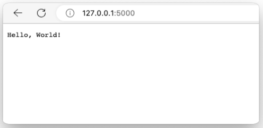

## golang 实时收集代码覆盖率工具 goc

由于公司业务需要，我们最近在使用 goc 应用于go语言项目的代码覆盖率收集。当然，不少同学对goc并不陌生，由七牛云开源的项目。

## 安装与使用

#### 😈 安装

* mac OS 安装

```bash
$ curl -s https://api.github.com/repos/qiniu/goc/releases/latest | grep "browser_download_url.*-darwin-amd64.tar.gz" | cut -d : -f 2,3 | tr -d \" | xargs -n 1 curl -L | tar -zx && chmod +x goc && mv goc /usr/local/bin
```
默认下载 goc 命令解压到 `/usr/local/bin` 目录。

* 查看 goc 版本

```bash
$ goc version
v1.4.5
```


#### 😈 使用


__启动服务注册中心__

```bash
$ goc server

[GIN-debug] [WARNING] Creating an Engine instance with the Logger and Recovery middleware already attached.

[GIN-debug] [WARNING] Running in "debug" mode. Switch to "release" mode in production.
 - using env:	export GIN_MODE=release
 - using code:	gin.SetMode(gin.ReleaseMode)

[GIN-debug] GET    /static                   --> github.com/gin-gonic/gin.(*RouterGroup).StaticFile.func1 (3 handlers)
[GIN-debug] HEAD   /static                   --> github.com/gin-gonic/gin.(*RouterGroup).StaticFile.func1 (3 handlers)
[GIN-debug] POST   /v1/cover/register        --> github.com/qiniu/goc/pkg/cover.(*server).registerService-fm (3 handlers)
[GIN-debug] GET    /v1/cover/profile         --> github.com/qiniu/goc/pkg/cover.(*server).profile-fm (3 handlers)
[GIN-debug] POST   /v1/cover/profile         --> github.com/qiniu/goc/pkg/cover.(*server).profile-fm (3 handlers)
[GIN-debug] POST   /v1/cover/clear           --> github.com/qiniu/goc/pkg/cover.(*server).clear-fm (3 handlers)
[GIN-debug] POST   /v1/cover/init            --> github.com/qiniu/goc/pkg/cover.(*server).initSystem-fm (3 handlers)
[GIN-debug] GET    /v1/cover/list            --> github.com/qiniu/goc/pkg/cover.(*server).listServices-fm (3 handlers)
[GIN-debug] POST   /v1/cover/remove          --> github.com/qiniu/goc/pkg/cover.(*server).removeServices-fm (3 handlers)
[GIN-debug] [WARNING] You trusted all proxies, this is NOT safe. We recommend you to set a value.
Please check https://pkg.go.dev/github.com/gin-gonic/gin#readme-don-t-trust-all-proxies for details.
[GIN-debug] Listening and serving HTTP on :7777
```

`goc server` 命令部署一个服务注册中心，它将会作为枢纽服务跟所有的被测服务通信。注意 `goc server` 监听本地 `7777` 端口。


__启动被测服务__

goc 贴心为我们准备了一个 实例项目：simple-go-server

```bash
# 克隆
$ git clone https://github.com/CarlJi/simple-go-server 

# 进入项目根目录
$ cd simple-go-server

# goc 构建
$ goc build .

# 执行编译文件
$ ./simple-go-server
http: 2023/09/22 00:41:50 Simple go server
http: 2023/09/22 00:41:50 Version: 
http: 2023/09/22 00:41:50 GitTag: 
http: 2023/09/22 00:41:50 GitCommit: 
http: 2023/09/22 00:41:50 GitTreeState: 
http: 2023/09/22 00:41:50 Server is starting...
http: 2023/09/22 00:41:50 Server is ready to handle requests at :5000
```

go语言是静态语言，在运行程序之前需要先编译，后执行。 通过 `goc build` 来代替 `go build` 从而实现对被测项目的动态插装。此时，运行被构建后的 `simple-go-server` 文件，即可实现实时覆盖率的上报的到 `go server` 服务。

`simple-go-server` 作为一个 web 服务被启动，通过浏览器访问：http://127.0.0.1:5000/





__收集数据__

```bash
$ goc profile 2>&1 coverage.out

mode: count
enricofoltran/simple-go-server/main.go:30.13,48.33 13 1
enricofoltran/simple-go-server/main.go:48.33,50.3 1 5
enricofoltran/simple-go-server/main.go:52.2,65.12 5 1
enricofoltran/simple-go-server/main.go:65.12,74.46 7 1
enricofoltran/simple-go-server/main.go:74.46,76.4 1 0
...
```

在控制台输出结果的同时，将结果保存到`coverage.out` 文件。

* 参数说明
`main.go:30.13,48.33 13 1`
`文件`:`起始行`.`起始列`,`结束行`.`结束列` `该基本块中的语句数量` `该基本块被执行到的次数`


## 生成HTML报告

通过 `go tool cover` 命令可以将收集到的 `coverage.out` 原始文件生成HTML报告。

```bash
$ go tool cover -html=coverage.out -o coverage.html
```

在当前目录下生成 `coverage.html` 文件。


## 总结

真正将 `goc` 代码覆盖率工具在项目中落地会面临诸多挑战。

1. 需要一个 `go server` 启动注册中心。如果注册中心服务挂掉会影响数据的搜集。
2. 需要对现有项目修改为 `goc build` 进行构建，对于一个有成熟构建流程的团队，需要修改构建脚本，并且几百个服务都需要用新的构建脚本。
3. 覆盖率的搜集过程，什么时候开始搜集，什么时候结束。需要运行哪个分支的项目。需要全量，还是与 master/main 主分支增量对比。
4. 如果要生成 HTML 文件就必须在项目下执行。那就需要拉取所有项目代码来进行HTML文件生成。
