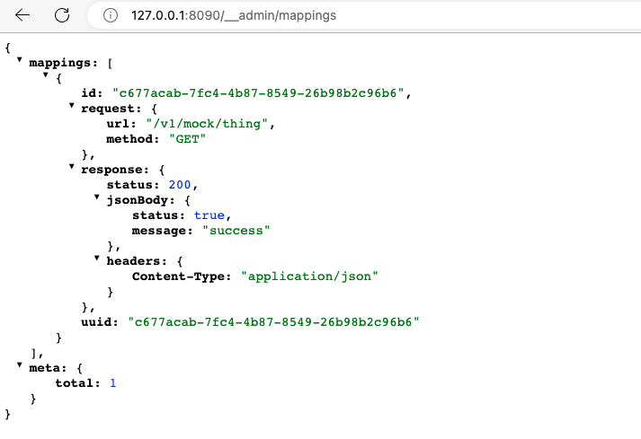
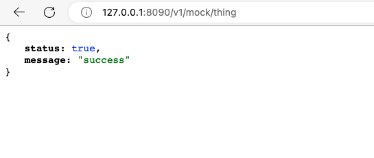
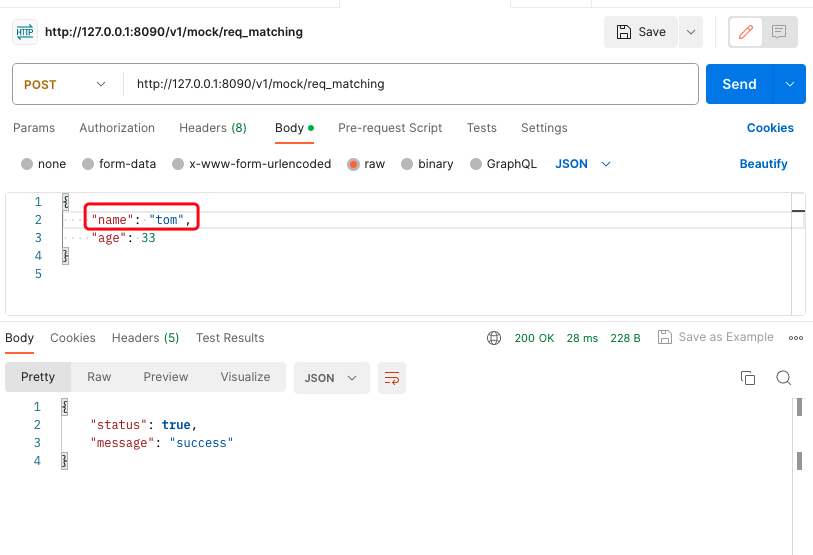
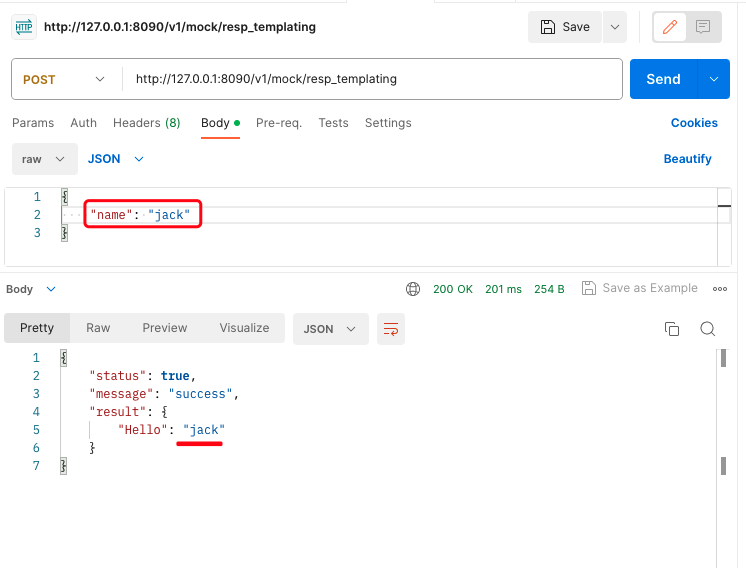
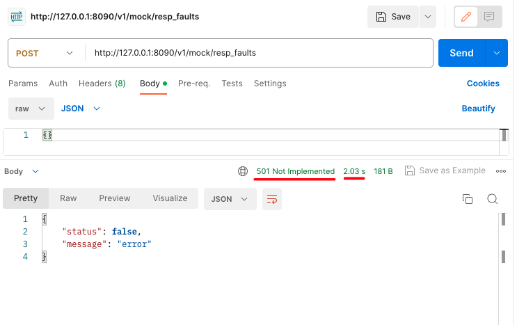

# wiremock 使用

## 安装启动（docker）

* 使用容器创建服务

```bash
docker run -it --rm \
  -p 8090:8080 \
  --name wiremock \
  wiremock/wiremock:2.35.0

docker run -d \
-p 8090:8080 \
-v $PWD/stubs:/home/wiremock \
-v $PWD/extensions:/var/wiremock/extensions \
--name wiremock \
wiremock/wiremock:2.35.0 \
--global-response-templating \
--print-all-network-traffic
```


要挂载当前目录，请使用例如：-v $PWD:/Users/fnngj/zhpro/wiremock

```bash
docker run -it --rm \
  -p 8090:8080 \
  --name wiremock \
  -v $PWD:/Users/fnngj/zhpro/wiremock \
  wiremock/wiremock:2.35.0
```

* 启动成功

```bash
...

 /$$      /$$ /$$                     /$$      /$$                     /$$      
| $$  /$ | $$|__/                    | $$$    /$$$                    | $$      
| $$ /$$$| $$ /$$  /$$$$$$   /$$$$$$ | $$$$  /$$$$  /$$$$$$   /$$$$$$$| $$   /$$
| $$/$$ $$ $$| $$ /$$__  $$ /$$__  $$| $$ $$/$$ $$ /$$__  $$ /$$_____/| $$  /$$/
| $$$$_  $$$$| $$| $$  \__/| $$$$$$$$| $$  $$$| $$| $$  \ $$| $$      | $$$$$$/ 
| $$$/ \  $$$| $$| $$      | $$_____/| $$\  $ | $$| $$  | $$| $$      | $$_  $$ 
| $$/   \  $$| $$| $$      |  $$$$$$$| $$ \/  | $$|  $$$$$$/|  $$$$$$$| $$ \  $$
|__/     \__/|__/|__/       \_______/|__/     |__/ \______/  \_______/|__/  \__/

port:                         8080
enable-browser-proxying:      false
disable-banner:               false
no-request-journal:           false
verbose:                      false
```

### 创建mock接口

* 创建一个简单的 GET接口

```bash
curl --location 'http://127.0.0.1:8090/__admin/mappings' \
--header 'Content-Type: text/plain' \
--data '{
    "request": {
        "method": "GET",
        "url": "/v1/mock/thing"
    },
    "response": {
        "status": 200,
        "jsonBody": { "status": true, "message": "success" },
        "headers": {
            "Content-Type": "application/json"
        }
    }
}'
```

* 查看创建的mock接口

访问：http://127.0.0.1:8090/__admin/mappings




* 调用创建的 mock 接口(浏览器调用)




## 请求匹配

wiremock 除了一般的 请求方法 + URL 之外，支持各种类型请求匹配。

可以使用以下请求属性：

* URL
* HTTP Method
* Query parameters
* Headers
* Basic authentication (a special case of header matching)
* Cookies
* Request body
* Multipart/form-data

例如设置匹配 请求中的某个字段的值，如果出现了就匹配这个mock。

```bash
curl --location --request GET 'http://127.0.0.1:8090/__admin/mappings' \
--header 'Content-Type: application/json' \
--data '{
    "request": {
        "method": "POST",
        "url": "/v1/mock/req_matching",
        "bodyPatterns": [
            {
                "matchesJsonPath": {
                    "expression": "$.name",
                    "contains": "tom"
                }
            }
        ]
    },
    "response": {
        "status": 200,
        "jsonBody": {
            "status": true,
            "message": "success"
        },
        "headers": {
            "Content-Type": "application/json"
        }
    }
}'
```

要求请求的结构体必须出现使用下面数据，才能匹配到这个 Mock: 

```json
{
    ...
    "name": "tom"
    ...
}
```

验证请求匹配




更多用法：https://wiremock.org/docs/request-matching/

## 响应模板

response 返回，支持动态模板。支持从请求中提取数据放到 响应数据中。

以下请求属性是可用的:

* `request.url` - URL path and query

* `request.path` - URL path

* `request.pathSegments.[<n>]` - URL path segment (zero indexed) e.g. `request.pathSegments.[2]`

* `request.query.<key>` - First value of a query parameter e.g. `request.query.search`

* `request.query.<key>.[<n>]` - nth value of a query parameter (zero indexed) e.g. `request.query.search.[5]`

* `request.method` - request method e.g. `POST`

* `request.host` - hostname part of the URL e.g. `my.example.com`

* `request.port` - port number e.g. `8080`

* `request.scheme` - protocol part of the URL e.g. `https`

* `request.baseUrl` - URL up to the start of the path e.g. `https://my.example.com:8080`

* `request.headers.<key>` - First value of a request header e.g. `request.headers.X-Request-Id`

* `request.headers.[<key>]` - Header with awkward characters e.g. `request.headers.[$?blah]`

* `request.headers.<key>.[<n>]` - nth value of a header (zero indexed) e.g. `request.headers.`ManyThings.[1]

* `request.cookies.<key>` - First value of a request cookie e.g. `request.cookies.JSESSIONID`

* `request.cookies.<key>.[<n>]` - nth value of a request cookie e.g. `request.cookies.JSESSIONID.[2]`

* `request.body` - Request body text (avoid for non-text bodies)

例如 从请求体的 body 中提取 name 填充到 response 中。


```bash
curl --location 'http://127.0.0.1:8090/__admin/mappings' \
--header 'Content-Type: application/json' \
--data '{
    "request": {
        "method": "POST",
        "url": "/v1/mock/req_matching"
    },
    "response": {
        "status": 200,
        "jsonBody": {
            "status": true,
            "message": "success",
            "result": {
                "Hello": "{{jsonPath request.body '\''$.name'\''}}"
            }
        },
        "headers": {
            "Content-Type": "application/json"
        }
    }
}'
```

要求请求的结构体必须出现使用下面数据，这个 Mock 才能提取到数据: 

```json
{
    ...
    "name": "xxx"
    ...
}
```

验证响应提取匹配



更多用法：https://wiremock.org/docs/response-templating/

## 模拟故障

有时希望模拟接口返回 HTTP 状态码 非 200， 或者 延迟返回。 wiremock 同样可以轻松应对。


例如 response 模拟 HTTP 状态码 501， 并且延迟 2s 返回。

```bash
curl --location 'http://127.0.0.1:8090/__admin/mappings' \
--header 'Content-Type: application/json' \
--data '{
    "request": {
        "method": "POST",
        "url": "/v1/mock/resp_faults"
    },
    "response": {
        "status": 501,
        "fixedDelayMilliseconds": 2000,
        "jsonBody": {
            "status": false,
            "message": "error"
        },
        "headers": {
            "Content-Type": "application/json"
        }
    }
}'
```

验证响应提取匹配



更多用法：https://wiremock.org/docs/simulating-faults/

## 结束

WireMock 还有好多功能，我们最近在调研mock工具，以上这些特性都是我们需要用到的。发现 wiremock 是为数不多mock 能力比较强大，而且在持续更新的工具。

除此之外，wireMock 还提供各种语言的 SDK，也就是说我们可以在编程语言中使用 wiremock。而且，还有 wiremock 的云平台，可以通过web界面创建 mock 服务。


