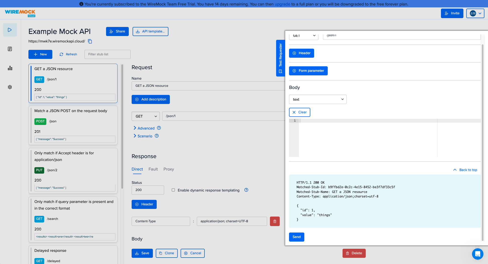
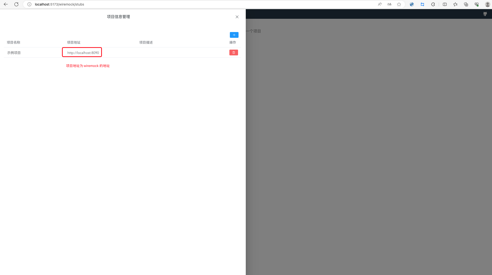
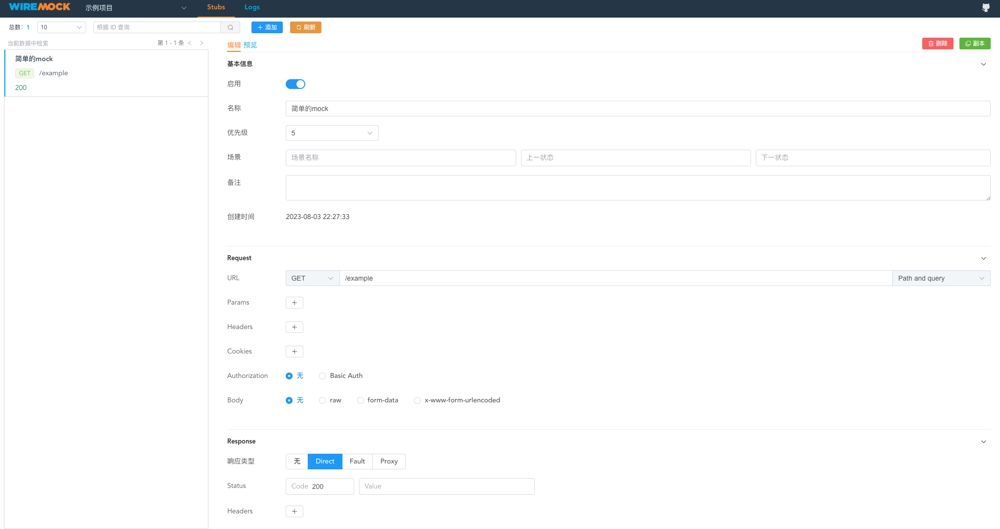
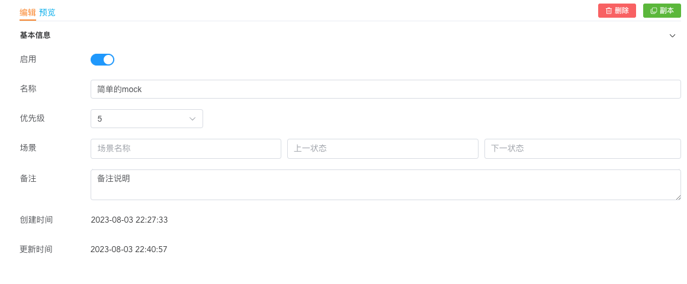
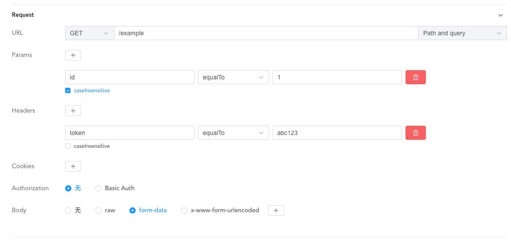
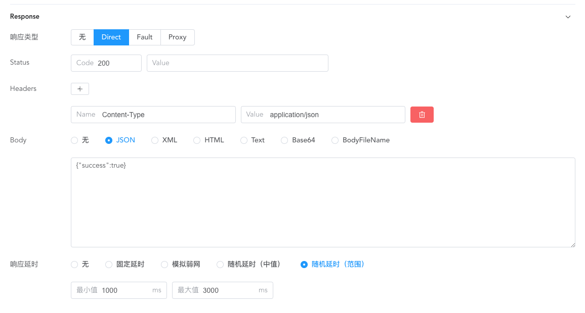
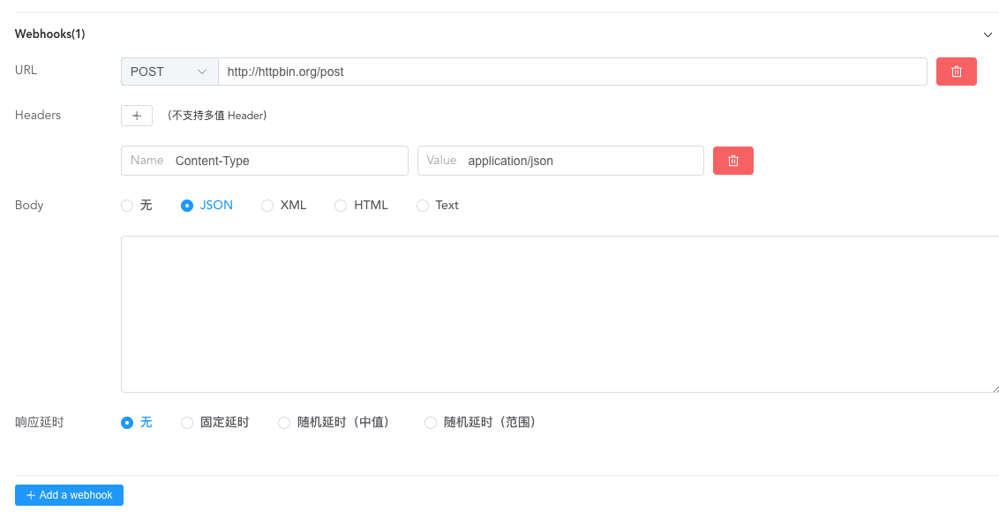
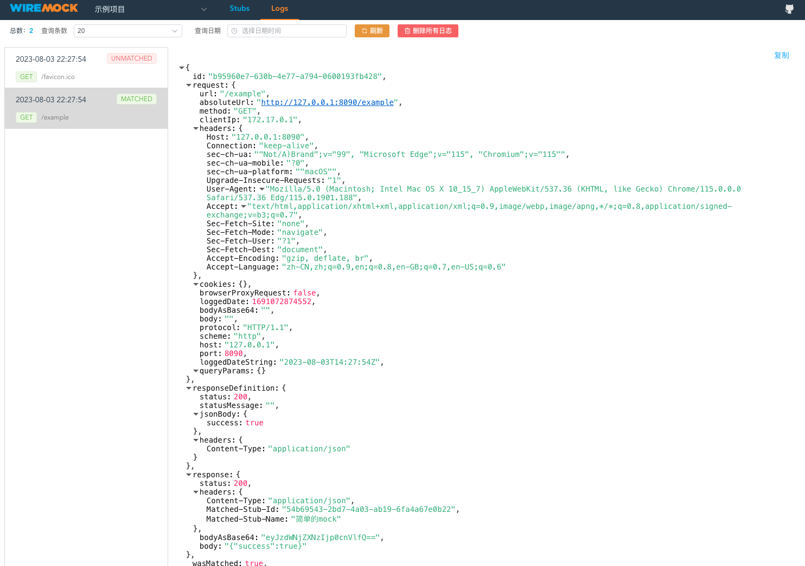

## wiremock UI管理mock更简单

前一篇文章介绍了wiremock工具的使用，通过调用接口的方式添加 mock 确实不够方便，我们需要花费一些学习成本来了解 wiremock 定义mock 接口的规则。


例如下面的结构，我们需要理解每个字段的含义，并且准确的知道这个字段应该插入在哪个位置。

```json
{
    "request": {
        "urlPath": "/everything",
        "method": "ANY",
        "headers": {
            "Accept": {
                "contains": "xml"
            }
        },
        "queryParameters": {
            "search_term": {
                "equalTo": "WireMock"
            }
        },
        "cookies": {
            "session": {
                "matches": ".*12345.*"
            }
        },
        "bodyPatterns": [
            {
                "equalToXml": "<search-results />"
            },
            {
                "matchesXPath": "//search-results"
            }
        ],
        "multipartPatterns": [
            {
                "matchingType": "ANY",
                "headers": {
                    "Content-Disposition": {
                        "contains": "name=\"info\""
                    },
                    "Content-Type": {
                        "contains": "charset"
                    }
                },
                "bodyPatterns": [
                    {
                        "equalToJson": "{}"
                    }
                ]
            }
        ],
        "basicAuthCredentials": {
            "username": "jeff@example.com",
            "password": "jeffteenjefftyjeff"
        }
    },
    "response": {
        "status": 200
    }
}
```

那么，有没有个管理界面来配置这些参数呢？ 答案是肯定的，我们可以使用 wiremock 的云平台。

## wiremock clould

wiremock云平台：https://app.wiremock.cloud/



除了提供 mock 的管理 还提供了在线调试功能。这一点非常棒。

## wiremock UI

### 介绍

github地址：https://github.com/ly1012/wiremock-ui

> WireMock UI 基于 Wiremock Admin API 开发，用于 Stub Mapping 数据的可视化管理。
>
> 本项目为前端项目，仅提供可视化数据管理功能，不提供 Wiremock 实例服务管理、用户管理等功能。

作者已经介绍的比较清楚了，他只是 wiriemock加了一层UI，也正因如此，他的使用方式非常简单，同时，我们还可以基于 wiremock UI 方便的做二次开发。

### 安装与运行

```bash
# 克隆项目
git clone https://github.com/ly1012/wiremock-ui  

# 进入目录
> cd wiremock-ui

# 安装依赖（需要 node）
> npm install

# 运行项目
> npm run dev
```

* 访问平台

http://localhost:5173/wiremock

* 接入wiremock

点击 logo 添加 wiremock 项目。



* 创建mock接口




### 功能

__基本信息__



* `启用`/`禁用`
* `名称`：
* `优先级`：默认5，设置为1优先级最高，最大值为2147483647。
* `场景`：用于多个mock 接口关联。
* `备注`：
* `创建时间`：
* `更新时间`：

__请求匹配__



请求匹配的意思是只有匹配上一下信息，才会走到这个mock接口。最基本的就是 `请求方法 + URL` 匹配。

* `URL`： 请求方法 + URL
* `params`： GET请求参数
* `Headers`：请求头
* `Cookie`：
* `Authorization`：
* `body`：


__响应__



* `响应类型`: 支持 Direct / Fault / Proxy， fault 用于故障模拟，proxy 用于代码转发。
* `status`: HTTP状态码。
* `Header`: 响应头。
* `body`: 响应数据格式，JSON/HTML/Text/Base64/BodyFileName。最常见的就是JSON格式，BodyFileName可以设置XML格式的文件。body功能并不友好，应该内嵌编辑器，提供格式校验和着色。
* `响应延迟`：这里固定延/模拟弱网/随机延时（中值）/随机延时（范围）等，可以灵活使用。


__回调__



这个也是 wiremock 特色功能，调用A接口，希望他触发B接口的调用。wiremock不但支持，还支持多个回调。

* `URL`: 回调的请求方法 + URL地址
* `Headers`: 
* `Body`:
* `响应延迟`:


__请求日志__



最后，我们还可以通过wiremock 查看mock接口的请求日志。


wiremock作为一款成熟的mock工具，几乎是完美的mock任何我们想要的接口，配合wiremock UI可以大大降低使用难度。为何用 `几乎`呢？是因为 wiremock 的动态数据能力不够。如果我们需要高度控制 mock 接口返回的数据的话（例如代码逻辑判断控制接口返回的数据），因为 wiremock 能力提供的语法非常有限。除此之外，他是一个很棒的工具。


