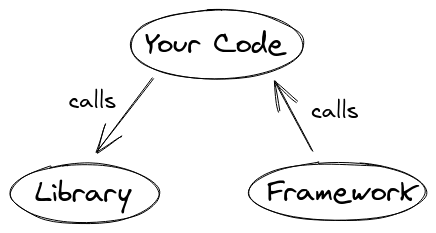

## 《自动化框架设计》01-相关概念

作为一本介绍自动化测试框架的书，那么首先应该解释清楚什么是`测试框架`。 我先来试着解释几个相关概念。

### 库与框架

相信不少同学对`Martin Fowler`并不陌生，他提出了`分层自动化测试` 、`PageObject` 等对测试领域产生深远影响的概念。先来看看他的解释:

> A library is essentially a set of functions that you can call, these days usually organized into classes. Each call does some work and returns control to the client.

库本质上是一组可以调用的函数，现在通常被组织成类。每个调用都会执行一些工作，并将控制权返回给客户端。

> A framework embodies some abstract design, with more behavior built in. In order to use it you need to insert your behavior into various places in the framework either by subclassing or by plugging in your own classes. The framework's code then calls your code at these points.

框架体现了一些抽象的设计，并内置了更多的行为。为了使用它，你需要通过子类或插入自己的类，将你的行为插入框架中的各个位置。然后，框架的代码在这些点调用你的代码。

另一段解释更加有意思：

> The main difference between a library and a framework is determined by who controls the development process, which is known as inversion of control.

库和框架之间的主要区别取决于谁控制开发过程，这称为控制反转。



好了，到这里估计你被上面的一些概念搞晕了，举个例子帮你理解。

* Requests

> Requests 唯一的一个非转基因的 Python HTTP 库，人类可以安全享用。

根据官方的定义，Requests是一个库，这点相信你没有异议。

```py
import requests

r = requests.get('https://api.github.com/user', auth=('user', 'pass'))
r.status_code
```

上面的代码用于调用一个`GET`接口。当我们在使用库的时候，控制权是在我这里，我可以选择在任意类方法、函数中使用上面的代码。

* unittest 

> unittest 单元测试框架是受到 JUnit 的启发，与其他语言中的主流单元测试框架有着相似的风格。其支持测试自动化，配置共享和关机代码测试。支持将测试样例聚合到测试集中，并将测试与报告框架独立。

同样摘自官方的介绍，unittest是Python的标准库中集成的单元测试框架。

```py
import unittest

class TestStringMethods(unittest.TestCase):

    def test_upper(self):
        self.assertEqual('foo'.upper(), 'FOO')

    def test_isupper(self):
        self.assertTrue('FOO'.isupper())
        self.assertFalse('Foo'.isupper())

    def test_split(self):
        s = 'hello world'
        self.assertEqual(s.split(), ['hello', 'world'])
        # check that s.split fails when the separator is not a string
        with self.assertRaises(TypeError):
            s.split(2)

if __name__ == '__main__':
    unittest.main()
```

上面这段代码实现了三条测试用例。当我们使用框架时，控制器是由框架决定的。除了你看到我们使用了unittest所提供的一些类方法`TestCase`，`main()`、`assertXXX` 之外，还有一些隐含的规则。

1. 必须创建一个类去集成`TestCase`类。
2. 定义测试用例必须以`test`开头。
3. 断言方法`assertXXX`需要写用例方法中。

我们在按照框架的`规则`写代码。换言之，框架在控制我的代码。再翻回去看上面的解释，相信你已经有了些许体会。


## 工具和框架

工具和框架，我们有时也会在工作中混用，例如 `selenium自动化测试工具` 、`selenium自动化测试框架`，这二者有什么不同，这里引述Quora网站的一个回答。


> A TOOL is an instrument for special functions in software and system design. It has predefined inputs an delivers predefined outputs.
>
> A FRAMEORK is a wider term. It is an amount of different TOOLs and design procedures in order to create a wider product f. i : a new software system (from analysing of the necessary problem till testing of all evaluated new software) or creating a new software language (including a parser as TOOL).
>
> So a development of a TOOL can be made by an own FRAMEWORK.
>
> A FRAMEWORK includes mental creativity a TOOL needs human factorized usability only.

工具是在软件和系统设计中执行特殊功能的工具。它有预定义的输入，提供预定义的输出。

框架是一个更广泛的术语。它是为了创建一个更广泛的产品，即:一个新的软件系统(从分析必要的问题到测试所有评估过的新软件)或创建一个新的软件语言(包括一个作为TOOL的解析器)。

因此，我们可以使用框架去开发一个工具。

一个框架包含了思维的创造性，而一个工具只需要人为因素的可用性。

根据上面回答， `工具`更偏向于`软件`，可以运行在操作系统之上，并提供独立的交互界面。例如 性能测试工具`loadRunner`。 框架是基于编程语言被设计出来的，开源自动化测试框架`Robot Frameowrk`。

* selenium 是测试工具还是测试框架？

在官网的对selenium的介绍中，并没有用到`tools` 或`framework` 的字眼。selenium由三部分组成。`Webdriver` 、`IDE`、`Grid`。其中， `Webdriver`是基于不同语言被开发出来用于驱动浏览器的 `测试库`。`IDE`是基于Chrome/Firefox的浏览器插件。而 `Grid` 被集成到一个Java`jar`包使用。

因此，我把Selenium称工具或框架都不够准确，我也没有有更适合的词来形容他，如果非要在`工具`和`框架`之间选一个，个人更倾向于称其为工具。


## 项目与框架

这两者的非常容易区分，甚至我没有找到`项目与框架的区别`相关提问。如果把项目当成你屁股下面的这把椅子的化，那么，框架就是制造这把椅子所用的工具箱。

项目非常具体的，例如，你开发一个用于学习编程的网站，我开发了一个用于爬取电影评分的脚本，这些都属于一个个非常具体的项目。

框架就是开发这些项目所用到的工具，例如，开发学习编程网站会用到Web框架，开发爬虫脚本会用到爬虫框架。

在自动化测试领域，我们更习惯性声称在开发`自动化测试框架`？

一方面，我们有意无意的被一些技术文章或书籍误导，并未认真的思考二者的区别。

另一个方面，我们可以非常容易的将现有的一些框架和库拼装到一起。例如，`pytest`、`selenium`、`allure` 放到一起去做自动化Web UI自动化测试，然后，再提供少量的样板用例。这其实更像是`脚手架`或`项目模板`。使用这样的项目模板，确实可以更方便的开始编写自动化测试用例。

参考下面这个项目，他就是一个典型的`自动化测试项目模板`。
https://github.com/defnngj/pyautoTest

开发自动化测试框架本质上是一种造轮子行为，他被设计的初衷是为了解决一类问题，并且独立于项目之外开发迭代。下一节，我将聊聊一个测试框架应该具备哪些特征。


## 参考：

工具与框架的不同:
https://www.quora.com/What-is-the-difference-between-a-tool-and-framework

库和框架的不同：
https://dev.to/maggiecodes_/the-difference-between-a-library-and-a-framework-5dec

https://martinfowler.com/bliki/InversionOfControl.html
