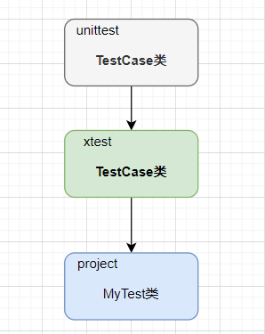

## 开发unittest扩展

`unittest`属于是有类集成的测试框架，扩展他的API相对要简单很多。需要在`TestCase` 类的基础上扩展即可，例如`django`框架所提供的测试类也继承自`unittest`的`TestCase`类。



如上图所示，值需要在自己的的扩展中创建`TestCase`类继承unittest框架的`TestCase`类，然后，在具体项目中使用自己的扩展`TestCase`类即可。

### 实现扩展

```shell
unittest_sample/
├── xtest.py
└── test_sample.py
```

首先，创建一个`xtext`文件， 实现代码如下。

```py
import unittest
import random


class TestCase(unittest.TestCase):
    """
    扩展unittest 的方法
    """

    @staticmethod
    def say_hello(name: str, times: int = 1) -> None:
        if times < 1:
            return
        for _ in range(times):
            print(f'Hello {name}')

    @property
    def get_name(self) -> str:
        """
        随机返回一个名字
        """
        name_list = ["Andy", "Bill", "Jack", "Robert", "Ada", "Jane", "Eva", "Anne"]
        choice_name = random.choice(name_list)
        return choice_name


def run():
    """
    运行用例方法
    """
    unittest.main()

```

__主要代码说明:__

1. 创建`TestCase` 类继承`unittest.TestCase` 类。

2. 实现`say_hello()` 方法，针对输入的`name`，输出`times` 次数的“Hello, XX”。

3. 实现`get_name()` 方法，用于随机返回一个英文名。

4. 将`unittest.main()` 入口方法，重写到一个`run()`方法中，这样做是为了完全消除编写测试用例中`unittest` 的影子。

然后，创建测试文件`test_sample.py`，实现代码如下：

```py
import xtest


class MyTest(xtest.TestCase):

    def test_case(self):
        self.say_hello(self.get_name, 3)


if __name__ == '__main__':
    xtest.run()
```

__主要代码说明:__

1. 创建测试类`MyTest` 继承`xtest.TestCase`类。

2. 创建测试用例`test_case()`, 在用例中使用父类中封装的`say_hello()`方法，然后调用父类中的`get_name`语句获取一个英文名，最后，对着个名字说三次“hello”。


执行结果：

```shell
> python test_sample.py

Hello Andy
Hello Andy
Hello Andy
.
----------------------------------------------------------------------
Ran 1 test in 0.002s

OK
```

最后，扩展`unittest`单元测试框架的功能并不局限于在父类中实现方法，同样可以使用装饰器、运行方法（`run()`方法）或者命令行参数。我们会在后续的章节中详细介绍。


-----------
* 测试覆盖率：
https://github.com/craigahobbs/unittest-parallel

* 扩展，例如 参数化
https://github.com/nose-devs/nose2

* unittest 扩展
https://pypi.org/project/punittest/
