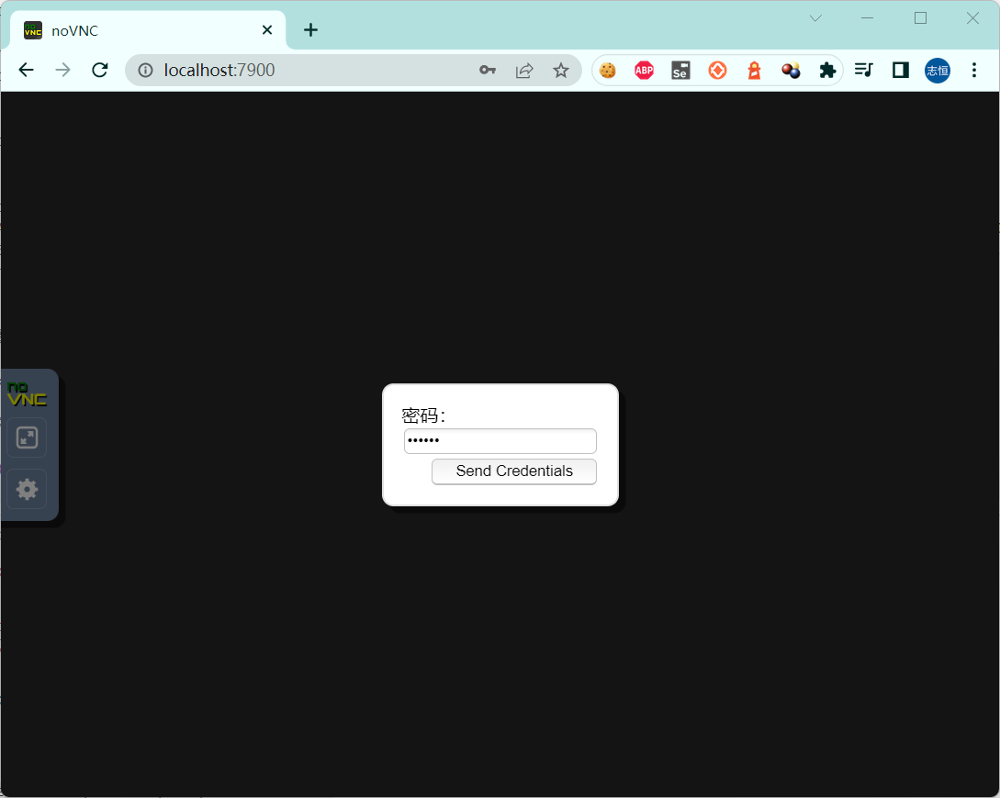
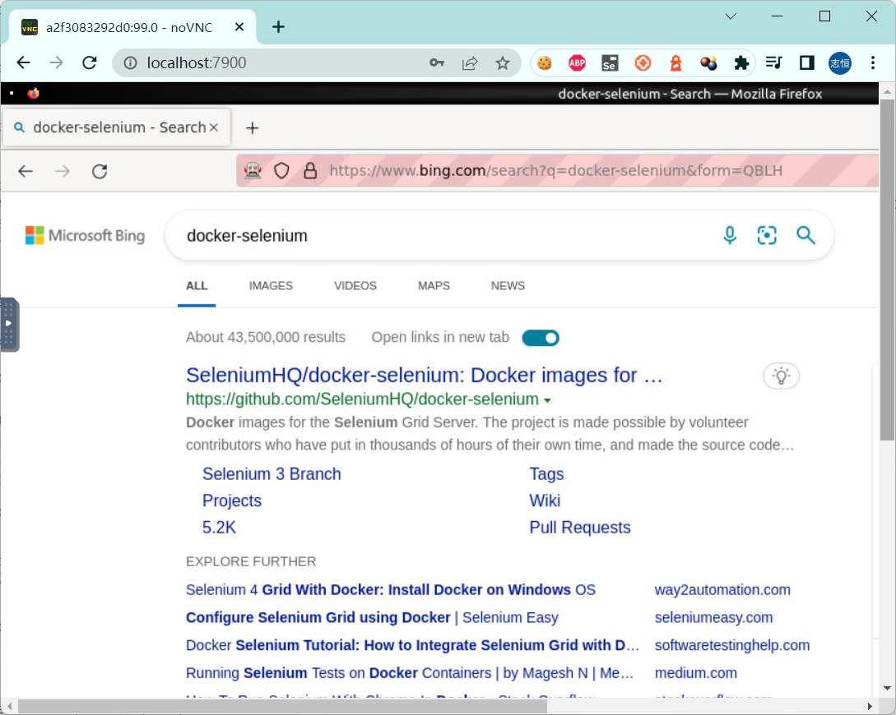

# selenium 环境管理

新的Web自动化工具`Cypress`、`playwright` 在安装的过程中会自动化把要运行的浏览器环境一起下载。`selenium`则需要你手动安装不同的浏览器，甚至需要知道不同浏览器的驱动地址，以及知道浏览器和驱动的版本对应关系，还要设置浏览器驱动的环境变量`path`。虽然，这些工作是一次性的，但是仍然给新手设置了门槛。今天介绍几种方式来简化驱动的安装和创建测试运行环境。


## pyderman

这是一个快速，简单，无依赖的包，可以自动找到和下载任何版本的谷歌Chrome (chromeDriver)， Firefox (geckoDriver)， PhantomJS, Opera (operdriver)，和Edge (edgeDriver)的web驱动程序。 

地址：https://github.com/shadowmoose/pyderman

* pip 安装

```
> pip install pyderman
```

创建`pyderman_demo.py`，编写下载浏览器驱动代码。

```py
# pyderman_demopy
import pyderman as driver
path = driver.install(browser=driver.firefox)
print(f"Installed geckodriver driver to path: {path}")

```

* 运行

```shell
> python .\pyderman_demo.py
geckodriver is already installed.
Installed geckodriver driver to path: ...\lib\geckodriver_0.31.0.exe
```

程序会将浏览器驱动下载到当前脚本的`lib\` 目录下并自动解压驱动文件。

`pyderman`只能看做是半自动工具，虽然帮你下载了驱动文件，你仍然需要设置环境变量，或者在导入selenium webdriver的时候指定浏览器驱动的位置。


## webdriver_manager

__描述__：其主要思想是简化对不同浏览器的二进制驱动程序的管理。

支持的浏览器：

* ChromeDriver

* GeckoDriver

* IEDriver

* OperaDriver

* EdgeChromiumDriver

地址：https://github.com/SergeyPirogov/webdriver_manager

* pip 安装

```
> pip install webdriver_manager
```

创建`webdriver_manager_demo.py`，编写使用`webdriver_manager`。

```py
# webdriver_manager_demo.py
from selenium import webdriver
from selenium.webdriver.chrome.service import Service as ChromeService
from webdriver_manager.chrome import ChromeDriverManager

driver = webdriver.Chrome(service=ChromeService(ChromeDriverManager().install()))

```

如果`pyderman`是半自动工具，那么，`webdriver_manager`就是全自工具了，只要导入相关模块，自动根据浏览器版本下载驱动、安装、设置环境变量。整个过程都不需要关心浏览器驱动。


## docker-selenium

> Docker images for the Selenium Grid Server

如果你熟悉docker的话，无疑通过docker创建selenium的运行环境是最简单的，甚至浏览器都不需要安装。

地址：https://github.com/SeleniumHQ/docker-selenium

* docker 安装firefox镜像

```shell
> docker run -d -p 4444:4444 -p 7900:7900 --shm-size="2g" selenium/standalone-firefox:4.3.0-20220706
```

* docker查看镜像

```
>  docker ps
CONTAINER ID   IMAGE                                        COMMAND                  CREATED         STATUS         PORTS                                                      NAMES
a2f3083292d0   selenium/standalone-firefox:4.3.0-20220706   "/opt/bin/entry_poin…"   5 minutes ago   Up 5 minutes   0.0.0.0:4444->4444/tcp, 0.0.0.0:7900->7900/tcp, 5900/tcp   determined_gagarin
```

* 查看运行环境

`docker-selenium`甚至提供了一个可视化的环境：`noVNC`，帮你查看浏览器的运行过程。

通过浏览器访问：http://localhost:7900/ (密码：`secret`)




创建`docker_grid_demo.py`，编写使用`docker-selenium`。

```py
# docker_grid_demo.py
from selenium.webdriver import Remote, DesiredCapabilities

# 引用firefox浏览器配置
driver = Remote(command_executor='http://localhost:4444/wd/hub',
                desired_capabilities=DesiredCapabilities.FIREFOX.copy())

driver.get("https://www.bing.com")
search = driver.find_element("id", "sb_form_q")
search.send_keys("docker-selenium")
search.submit()

```

* 查看运行过程

运行上面的例子，通过`noVNC`查看运行过程。



`docker-selenium`非常适合Linux环境的部署，尤其是需要远程执行或持续继承的时候。

