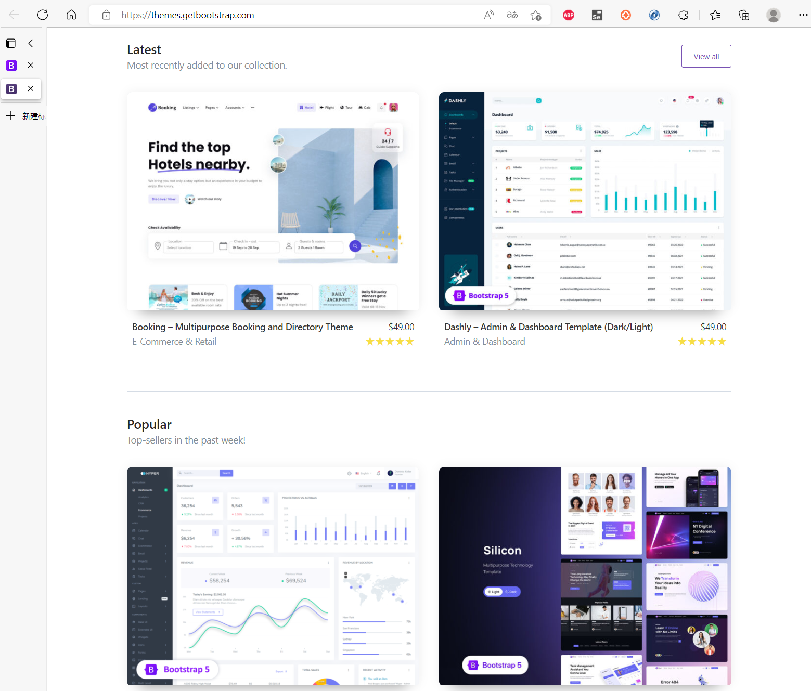
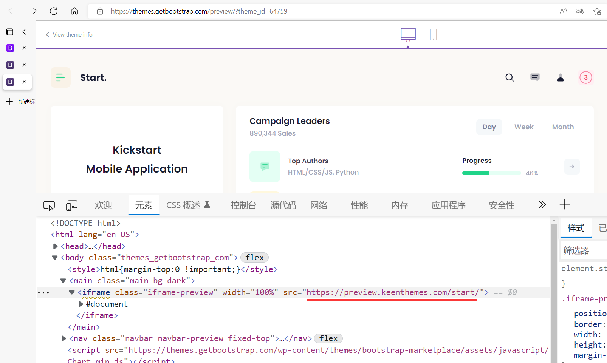
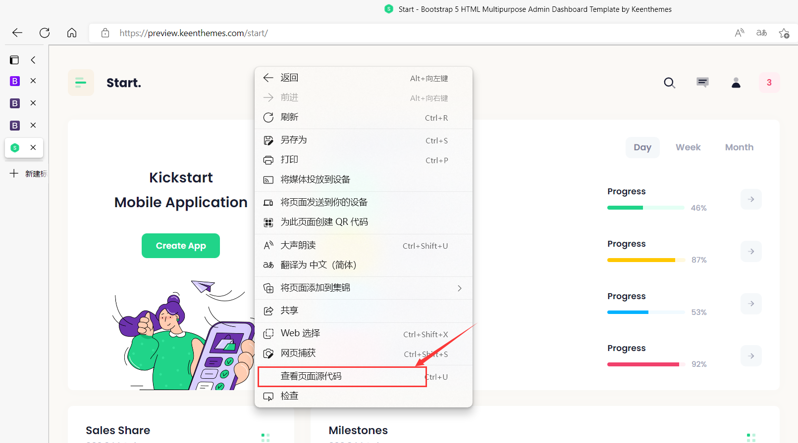
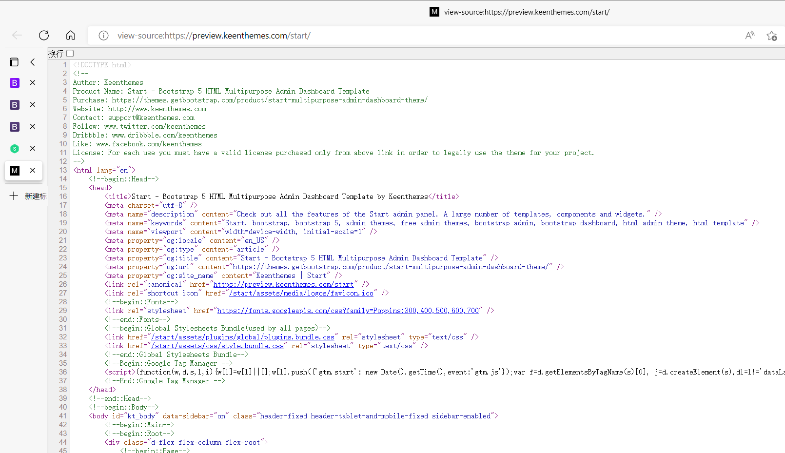
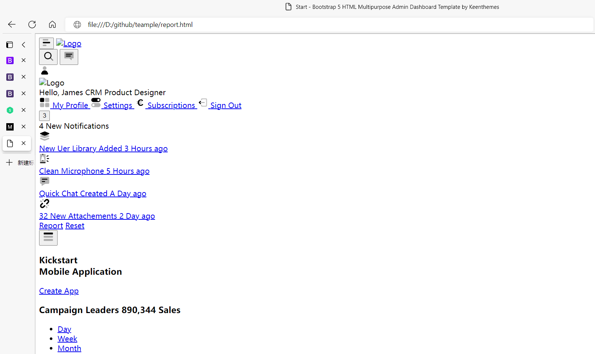
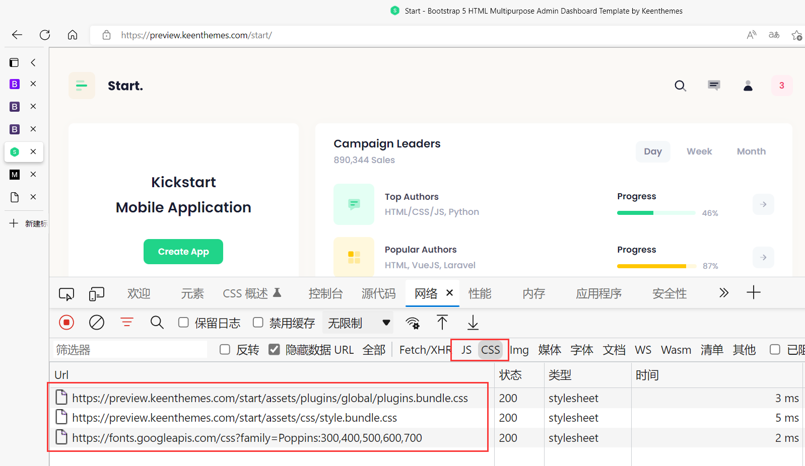
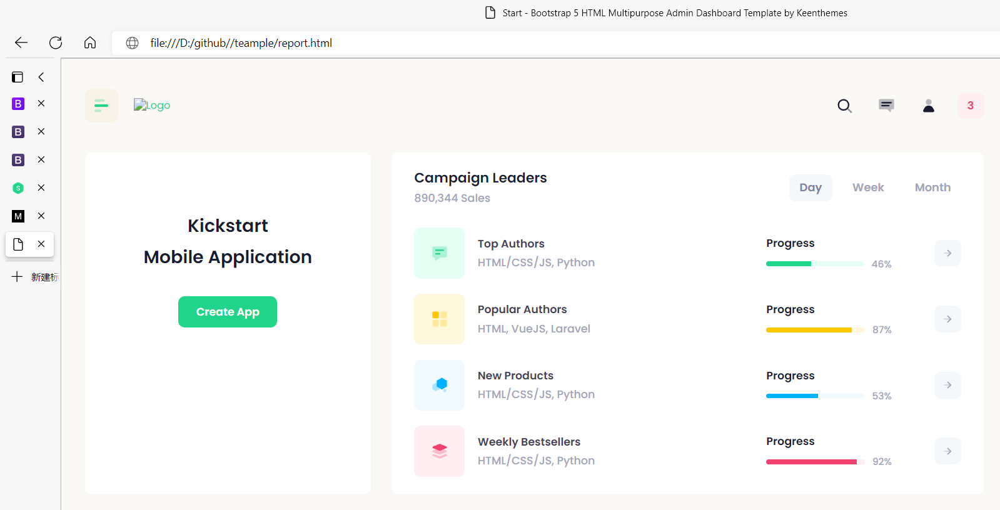

## 如何获取HTML模板

从零开始学习HTML/CSS/JavaScript需要花费不少时间，而且除了技术层面，如何做出一套风格统一的模板也很考验每个人的设计能力。更快捷的方式就是去找一套网站模板来使用。

bootstrap主题：https://themes.getbootstrap.com/



bootstrap网站提供了许多漂亮的模板。当然想要拿来使用需要一些技巧，接下来我将介绍如何快速获得一套HTML主题模板。

### 获取HTML主题模板步骤

第一步：选择一套你喜欢的主题，点击主题查看详情。



打开，前端开发者工具，`<iframe>` 标签的`src`属性会显示真正网站地址；复制地址在新的浏览器窗口打开。


第二步：在新打开的页面上右键弹出菜单。



选择`查看页面源代码`。



将源代码全选复制到本地保存为`report.html`文件。

第三步：通过浏览器打开本地 `report.html` 文件。



此时，因为本地HTML页面丢失样式，所以，你看到的页面事乱的。没关系，重新回到主题页面，通过前端开发者工具，查看引用的js/CSS样式地址。



将这些地址替换本地`report.html` 中的地址。

例如：

```html
<!--begin::Global Stylesheets Bundle(used by all pages)-->
<link href="/start/assets/plugins/global/plugins.bundle.css" rel="stylesheet" type="text/css" />
<link href="/start/assets/css/style.bundle.css" rel="stylesheet" type="text/css" />
```
替换为：
```html
<!--begin::Global Stylesheets Bundle(used by all pages)-->
<link href="https://preview.keenthemes.com/start/assets/plugins/global/plugins.bundle.css" rel="stylesheet" type="text/css" />
<link href="https://preview.keenthemes.com/start/assets/css/style.bundle.css" rel="stylesheet" type="text/css" />
```

重新刷新本地`report.html`页面，样式就可以正常显示了。





接下来要做的就是对`report.html` 的内容进行删减，仅保留需要的样式。当然，这需要你具备一定的HTML/CSS基础。

