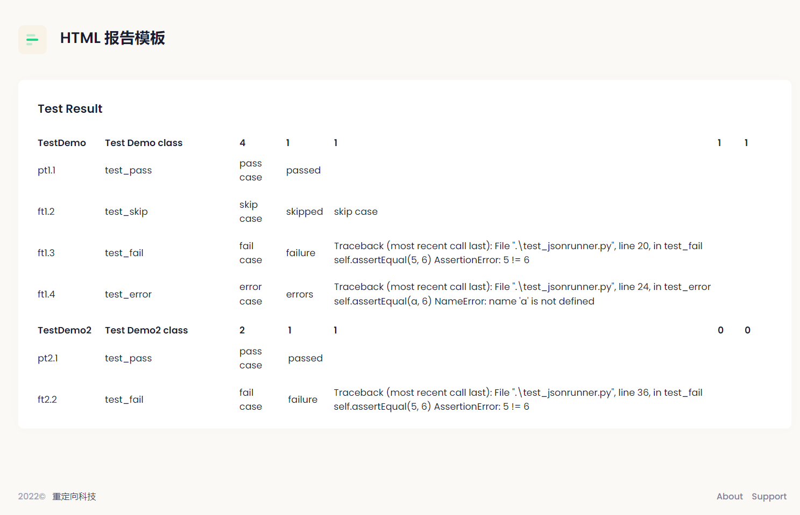

## unittest生成HTML测试报告

这一小节会对前面三节所学的知识进行综合运用。基于unittest单元测试框架生成HTML测试报告。

```tree
├───jsonrunner  // 重写unittest运行器
│   ├───result.py
|   ├───runner.py
│   └───template   // HTML报告模板
│       └─── report.html
├───test_jsonrunner.py  // 测试用例
├───result.html         // HTML测试报告
└───result.json
```

### 修改runner.py测试运行器

在`runner.py` 文件中实现了，测试结果的收集并生成JSON格式的报告，我们修改代码使其支持HTML报告。

```python
import os
import json
import datetime
from .result import _TestResult
from jinja2 import Environment, FileSystemLoader, select_autoescape

# template模板目录
PATH_DIR = os.path.dirname(os.path.abspath(__file__))
TEMP_DIR = os.path.join(PATH_DIR, "template")

# 加载 template 目录
env = Environment(
    loader=FileSystemLoader(TEMP_DIR),
    autoescape=select_autoescape()
)
# 指定 table.html 文件
template = env.get_template("report.html")


# 定义用例类型
case_type = {
    0: "passed",
    1: "failure",
    2: "errors",
    3: "skipped",
}


class JSONTestRunner:
    """
    运行测试：生成JSON格式的测试结果
    """

    def __init__(self, output, verbosity=1):
        self.output = output
        self.verbosity = verbosity
        self.start_time = datetime.datetime.now()

    def run(self, test):
        """
        运行测试
        """
        result = _TestResult(self.verbosity)
        test(result)
        stop_time = datetime.datetime.now()
        case_info = self.test_result(result)

        # 测试结果写JSON文件
        with open(self.output, "w", encoding="utf-8") as json_file:
            json.dump(case_info, json_file)

        # 测试结果转HTML
        self.result_to_html(case_info)

        print(f"Time Elapsed: {self.start_time - stop_time}")
        return result

    def test_result(self, result):...

    @staticmethod
    def sort_result(result_list):...

    @staticmethod
    def generate_case_data(cid, tid, n, t, e):...

    @staticmethod
    def result_to_html(result):
        """
        测试结果转HTML
        """
        tmp = template.render(class_list=result)

        # 保存HTML结果
        with open("./result.html", "w", encoding="utf-8") as f:
            f.write(tmp)
```

__代码说明：__

首先，根据目录结构，指定`template` 目录的路径。导入jinja2模块，设置`report.html`模板文件。

接下来，实现`result_to_html()` 方法，将测试结果传给HTML模板，并保存为`result.html`文件。

最后，在`run()` 方法中调用`result_to_html()`方法。


### 修改HTML模板

前面一节单独介绍了如何获取HTML模板，现在我们在模板中加入Jinja2模板语言。

```html
<!--report.html-->
  ...
  <!--begin::Table-->
  
  <div class="table-responsive">
    <table class="table table-borderless align-middle">
      <thead>
        <tr>
          <th class="p-0 fw-bolder min-w-100px">{{ class.name }}</th>
          <th class="p-0 fw-bolder min-w-200px">{{ class.desc }}</th>
          <th class="p-0 fw-bolder min-w-40px">{{ class.count }}</th>
          <th class="p-0 fw-bolder min-w-40px">{{ class.pass }}</th>
          <th class="p-0 fw-bolder min-w-40px">{{ class.fail }}</th>
          <th class="p-0 fw-bolder min-w-40px">{{ class.error }}</th>
          <th class="p-0 fw-bolder min-w-40px">{{ class.skipped }}</th>
        </tr>
      </thead>
      <tbody>
        
        <tr>
          <td class="ps-0">
            <span class="text-dark me-2 fs-6">{{ case.number }}</span>
          </td>
          <td class="ps-0">
            <span class="text-dark me-2 fs-6">{{ case.name }}</span>
          </td>
          <td class="ps-0">
            <span class="text-dark me-2 fs-6">{{ case.doc }}</span>
          </td>
          <td class="ps-0">
            <span class="text-dark me-2 fs-6">{{ case.result }}</span>
          </td>
          <td class="ps-0">
            <span class="text-dark me-2 fs-6">{{ case.error }}</span>
          </td>
        </tr>
        
      </tbody>
    </table>
  </div>
  
  <!--end::Table-->
```

__代码说明：__

1. 这里是整个HTML模板的代码片段；我们可以在整个模板中加入更多内容，例如报告的标题，执行人，公司信息等。

2. HTML中的代码的 `class` 属性与引入的 `style.css` 样式库有关。例如 `class="table-responsive"` 具体会呈现什么样式，要看`CSS` 中 `table-responsive` 定义的具体样式。

3. 利用jinja2模板语言的两个for遍历测试数据，将测试数据插入到对应的HTML标签中。


### 编写测试用例

最后，编写测试用例，验证修改后的`jsonrunner` 是否能生成HTML测试报告。

```py
# test_jsonrunner.py
import unittest
from jsonrunner.runner import JSONTestRunner


class TestDemo(unittest.TestCase):
    """Test Demo class"""

    def test_pass(self):
        """pass case"""
        self.assertEqual(5, 5)

    @unittest.skip("skip case")
    def test_skip(self):
        """skip case"""
        ...

    def test_fail(self):
        """fail case"""
        self.assertEqual(5, 6)

    def test_error(self):
        """error case"""
        self.assertEqual(a, 6)


class TestDemo2(unittest.TestCase):
    """Test Demo2 class"""

    def test_pass(self):
        """pass case"""
        self.assertEqual(1+1, 2)

    def test_fail(self):
        """fail case"""
        self.assertEqual(5, 6)


if __name__ == '__main__':
    suit = unittest.TestSuite()
    suit.addTests([
        TestDemo("test_pass"),
        TestDemo("test_skip"),
        TestDemo("test_fail"),
        TestDemo("test_error"),
        TestDemo2("test_pass"),
        TestDemo2("test_fail")
    ])

    runner = JSONTestRunner(output="./result.json")
    runner.run(suit)
```

* 运行测试

```shell
> python test_jsonrunner.py
```

* 查看`result.html` 测试结果




