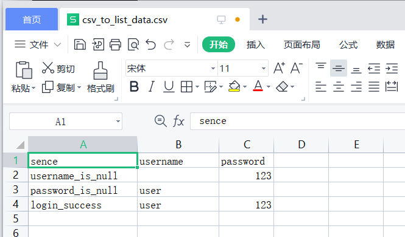
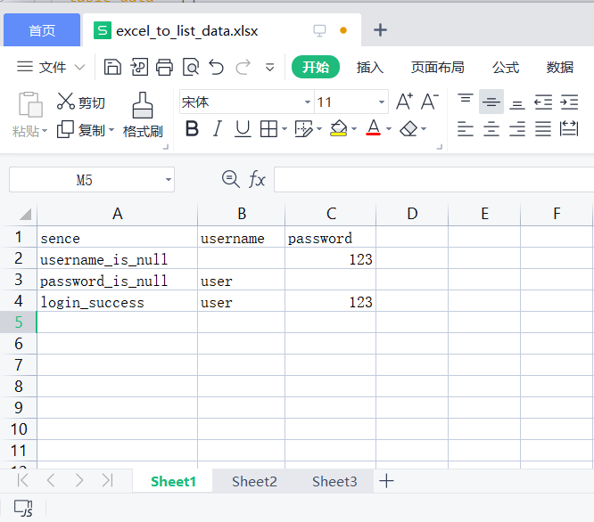

## 数据文件参数化

我们需要数据驱动能支持外部数据文件，那么就需要单独设计一个装饰器来支持数据文件，然而，我们直到不同的数据文件，读取方式是不一样的。

接下来，要思考的是数据文件的数据如何用于数据驱动。这个其实很简单，不管是什么数据文件的数据，我们最终只要转化为`data`函数想要的数据，由他进行处理即可。


## 实现JSON文件转list

JSON文件是我们最常用的用于存储测试数据的一个格式，我们先以JSON文件为例，实现数据文件的转换。

```python
# extend/data_conversion.py
import json
from extend.parameterized_extend import check_data

def json_to_list(file: str = None, key: str = None) -> list:
    """
    将JSON文件数据转化为list
    :param file: JSON文件地址
    :param key: 字典的key
    return: list
    """
    if file is None:
        raise FileExistsError("Please specify the JSON file to convert.")

    if key is None:
        with open(file, "r", encoding="utf-8") as json_file:
            data = json.load(json_file)
            list_data = check_data(data)
    else:
        with open(file, "r", encoding="utf-8") as json_file:
            try:
                data = json.load(json_file)[key]
                list_data = check_data(data)
            except KeyError:
                raise ValueError(f"Check the test data, no '{key}'.")

    return list_data

```

__代码说明:__

首先，创建`json_to_list()`函数，接受两个参数，file用于指定JSON文件的路径；key用于指定解析的数据部分，如果不指定key 默认解析整个文件。

然后，代码实现部分比较简单，通过`open()` 方法打开一个JSON文件，利用json模块提供的`load()` 方法将读取到的JSON数据转换为dict/list数据格式。调用前面实现的 check_data() 方法判断数据如果是dict格式，则转换为list格式，保证数据返回的格式统一为list。


__使用例子:__

编写测试用例，验证`json_to_list` 是否可用。

* 创建`data/json_to_list_data.json`文件

```json
{
    "login": [
        {"scene": "username_is_null", "username": "", "password": "123"},
        {"scene": "password_is_null", "username": "user", "password": ""},
        {"scene": "login_success", "username": "user", "password": "123"}
    ]
}
```

* 创建测试用例

```py
# parameterized_expend_demo.py
import unittest
from extend.parameterized_extend import data
from extend.data_conversion import json_to_list


class FileParamTestCase(unittest.TestCase):

    @data(json_to_list("data/json_to_list_data.json", key="login"))
    def test_login_json(self, name, username, password):
        print(f"case: {name}, username: '{username}' password: '{password}'")


if __name__ == '__main__':
    unittest.main(verbosity=1)
```

目前在`@data()`装饰器中再套用`json_to_list()` 的实现是不够优雅的，后面会介绍如何封装`@file_data()` 装饰器来支持各种数据文件。

__运行结果:__

```shell
> python .\parameterized_expend_demo.py
case: username_is_null, username: '' password: '123'
.case: password_is_null, username: 'user' password: ''
.case: login_success, username: 'user' password: '123'
.
----------------------------------------------------------------------
Ran 3 tests in 0.001s

OK
```

## 实现YAML文件转list

YAML格式与JSON格式比较类似，可以相互转换；在数据的描述上相比JSON更加简洁。python语言的标准库中并没有对 YAML格式进行执行，不过，我们可以使用第三方库-pyyaml。

* pip安装pyyaml

```shell
> pip install pyyaml
```

__功能代码__

实现YAML文件数据转换为 list


```python
# extend/data_conversion.py
import yaml
from extend.parameterized_extend import check_data

def yaml_to_list(file: str = None, key: str = None) -> list:
    """
    将YAML文件数据转换为list
    :param file: YAML文件路径
    :param key: 字典的key
    return: list
    """
    if file is None:
        raise FileExistsError("Please specify the YAML file to convert.")

    if key is None:
        with open(file, "r", encoding="utf-8") as yaml_file:
            data = yaml.load(yaml_file, Loader=yaml.FullLoader)
            list_data = check_data(data)
    else:
        with open(file, "r", encoding="utf-8") as yaml_file:
            try:
                data = yaml.load(yaml_file, Loader=yaml.FullLoader)[key]
                list_data = check_data(data)
            except KeyError as exc:
                raise ValueError(f"Check the YAML test data, no '{key}'") from exc

    return list_data

```


__代码说明:__

首先，创建`yaml_to_list()`函数，接受两个参数，file用于指定JSON文件的路径；key用于指定解析的数据部分，如果不指定key默认解析整个文件。

然后，代码实现部分比较简单，通过`open()` 方法打开一个YAML文件，利用YAML模块提供的`load()` 方法将读取到的YAML数据转换为dict/list数据格式。调用前面实现的 check_data() 方法判断数据如果是dict格式，则转换为list格式，保证数据返回的格式统一为list。


__使用例子:__

编写测试用例，验证`json_to_list` 是否可用。

* 创建`data/yaml_to_list_data.yaml`文件

```yaml
---
login:
- scene: username_is_null
  username: ''
  password: '123'
- scene: password_is_null
  username: user
  password: ''
- scene: login_success
  username: user
  password: '123'
```

如果你不会使用YAML格式，可以借助在线工具，将JSON格式转换为YAML格式。推荐：http://www.json2yaml.com/ 网站可以轻松实现两种格式的互相转换。


* 创建测试用例

```py
# parameterized_expend_demo.py
import unittest
from extend.parameterized_extend import data
from extend.data_conversion import yaml_to_list


class FileParamTestCase(unittest.TestCase):

    @data(yaml_to_list("data/yaml_to_list_data.yaml", key="login"))
    def test_login_yaml(self, name, username, password):
        print(f"case: {name}, username: '{username}' password: '{password}'")


if __name__ == '__main__':
    unittest.main(verbosity=1)
```

`yaml_to_list()`用法与`json_to_list()` 基本一致。


## 实现csv文件转list

CSV文件也是我们比较常用的一种数据格式。python标准库中包含的有关于CSV文件的方法。

__功能代码__

实现CSV文件数据转换为 list

```python
# extend/data_conversion.py
import csv
import codecs
from itertools import islice
from extend.parameterized_extend import check_data


def csv_to_list(file: str = None, line: int = 1) -> list:
    """
    将CSV文件数据转换为list
    :param file: CSV文件路径
    :param line: 从第几行开始读取
    :return: list
    """
    if file is None:
        raise FileExistsError("Please specify the CSV file to convert.")

    table_data = []
    with codecs.open(file, 'r', encoding='utf_8_sig') as csv_file:
        csv_data = csv.reader(csv_file)
        for i in islice(csv_data, line - 1, None):
            table_data.append(i)

    return table_data

```

__代码说明:__

首先，创建`csv_to_list()`函数，接受两个参数，file用于指定CSV文件的路径；line指定从第几行开始读，CSV文件与Excel文件非常类似，数据以表格的方式存储；我们习惯将第1行作为表头，定义每列数据的名称，所以，可以选择从第2行开始读取数据。

然后，读取文件部分，通过`codecs.open()` 方法打开一个CSV文件，通过`csv.reader()`读取打开的csv对象；再然后，通过`islice()` 方法对读取的数据进行遍历，将遍历的每行数据追加到`table_data`列表中。


__使用例子:__

编写测试用例，验证`csv_to_list` 是否可用。

* 创建`data/csv_to_list_data.csv`文件




* 创建测试用例

```py
# parameterized_expend_demo.py
import unittest
from extend.parameterized_extend import data
from extend.data_conversion import csv_to_list


class FileParamTestCase(unittest.TestCase):

    @data(csv_to_list("data/csv_to_list_data.csv", line=2))
    def test_login_csv(self, name, username, password):
        print(f"case: {name}, username: '{username}' password: '{password}'")


if __name__ == '__main__':
    unittest.main(verbosity=1)
```

注意，`csv_to_list()` 的第二个参数与前面方法略有不同。


## 实现Excel文件转list

Excel同也是应用非常广泛的一种数据格式，相比较CSV文件支持sheet多标签页。python标准库没有提供Excel文件支持，不过，我们可以找到一些第三方库：openpyxl、pandas等。

我们这里选择openpyxl，它相对比较轻量一点，只提供Excel文件的操作；pandas专注于数据分析，功能更加强大。

* pip安装openpyxl

```shell
> pip install openpyxl
```

__功能代码__

实现Excel文件数据转换为 list

```python
# extend/data_conversion.py
from openpyxl import load_workbook


def excel_to_list(file: str = None, sheet: str = "Sheet1", line: int = 1) -> list:
    """
    将Excel文件数据转换为list
    :param file: Excel文件路径
    :param sheet: 文件标签页的名字, 默认：Sheet1
    :param line: 从第几行开始读取
    :return: list data
    """
    if file is None:
        raise FileExistsError("Please specify the Excel file to convert.")

    excel_table = load_workbook(file)
    sheet = excel_table[sheet]

    table_data = []
    for i in sheet.iter_rows(line, sheet.max_row):
        line_data = []
        for field in i:
            line_data.append(field.value)
        table_data.append(line_data)

    return table_data

```

__代码说明:__

首先，创建`excel_to_list()`函数，接受三个参数，file用于指定CSV文件的路径；sheet指定标签页的名子，默认：Sheet1，line指定从第几行开始读。

然后，读取文件部分，通过openpyxl提供的`load_workbook` 方法打开一个Excel文件，sheet以列表下标的方式指定要操作的标签页。

最后，通过`sheet.iter_rows()` 遍历读取每一行的数据，line 指定从第几行开始读；sheet.max_row指定读取到第几行结束；将遍历的每行数据追加到`table_data`列表中。

__使用例子:__

编写测试用例，验证`excel_to_list` 是否可用。

* 创建`data/excel_to_list_data.xlsx`文件




* 创建测试用例

```py
# parameterized_expend_demo.py
import unittest
from extend.parameterized_extend import data
from extend.data_conversion import excel_to_list


class FileParamTestCase(unittest.TestCase):

    @data(excel_to_list("data/excel_to_list_data.xlsx", sheet="Sheet1", line=2))
    def test_login_excel(self, name, username, password):
        print(f"case: {name}, username: '{username}' password: '{password}'")


if __name__ == '__main__':
    unittest.main(verbosity=1)
```

注意，`excel_to_list()` 除了指定文件路径，也需要根据情况指定sheet和line参数。


## 实现 @file_data 装饰器

通过前面的封装，我们实现了主流数据文件（JSON/YAML/CSV/EXCEL）的支持，但是，通过@data()装饰器嵌套转换方法非常不方便。所以，我们需要进一步实现@faile_data()装饰器，自动识别不同类型的方法。

__功能代码__

根据文件后缀名识别文件类型。

```python
# extend/data_conversion.py
import os
from extend.parameterized_extend import data


def file_data(file: str, line: int = 1, sheet: str = "Sheet1", key: str = None):
    """
    支持文件转参数化.

    :param file: 文件名
    :param line:  Excel/CSV 文件指定第几行开始读取
    :param sheet: Excel文件标签页名
    :param key: YAML/JSON文件指定key
    """
    if file is None:
        raise FileExistsError("File name does not exist.")

    if os.path.isfile(file) is False:
        raise FileExistsError(f"No '{file}' data file found.")

    suffix = file.split(".")[-1]
    if suffix == "csv":
        data_list = csv_to_list(file, line=line)
    elif suffix == "xlsx":
        data_list = excel_to_list(file, sheet=sheet, line=line)
    elif suffix == "json":
        data_list = json_to_list(file, key=key)
    elif suffix == "yaml":
        data_list = yaml_to_list(file, key=key)
    else:
        raise FileExistsError(f"Your file is not supported: {file}")

    return data(data_list)

```

__代码说明:__

首先，在`data_conversion.py`文件中增加`file_data()`函数，file参数接收不同的文件，另外几个参数根据文件类型进行选择。

然后，判断文件的后缀名，交由对应的数据转换函数进行处理，得到 list格式的数据。

最后，需要将`parameterized_extend.py`文件中data函数导入，将处理后的list数据丢给data()函数。

__使用例子:__

测试数据仍然使用前面的数据，将装饰器替换为 @file_data() 重新实现前面的用例。


* 创建测试用例

```py
# parameterized_expend_demo.py
import unittest
from extend.data_conversion import file_data


class FileDataTestCase(unittest.TestCase):

    @file_data("data/json_to_list_data.json", key="login")
    def test_login_json(self, name, username, password):
        print(f"case: {name}, username: '{username}' password: '{password}'")

    @file_data("data/yaml_to_list_data.yaml", key="login")
    def test_login_yaml(self, name, username, password):
        print(f"case: {name}, username: '{username}' password: '{password}'")

    @file_data("data/csv_to_list_data.csv", line=2)
    def test_login_csv(self, name, username, password):
        print(f"case: {name}, username: '{username}' password: '{password}'")

    @file_data("data/excel_to_list_data.xlsx", sheet="Sheet1", line=2)
    def test_login_excel(self, name, username, password):
        print(f"case: {name}, username: '{username}' password: '{password}'")


if __name__ == '__main__':
    unittest.main(verbosity=1)
```

相比而言，@file_data() 装饰器的用法优雅了很多。

这里，仍然要注意一个问题，对于文件的路径和用例的执行位置有严格的要求；要么文件路径设置绝对路径（d://project/test_data/xxx.json）, 要么需要在测试文件（`parameterized_expend_demo.py`）当前目录下运行用例。两种方式否不可行，我们需要进一步实现数据文件的查找规则。这个问题作为作业，你可以自己思考。
