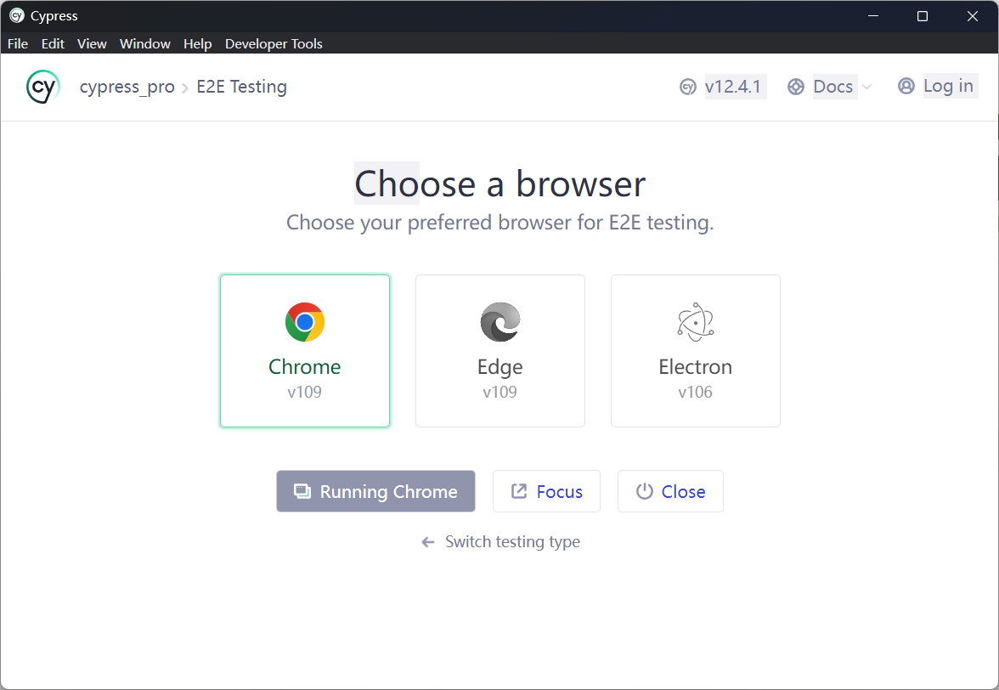
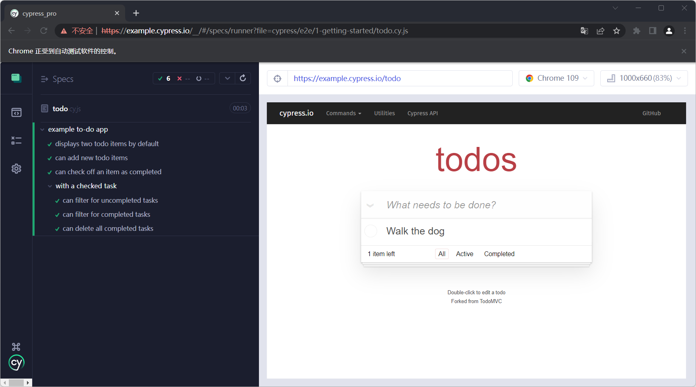
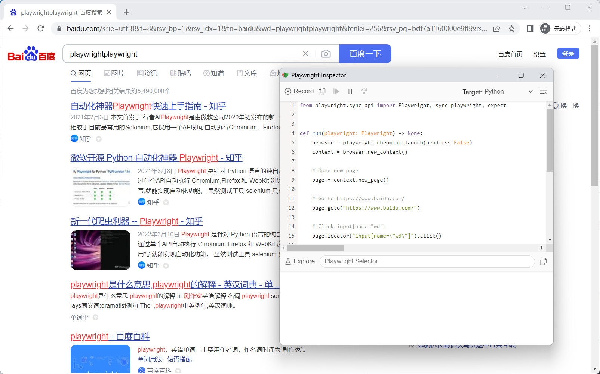

# web UI 自动化测试工具介绍

我在十几年前刚进入软件测试行业，HP公司的自动化测试工具是 QTP（即Quick Test Professional）是行业的主流，后来开源自动化工具 selenium 逐渐流行，在此后的数年间，selenium得到行业的广泛应用，几乎成为了Web UI自动化测试必备工具。最近两年，在web UI自动化领域，出现了一些新的性能测试工具。例如 cypress、playwright等，大有与selenium三足鼎立之势。

## selenium

selenium 大版本已经到了4.0，虽然，仍然在稳步向前，但并未有太多突破性更新。selenium仍然在一些方面优势明显：

* selenium 支持更多的语言（java\python\ruby\C#\C++\JavaScript）和浏览器（Chrome\Chromium\Edge\Firefox\IE\Safari）。这仍然是selenium最大的优势，他给想要进行Web UI自动化的工程师提供了最大的便利。

* selenium Grid: 可以轻松的实现在多台主机上实现分布式运行。因为有docker技术，利用 docker-selenium 可以轻松的启动多个 seleium 的运行环境。

__selenium使用__

以Python语言为例子，介绍selenium的使用。

* 安装selenium

```shell
> pip install selenium
```

* 安装浏览器以及驱动（firefox为例）

  1. firefox浏览器下载：http://www.firefox.com.cn/

  2. firefox浏览器驱动下载：https://github.com/mozilla/geckodriver/releases

  3. 添加浏览器驱动文件所在目录到环境变量Path。

* 编写自动化用例。

```py
# se.py
from selenium import webdriver

browser = webdriver.Firefox()
browser.get('http://selenium.dev/')
```

* 运行测试

```shell
> python se.py
```

## cypress

cypress 是近两年比较受测试关注的自动化测试工具。提供了更好的开发、调试和运行体验。我曾在 vue 项目中使用cypress完成进行前端UI自动化测试，体验非常棒，结合自己的经验谈谈 cypress 的优势。

* 集成装浏览器及驱动：当你通过一条命令安装完 cypress, 那么他所需要的环境都已经安装完了。相比较selenium 而言的，无需单独安装浏览器及驱动。

* 运行速度更快：
  1. 在运行测试之前，Cypress会首先使用webpack将测试代码中的所有模块放入一个js文件中，再启动浏览器，并将测试代码注入到一个空白页面，然后在在浏览器中运行。相比较selenium而言无需每次运行都需要启动浏览器。
  2. Cypress测试代码和应用程序均运行在由Cypress全权控制的浏览器中，且它们运行在同一个Domain下的不同iframe内，所以Cypress的测试代码可以直接操作DOM，Windows Objects甚至Local Storages而无须通过网络访问，这就是Cypress可以运行的更快的原因。


* 支持更多类型的测试：
  * e2e测试：即 End-to-end tests，当然，作为测试工程师，我个人习惯称为 Web UI测试。
  * 组件测试：即 Component tests, 我们知道一个Web页面有许多组件组成，例如：按钮、输入框、下拉框、表格等。 cypress 提供针对单个组件进行测试，而不是一个页面。
  * 集成测试：即 Integration tests， 我片面的将集成测试理解为 接口测试(或 API测试) ，cypress 集成了HTTP接口 API，可以进行HTTP接口测试。
  * 单元测试：即 Unit tests，Cypress 仅支持 JavaScript/TypeScript 语言编写，这里的单元测试也仅仅只针对 JavaScript/TypeScript 语言 而言。


__cypress使用__

cypress目前并不支持多语言，只能基于node.js，使用 JavaScript/TypeScript 语言编写。

* 安装node

https://nodejs.org

* 安装cypress

```shell
> npm install cypress --save-dev
```

* 启动cypress

```shell
> npm cypress open
```

启动cypress窗口：



运行测试用例窗口：



## playwright

playwright是由微软推出的一款自动化测试工具。同样提供了更好的开发、调试体验。并且，由于他同样支持多种编程语言，在未来很有可能替代selenium成为软件测试工程师的首选。

* 集成装浏览器及驱动：与cypress相同，直接集成自动化测试运行环境，无需单独安装浏览器及驱动。

* 支持多语言： 同时支持 Node.js(TypeScript/JavaScript)、Java、Python、.NET 等语言，可以根据自己熟悉的编程语言使用 palywright。

* 更好的开发、调试体验、运行体验：
  * 开发：提供录制功能；API支持断言、更方便的实现多窗口等；支持同步/异步两套写法。
  * 调试：通过Playwright Inspector支持运行调试用例。


__playwright使用__

以Python语言为例子，介绍playwright的使用。

* pip安装playwright

```shell
> pip install playwright
```

* 运行Codegen

```
> playwright codegen baidu.com
```

录制百度搜索用例。



将录制的脚本保存为 `pw.py` 文件，通过Python执行。

```shell
> python pw.py
```
