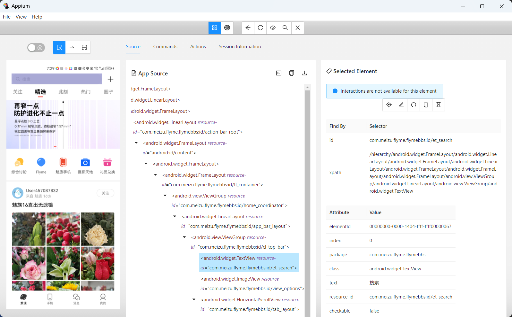

## appium 基础

App 自动化工具非常多，我们这里选择appium进行重点介绍，主要基于以下几点考虑。

* appium 是由商业工具在维护，诞生的历史比较长，并且仍在持续维护中。

* appium 应用更加广泛，使用得人更多，支持得平台多（android/ios/flutter）

* appium 继承selenium，对于开发测试框架来说，可以很好的继承selenium的 API来实现 App自动化支持。


### Appium 2.0 安装

在编写本书的时候，appium 2.0 还没有出稳定版，他带来了一些新的特性。

* __独立的驱动__：能够安装和使用基于你的应用平台的驱动程序(iOS, Android, Windows OS, Flutter, etc.) 。

* __插件生态__: 能够通过插件的方式为Appium扩展功能。


appium 2.0 文档：https://appium.github.io/appium/docs/en/2.0/


* 安装node.js

官方网站：https://nodejs.org

查看node.js  和 npm 版本

```shell
> node --version
v16.17.0

> npm --version
8.18.0
```

> 注：appium2.0 要求 npm 版本需要大于8.x。


* 安装 appium 2.0

```shell
> npm install -g appium@next
```

* 检查 appium 版本

```shell
> appium --version
2.0.0-beta.55
```

* 查看驱动

```shell
> appium driver list

✔ Listing available drivers
- espresso [not installed]
- uiautomator2 [not installed]
- xcuitest [not installed]
- mac2 [not installed]
- flutter [not installed]
- safari [not installed]
- gecko [not installed]
- chromium [not installed]
```

* 安装Android 和 iOS 驱动

```shell
> appium driver install espresso
> appium driver install uiautomator2
> appium driver install xcuitest
```

* 安装 python-client

python-client 是appium 官方提供的 python 语言客户端。

```shell
> pip install Appium-Python-Client
```

* appium-inspector

appium inspector用于移动应用程序等的 GUI 检查器。

项目地址：https://github.com/appium/appium-inspector



### appium 2.0 使用

* 使用插件的方式启动appium

```shell
> appium
...
[Appium] Appium REST http interface listener started on 0.0.0.0:4723
[Appium] Available drivers:
[Appium]   - espresso@2.15.4 (automationName 'Espresso')
[Appium]   - uiautomator2@2.12.6 (automationName 'UiAutomator2')
[Appium]   - xcuitest@4.18.1 (automationName 'XCUITest')
[Appium] Available plugins:
[Appium]   - gestures@1.0.0-beta.4
[Appium]   - appium-reporter-plugin@1.0.0-beta.7
[Appium] No plugins activated. Use the --use-plugins flag with names of plugins to activat
```

编写App自动化用例（以魅族社区App为例）:

```python
# appium_android.py
from time import sleep
from appium import webdriver
from appium.webdriver.common.mobileby import MobileBy


# Android App配置
desired_caps = {
    'deviceName': 'ELS-AN00',
    'automationName': 'UiAutomator2',
    'platformName': 'Android',
    'appPackage': 'com.meizu.flyme.flymebbs',
    'appActivity': '.ui.LoadingActivity',
    'noReset': True,
}

driver = webdriver.Remote(command_executor='http://127.0.0.1:4723',
                          desired_capabilities=desired_caps)
sleep(2)

# 搜索 flyme 关键字
driver.find_element(MobileBy.ID, "com.meizu.flyme.flymebbs:id/nw").click()
sleep(2)
driver.find_element(MobileBy.ID, "com.meizu.flyme.flymebbs:id/nw").send_keys("flyme")
driver.find_element(MobileBy.ID, "com.meizu.flyme.flymebbs:id/o1").click()
sleep(2)

# 打印结果列表
title_list = driver.find_elements(MobileBy.ID, "com.meizu.flyme.flymebbs:id/a29")
for title in title_list:
    print(title.text)

# 关闭App
driver.quit()
```

* 运行测试

```shell
> python appium_android.py

都在讨论19，我说说16sp的flyme8与flyme9（换电池后从9刷回了...
Flyme的短信功能吐槽
什么时候能用上flyme auto系统啊
FLYME的闹钟关机就不能用了吗？
note6用Flyme8卡吗
领克搭配flyme车机系统
```
